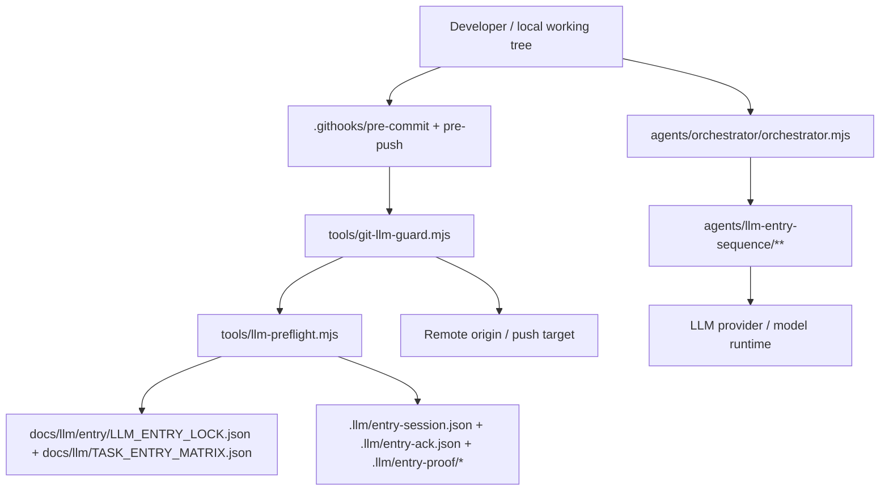

# LifeGameLab Threat Model

## Executive summary
LifeGameLab’s highest-risk surface is not the game runtime itself, but the local release toolchain around Git hooks, preflight classification, and orchestrator-driven prompt loading. The practical threat is a local actor who can alter repo content, exploit narrow path classification, or poison role/policy documents so a change appears approved when it is not.

The strongest controls already present are the hook gates in `.githooks/`, the centralized guard in `tools/git-llm-guard.mjs`, and the entry/ack/proof workflow in `tools/llm-preflight.mjs`. The main security question is whether those controls are broad enough to cover the whole repo without letting new paths, tracked config, or prompt-bearing files slip through a blind spot.

## Scope and assumptions
Scope:
- `.githooks/pre-commit`
- `.githooks/pre-push`
- `tools/git-llm-guard.mjs`
- `tools/llm-preflight.mjs`
- `agents/orchestrator/orchestrator.mjs`
- `agents/llm-entry-sequence/**`
- `docs/llm/**`
- `.llm/**`
- tracked workspace config that can affect reviews, especially `.vscode/settings.json`

Assumptions:
- This is a local developer workstation and repo-integrity problem, not a public network service problem.
- The main adversary already has access to the working tree or can influence files before commit/push.
- Defensive red-team behavior is in scope; sabotage or runtime-crash intent is not.

## System model
The repo has two adjacent control planes:

1. Git release gates.
   - `.githooks/pre-commit` and `.githooks/pre-push` both call `node tools/git-llm-guard.mjs ...`.
   - `tools/git-llm-guard.mjs` classifies changed paths, runs preflight checks, and blocks push/commit when the entry/ack contract is not satisfied.
   - `tools/llm-preflight.mjs` reads policy documents such as `docs/llm/entry/LLM_ENTRY_LOCK.json` and `docs/llm/TASK_ENTRY_MATRIX.json`, then writes session/ack/proof state under `.llm/`.

2. Orchestrator-driven agent execution.
   - `agents/orchestrator/orchestrator.mjs` builds pipelines such as `default`, `plan`, `review`, `ui`, `sim`, `contracts`, `full`, and `red-team-v2`.
   - Entry-sequence roles under `agents/llm-entry-sequence/**` are treated as executable policy text for agent behavior, including `09-global-minimum-gates/AGENT.md` and its `Gate-Compliance-Checker` role.
   - The orchestrator and the gate both derive meaning from repository files, so prompt-bearing docs are part of the trust boundary.

Evidence anchors:
- `.githooks/pre-push` invokes `node tools/git-llm-guard.mjs pre-push`.
- `.githooks/pre-commit` invokes `node tools/git-llm-guard.mjs pre-commit`.
- `tools/git-llm-guard.mjs` uses preflight classification and entry/ack checks before permitting release actions.
- `tools/git-llm-guard.mjs` blocks pushes until the entry+ack contract is satisfied for changed paths.
- `tools/llm-preflight.mjs` persists `.llm/entry-session.json`, `.llm/entry-ack.json`, and `.llm/entry-proof/*`.
- `agents/llm-entry-sequence/09-global-minimum-gates/AGENT.md` defines the final gate role and its report contract.

### Compact data-flow view

## Assets and security objectives
Primary assets:
- Repository integrity and release integrity.
- Correct enforcement of the entry/ack gate.
- Integrity of prompt-bearing role files and policy docs.
- Integrity of `.llm` proof/session artifacts.
- Predictable orchestrator behavior across pipelines and red-team runs.

Security objectives:
- Only intended files and scopes may pass through commit/push gates.
  - Prompt-bearing docs must not silently change the meaning of a role or policy, especially when they are consumed as instructions by the orchestrator.
- Session and proof artifacts must not be accepted as authoritative if they are stale, injected, or out of scope.
- The orchestrator must not be able to bypass guard policy by reading untrusted repo text as if it were trusted configuration.

## Attacker model
Primary attacker types:
- A malicious or careless local contributor with write access to the working tree.
- A contributor who can add new files or rename paths to fall outside existing classifiers.
  - A contributor who can edit role documents, entry locks, or proof/session files before hooks run, including files that the orchestrator treats as control text.
- A developer who accidentally introduces tracked config that alters review or orchestration behavior.

Capabilities assumed:
- Can change arbitrary repo files before commit.
- Can create new paths, nested directories, and ambiguous filenames.
- Can influence the content that the orchestrator loads as role text.
- Can try to race or replay local proof/session state.

Out of scope:
- Remote server compromise.
- Kernel-level attacks.
- Internet-facing exploitation of external services.

## Entry points and attack surfaces
The main entry points are local and file-driven:
- Git hook execution in `.githooks/`.
- Preflight CLI arguments and path classification in `tools/llm-preflight.mjs`.
- Guard decision logic in `tools/git-llm-guard.mjs`.
- Orchestrator pipeline selection in `agents/orchestrator/orchestrator.mjs`.
- Role-loading from `agents/llm-entry-sequence/**`.
- Policy docs in `docs/llm/**`, especially `docs/llm/entry/LLM_ENTRY_LOCK.json` and `docs/llm/TASK_ENTRY_MATRIX.json`.
- Generated local evidence under `.llm/**`.
- Tracked workspace config such as `.vscode/settings.json` when it is part of the diff.

The highest-value attack surface is any place where untrusted repo text becomes trusted policy or trusted prompt context.

## Top abuse paths
1. **Path-classification blind spot**
   - A new file or renamed path lands outside the classifier’s expectations and bypasses the intended entry/ack flow.
   - This is especially dangerous if the guard only checks a fixed target set or stale scope map.

2. **Prompt / role injection**
   - A malicious edit to `AGENT.md`, `BASE_RULES.md`, or another role-bearing file changes how the orchestrator interprets a task.
   - Because these files are part policy and part instruction, the boundary must stay explicit.

3. **Proof/session tampering**
   - A local actor modifies `.llm/entry-session.json`, `.llm/entry-ack.json`, or proof artifacts to impersonate a valid approval trail.
   - If stale proof is accepted, the guard becomes ceremonial instead of protective.

4. **Policy drift through tracked config**
   - A tracked workspace file like `.vscode/settings.json` changes review behavior, formatting, or file visibility in a way that obscures a meaningful diff.
   - This is lower severity than direct guard bypass, but it can still hide high-risk changes.

5. **Orchestrator abuse via red-team or pipeline selection**
   - A caller steers the orchestrator into a less restrictive pipeline or feeds it malformed scope data.
   - If pipeline names are treated as trusted intent, the wrong agent set may run with the wrong assumptions.
   - The `red-team-v2` path is especially sensitive because it intentionally amplifies scanner/attacker behavior for defensive validation.

6. **False safety from narrow tests**
   - A test proves that a small allowlist behaves correctly while missing files, dynamic string construction, or hidden path variants remain untested.
   - The result is a green check that does not cover the actual repo surface.

## Threat model table
| ID | Threat | Likelihood | Impact | Evidence anchor | Mitigation |
|---|---|---:|---:|---|---|
| TM-001 | Guard bypass through path-classification blind spot | Medium | High | `tools/git-llm-guard.mjs` + `tools/llm-preflight.mjs` | Move from fixed path sets to repo-wide classification with explicit excludes and unclassified-path failures. |
| TM-002 | Prompt or role injection via agent docs | Medium | High | `agents/llm-entry-sequence/**` | Separate policy docs from prompt-bearing instructions and test for instruction-smuggling patterns. |
| TM-003 | Session/proof tampering in `.llm/**` | Medium | High | `.llm/entry-session.json`, `.llm/entry-ack.json`, `.llm/entry-proof/*` | Treat proof as ephemeral, bind it to scope and hash, and reject stale or mismatched artifacts. |
| TM-004 | False approval from drift or malformed scope inputs | Medium | Medium | `docs/llm/entry/LLM_ENTRY_LOCK.json`, `docs/llm/TASK_ENTRY_MATRIX.json` | Validate scope mapping against policy hashes and fail closed on unknown or drifting entries. |
| TM-005 | Orchestrator misuse through pipeline selection | Medium | Medium | `agents/orchestrator/orchestrator.mjs` | Restrict pipelines to explicit intents, especially `red-team-v2`, and log every pipeline-selection decision. |
| TM-006 | Hidden risk in tracked workspace config | Low | Medium | `.vscode/settings.json` | Exclude or tightly review tracked IDE config so it cannot silently influence review or classification. |

## Criticality calibration
High criticality:
- Anything that lets a commit or push pass without the intended entry/ack contract.
- Anything that lets prompt-bearing policy files alter agent behavior without review.
- Anything that makes proof artifacts trustworthy when they are stale, injected, or out of scope.

Medium criticality:
- Pipeline-selection mistakes that do not directly bypass the guard but can distort agent behavior.
- Tracked config that can hide or reshape a review, even if it does not directly subvert policy.

Lower criticality:
- Noise, ergonomics issues, or local failures that stop the guard cleanly and visibly.

## Focus paths for security review
Prioritize these files and directories for deeper review:
- `.githooks/pre-commit`
- `.githooks/pre-push`
- `tools/git-llm-guard.mjs`
- `tools/llm-preflight.mjs`
- `docs/llm/entry/LLM_ENTRY_LOCK.json`
- `docs/llm/TASK_ENTRY_MATRIX.json`
- `docs/llm/ENTRY.md`
- `docs/llm/entry/ENTRY_ENFORCEMENT.md`
- `agents/orchestrator/orchestrator.mjs`
- `agents/llm-entry-sequence/**`
- `agents/llm-entry-sequence/09-global-minimum-gates/AGENT.md`
- `.llm/**`
- `.vscode/settings.json`

## Recommended next checks
- Expand the bypass test from a fixed target list to a repo-wide scan with explicit excludes.
- Add negative tests for unknown paths, malformed scope inputs, and proof/session replay.
- Verify that role-bearing files are treated as policy inputs, not just content.
- Confirm that tracked IDE config cannot interfere with gate decisions or reviewer visibility.
