# LifeGameLab v2.5.0


Deterministisches Zell-Strategieprodukt: autonome Kolonieentwicklung, fokussierte Eingriffe, klare Missionsführung statt Klick-Spam.

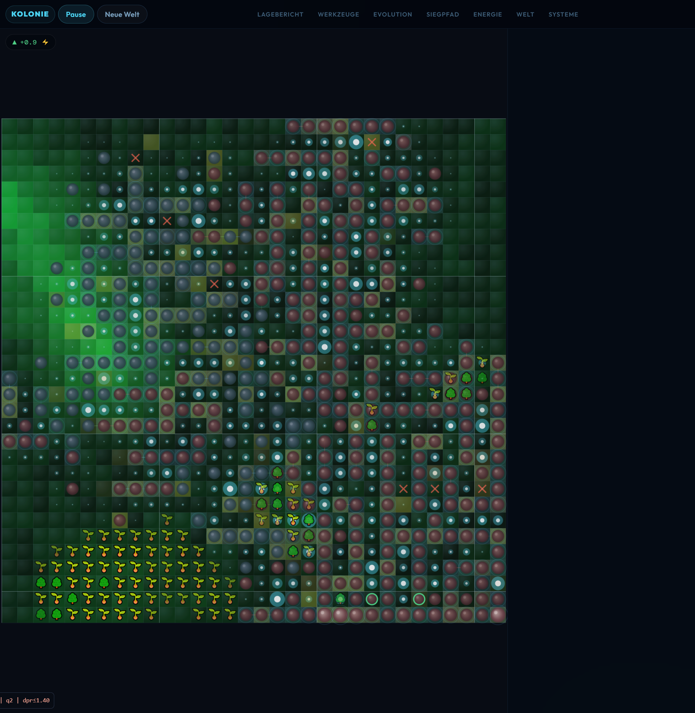

## Was es ist

`LifeGameLab` ist kein klassisches RTS. Du steuerst eine lebende Linie über Prioritäten, Evolution, Split-Seeds und Zonen. Die Kolonie wächst primär selbst. Dein Job ist Lesen, Lenken, Stabilisieren.

## Produkt-Highlights

- Mobile-first Shell (Bottom-Dock + Sheet), Desktop als Mission-Control
- Klare Top-Signale: `Kolonie`, `DNA`, `Risiko`, `Run-Pfad`, `Engpass`
- Deterministischer Advisor fuer `Run-Pfad`, Engpass, Blocker und naechsten Ausbauhebel
- Sichtbare Strukturreife: Einzelzellen -> 2x2-Biomodule -> Koloniekerne
- Deterministischer Kernel mit harten Manifest-/Schema-/Mutation-Gates
- Echte Diagnose-Scanner fuer `energy`, `toxin`, `nutrient`, `territory`, `conflict`
- Browser-Hooks fuer QA/Automation: `window.render_game_to_text`, `window.advanceTime`

## Screens

| Home | Desktop Status |
| --- | --- |
|  | 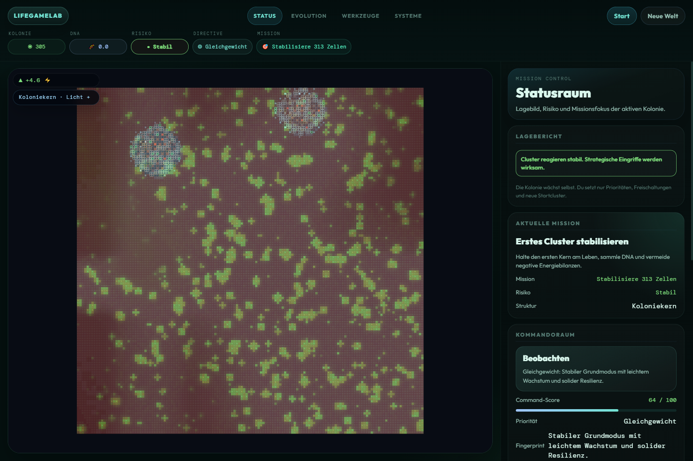 |

| Mobile Shell | Mobile Sheet |
| --- | --- |
| 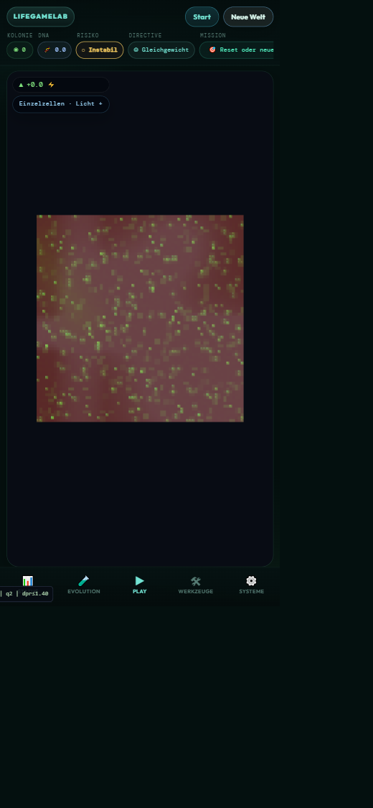 | 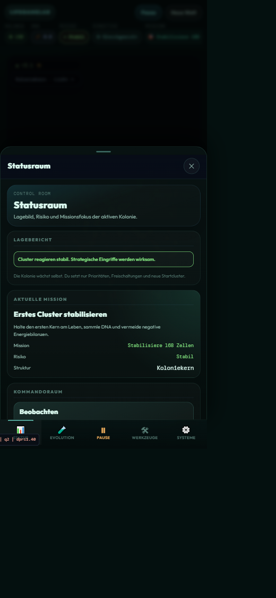 |

| Status Panel | Evolution Panel |
| --- | --- |
| 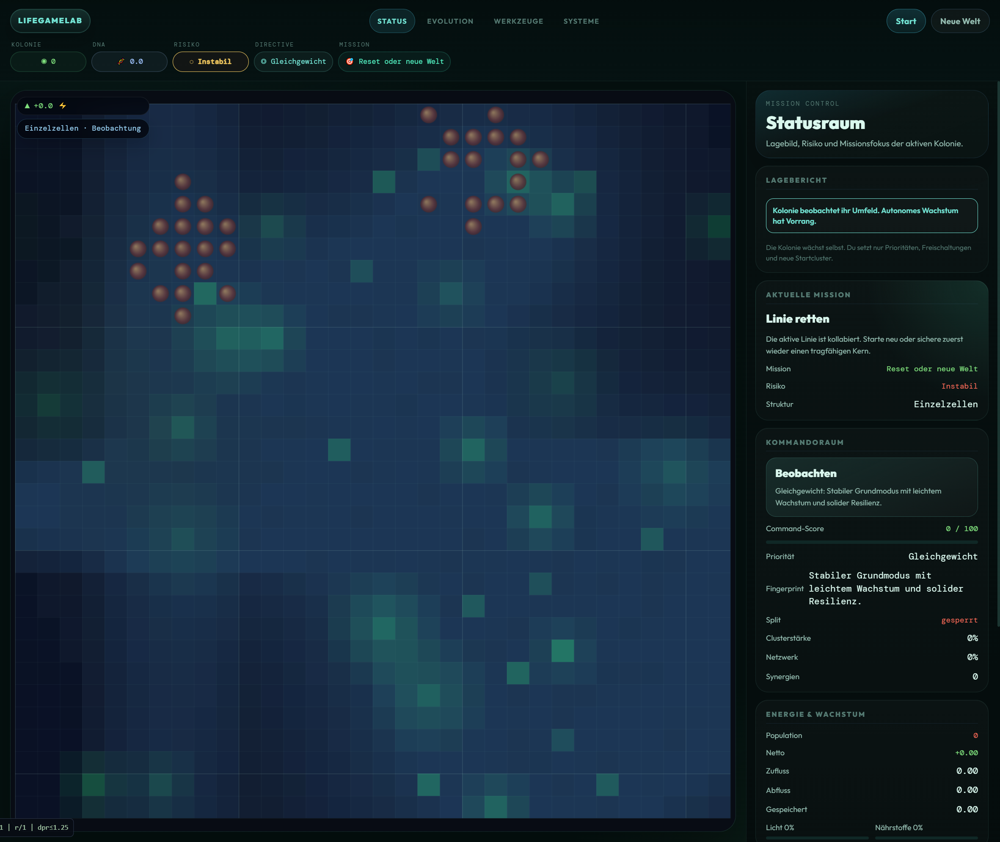 | 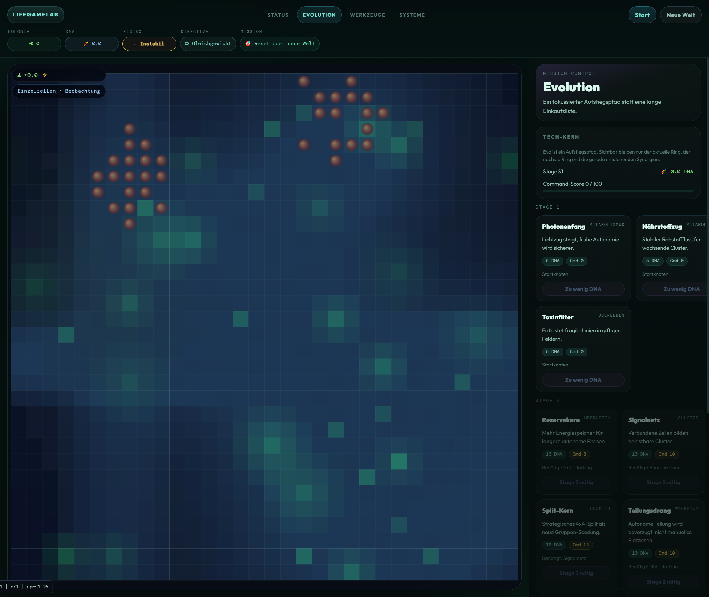 |

| Tools Panel | Systems Panel |
| --- | --- |
| 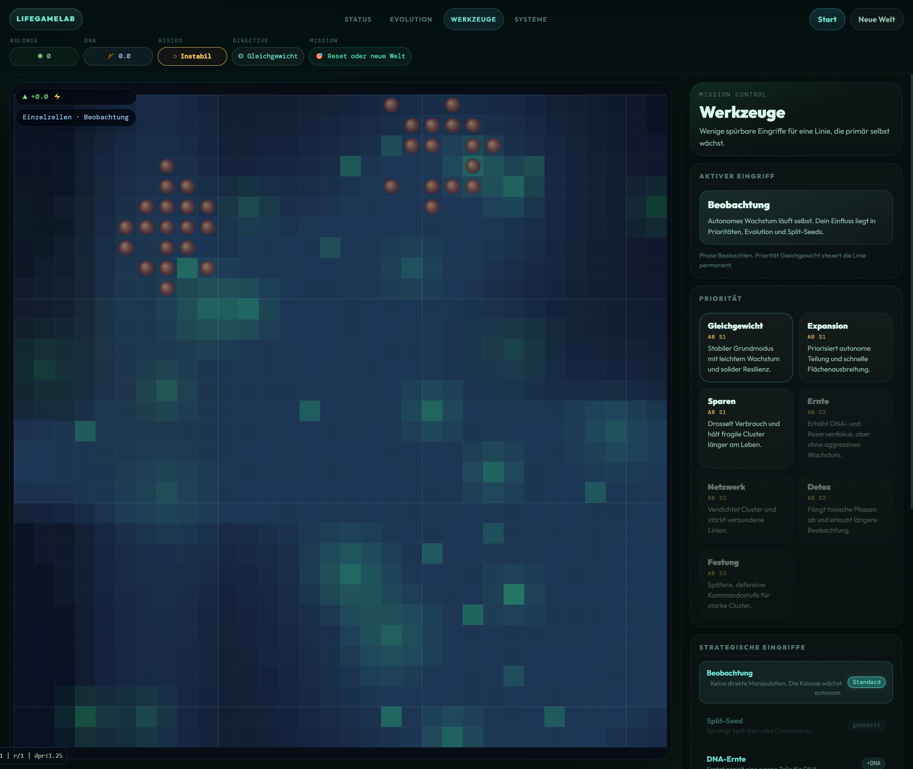 | 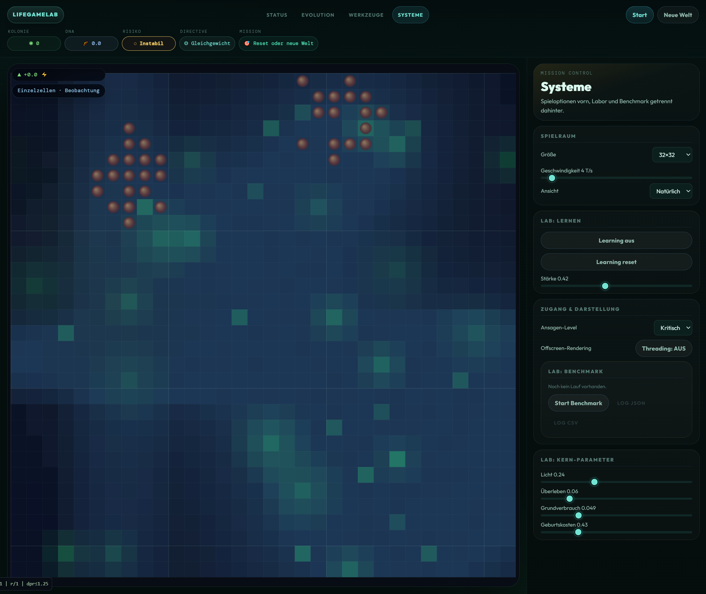 |

## Viewport-Vergleich (Playwright)

Automatisch erstellt am **14.03.2026** via Playwright gegen `http://127.0.0.1:8080/`.

| Desktop 1536x960 | Mobile 390x844 |
| --- | --- |
| 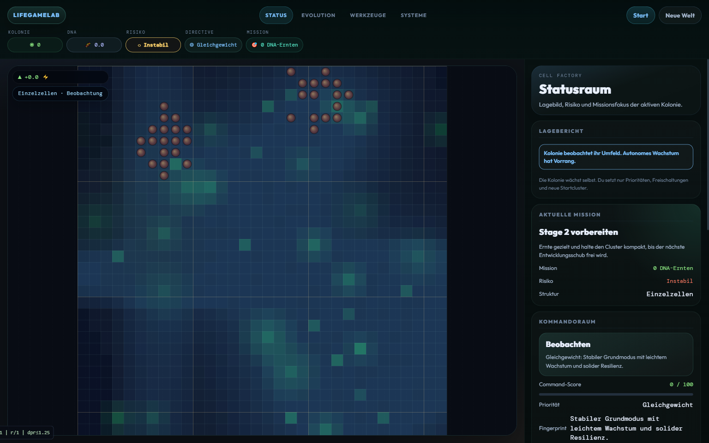 | 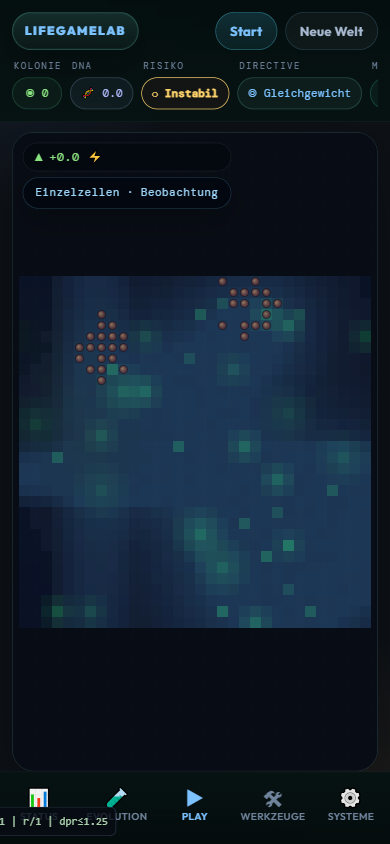 |

| Desktop Tools | Mobile Tools |
| --- | --- |
| 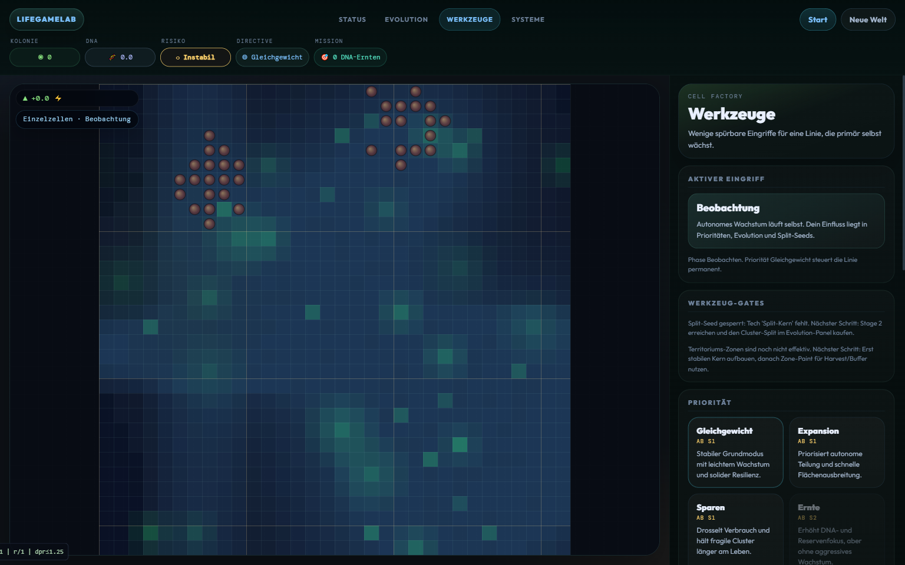 | 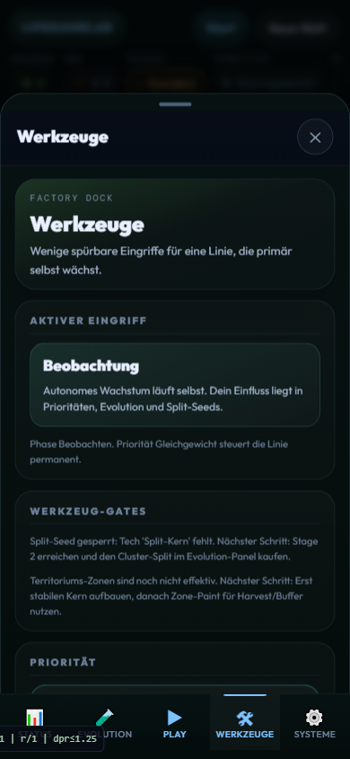 |

| Desktop Evolution | Mobile Systeme |
| --- | --- |
| 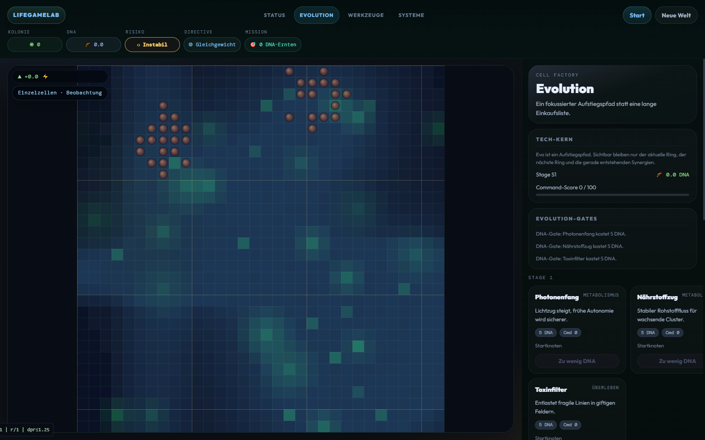 | 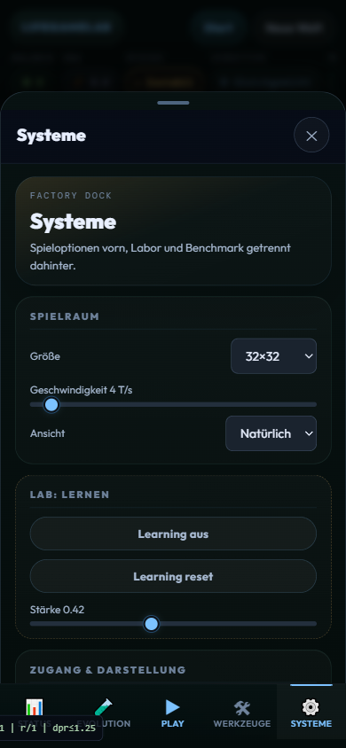 |

Vollständige Capture-Matrix (alle Größen/Ansichten):
- [docs/GITHUB_MEDIA_INDEX.md](docs/GITHUB_MEDIA_INDEX.md)

## Schnellstart

```bash
npm test
py -m http.server 8080
```

Dann im Browser öffnen: `http://127.0.0.1:8080/`

Optional:

```bash
npm run serve
npm run test:quick
npm run test:truth
npm run test:stress
```

## Steuerung

- `Leertaste`: Start/Pause
- `N`: neue Welt
- `S`: Status öffnen
- `E`: Evolution öffnen
- Maus/Touch: Werkzeuge, Split-Seeds, Zonen

## Qualitätsgates

- `npm test` = Quick-Suite (truth/stress bewusst aus, um grosse Testlaeufe nicht implizit zu triggern)
- `npm run test:full` = Quick + Truth + Stress
- Keine Zufallsquellen außerhalb Kernel-RNG
- State-Änderungen nur via `dispatch()` + Patches
- Contract-Tests für String-/Dataflow-/Wrapper-Hardening aktiv

## Repo-Struktur

- `src/app/` Bootstrap + Loop
- `src/core/` deterministischer Kernel + Runtime
- `src/game/` Sim, Renderer, UI
- `src/project/` Manifest + projektseitige Entry-Points
- `tests/` Gates, Determinismus, Gameplay, Contracts
- `tools/` Profiling, Debug, Redteam
- `docs/` Architektur, Governance, Handoff

## Aktueller Engineering-Status (ehrlich)

- Contract-/Gate-Härtung ist umgesetzt und testgrün.
- Main-Run ist jetzt staerker auf `ernten -> investieren -> ausbauen -> Engpaesse loesen` verdrahtet.
- Win-Mode-Lock, Placement-Cost-Default und Global-Learning-Default stuetzen jetzt den Main Run statt den Sandbox-Fall.
- Performance-Ziel aus dem letzten Implementierungsplan (`>=10%` je Profilfall) ist noch offen.

Details: `docs/PROJECT_STRUCTURE.md`, `docs/PROJECT_CONTRACT_SNAPSHOT.md`, `docs/SESSION_HANDOFF.md`
