# GitHub Media Index

Playwright-Captures für Vergleichsansichten von Desktop, Tablet und Mobile.

## Capture-Matrix

### Desktop 1536x960
- `home`: 
- `status`: 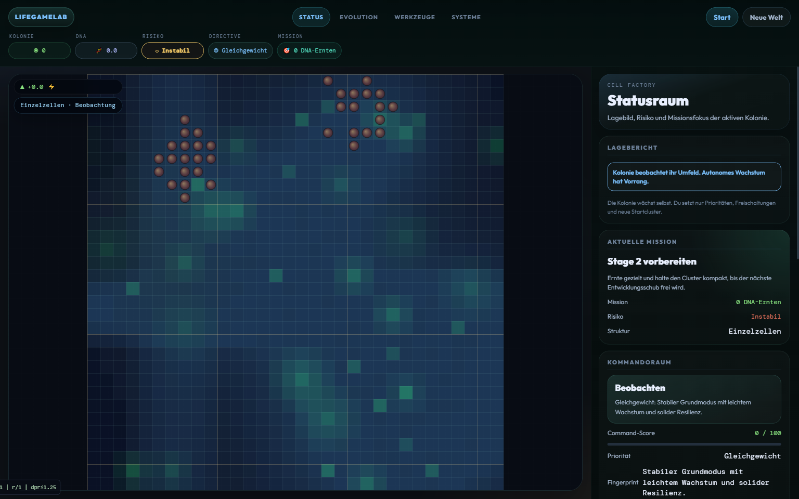
- `evolution`: 
- `werkzeuge`: 
- `systeme`: 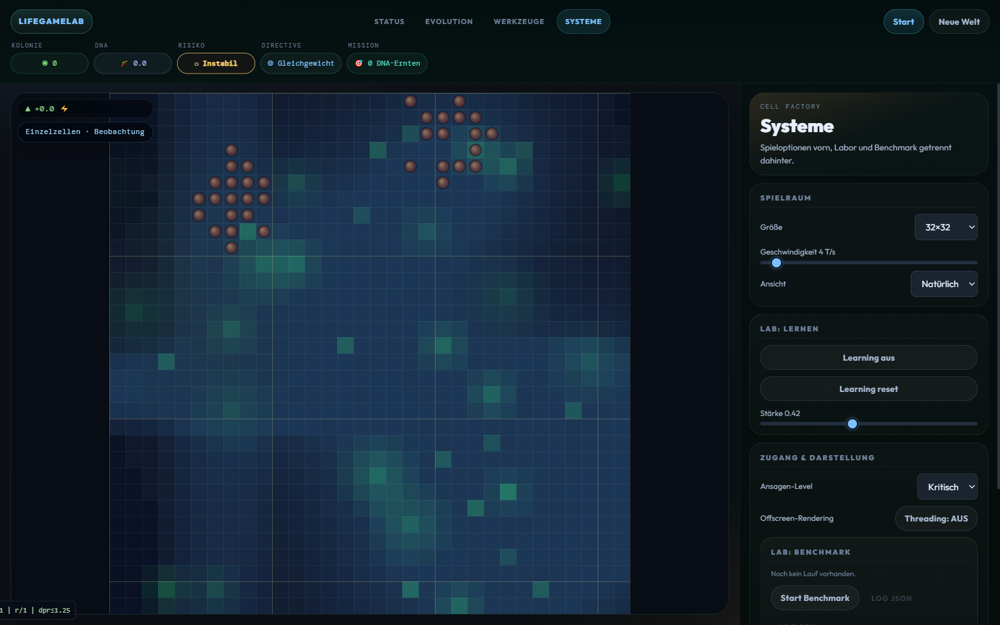

### Desktop 1280x720
- `home`: 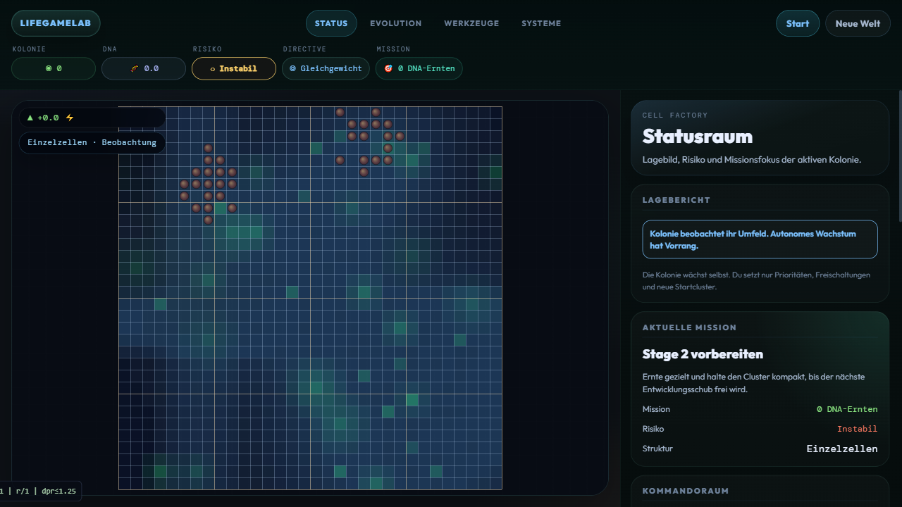
- `status`: 
- `werkzeuge`: 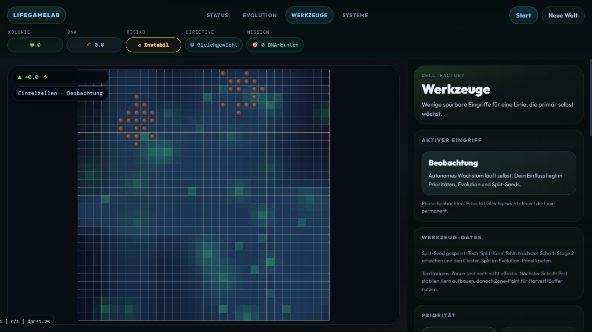

### Tablet 834x1112
- `home`: 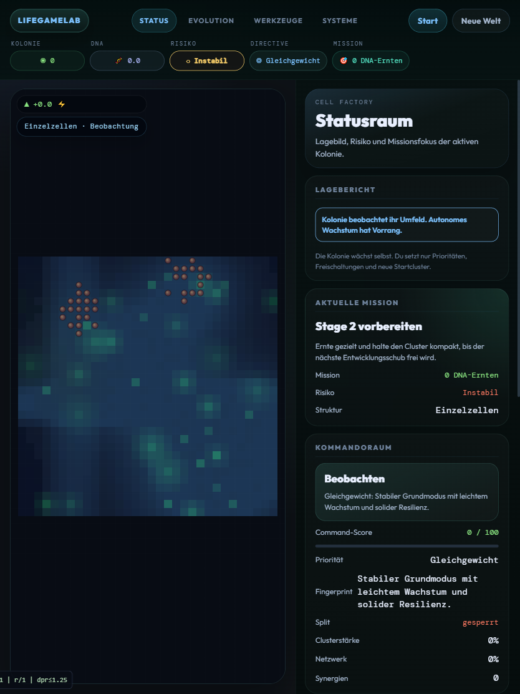
- `status`: 
- `werkzeuge`: 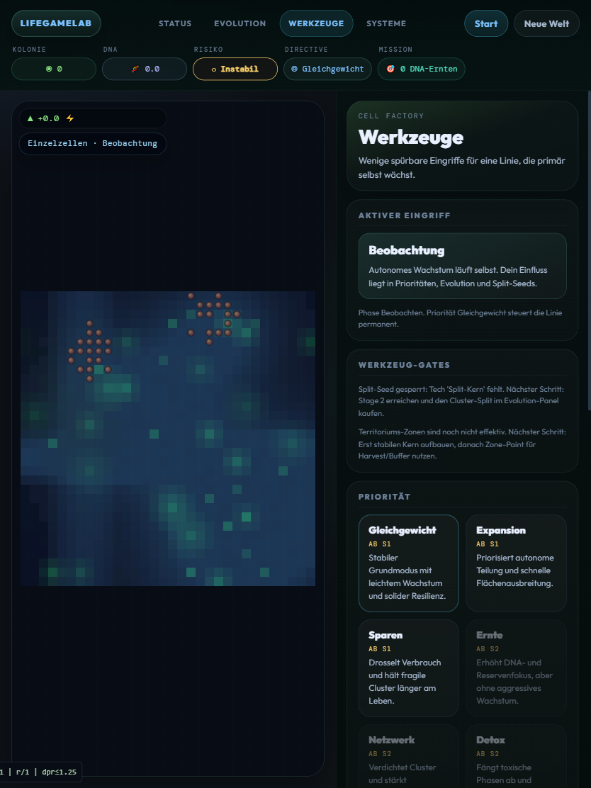

### Mobile 390x844
- `home`: 
- `status`: 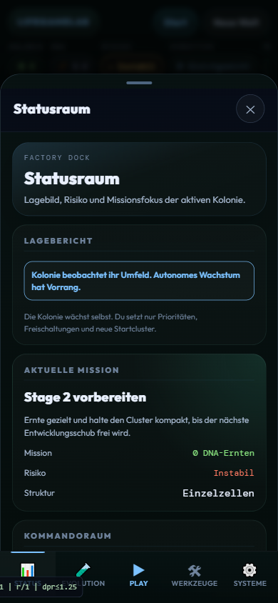
- `evolution`: 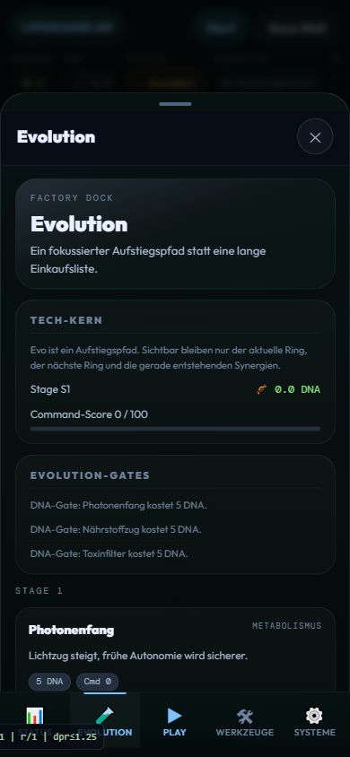
- `werkzeuge`: 
- `systeme`: 

### Mobile 360x640
- `home`: 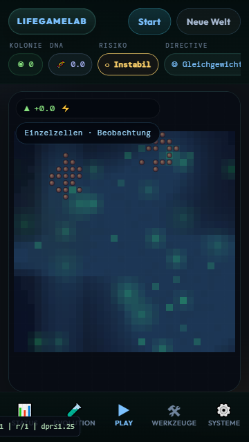
- `status`: 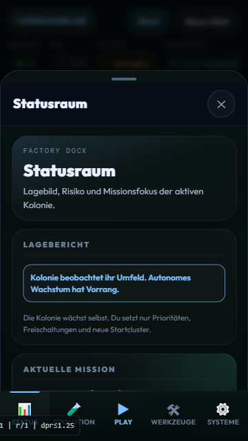
- `werkzeuge`: 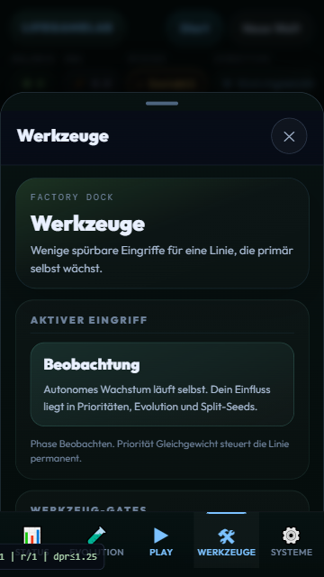

## Reproduzierbar erzeugen

1. Server starten:
   - `python -m http.server 8080`
2. Playwright-Flow gegen `http://127.0.0.1:8080/` laufen lassen.
3. Bilder landen unter `docs/assets/compare-*.png`.
