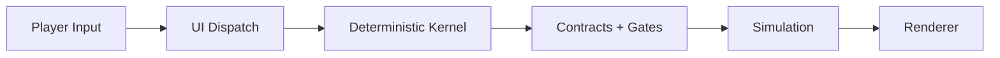
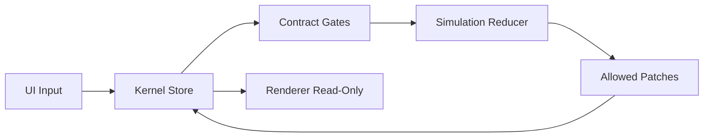
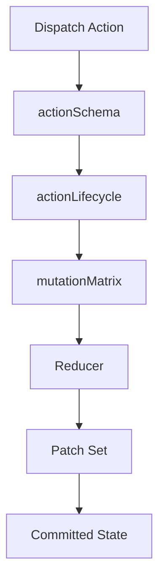
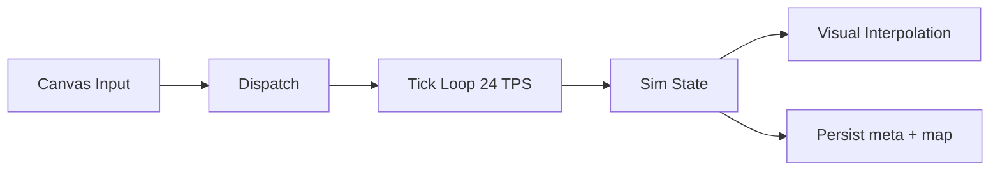
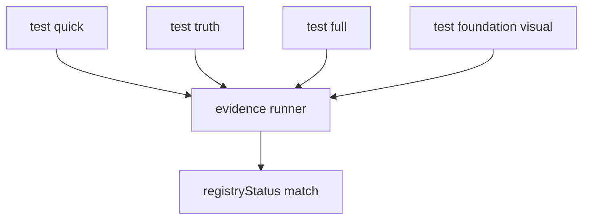

# LifeGameLab Wiki Export

Generated: 2026-03-20
Policy: only verified project facts from SoT docs and existing code paths.

---

# Page: Home

# LifeGameLab Wiki

Willkommen im technischen Wiki von LifeGameLab.

## Einstieg
- Vollstaendige Navigation: [Sidebar](./_Sidebar.md)
- Produktbasis: [Product SoT](./Product-SoT.md)
- Architekturbasis: [Architecture SoT](./Architecture-SoT.md)

## Projektkern
LifeGameLab ist ein deterministisches Browser-RTS mit einem Worker-First-Start.

- Ein Match beginnt mit genau einem Worker.
- Entscheidungen entstehen aus Konsequenz statt Menuefuehrung.
- Gleiche Seeds + gleiche Inputs liefern denselben Simulationsverlauf.

## Systemueberblick

## Aktueller Head (2026-03-20)
- Slice-B-MapSpec-Baseline aktiv.
- Slice-C-Minimal-UI aktiv.
- Worker-Migration weit fortgeschritten.
- Kernel-Hardening gegen nicht-serialisierbare/zyklische Inputs aktiv.

## Source of Truth
Fuer verbindliche Aussagen gelten:
- `docs/PRODUCT.md`
- `docs/ARCHITECTURE.md`
- `docs/STATUS.md`
- `src/project/contract/manifest.js`

---

# Page: Product SoT

# Product SoT

## Product Core
- Deterministisches Browser-RTS.
- Kein verstecktes Onboarding; das Spiel lehrt ueber Konsequenzen.
- Matchstart mit einem Worker; Core-Founding in Phase 0 durch manuelle Plant-Delivery.

## Deterministic Foundation
- 24 Ticks = 1 Sekunde.
- Seed + MapSpec bestimmen die Welt deterministisch.
- RNG bleibt replay-safe.

## Matchstruktur
- Blitz: `32x32`
- Standard: `64x64`
- Krieg: `128x128`
- Custom: ueber Map-Builder-Pipeline, weiterhin deterministisch.

## Wirtschaft
- Worker sind simultan Produktionskraft, Baukapazitaet und militaerischer Opportunitaetskostenfaktor.
- Canonical early values:
- Worker-Spawn: `2 energy`
- Worker-Spawn-Zeit: `240 ticks`
- Break-even: `480 ticks`
- Plant-Output: `1 energy / 120 ticks`

## Tiers und Progression
- T1/T2 werden im Feld ueber Konsequenz gelernt.
- T3 ist das einzige zusaetzliche Fenster.
- T3 Topology Classes: `triangle`, `square`, `loop`, `star`, `spiral`, `cross`, `pentagram`, `hexagram`.

Source of truth: `docs/PRODUCT.md`

---

# Page: Architecture SoT

# Architecture SoT

## Prinzipien
- Manifest-first Design.
- Kernel ist alleinige Write-Authority.
- UI/Renderer sind read-only auf State.
- State-Updates nur als Patches durch definierte Gates.

## Top-Level Struktur
- `src/kernel/` - Store, Patching, Validierung
- `src/project/contract/` - Manifest, Schemata, Mutation Matrix, Lifecycle
- `src/game/sim/` - Sim-Logik und Worldgen
- `src/game/render/` - visuelle Ausgabe
- `src/game/ui/` - Input-/Dispatch-Schicht
- `src/app/` - Orchestrierung

## Datenfluss
1. UI dispatcht Action.
2. Kernel validiert Action + Lifecycle + Matrix.
3. Reducer erzeugt erlaubte Patches.
4. Kernel commitet State.
5. Renderer liest State.

## Diagramm

Source of truth: `docs/ARCHITECTURE.md`, `docs/ARCHITECTURE_SOT.md`

---

# Page: Repository Structure and Module Map

# Repository Structure and Module Map

## Ziel
Diese Seite mappt die echten Modulgrenzen im aktuellen Head.

## Top-Level Rollen
- `src/kernel/`: deterministischer Store, Patching, Validierung, Persistenz, RNG.
- `src/project/contract/`: Manifest, Action/State-Schema, Mutation-Matrix, Lifecycle, Dataflow.
- `src/game/contracts/`: produktnahe Enums und IDs.
- `src/game/sim/`: aktive Runtime- und Simulationslogik inkl. MapSpec/Worldgen.
- `src/game/render/`: Renderer-Pfade.
- `src/game/ui/`: UI-Adapter und Input-Dispatch.
- `src/app/`: Boot, Runtime-Loop, Crash-Flows.

## Laufender Datenfluss
1. UI dispatcht Actions.
2. Kernel validiert und gate't gegen Contracts.
3. Reducer erzeugt erlaubte Patches.
4. Store commitet den neuen State.
5. Renderer liest State read-only.

## Slice-Realitaet
- Slice B MapSpec ist aktiv.
- Slice C Minimal UI ist aktiv.
- Legacy-Runtime bleibt als kontrollierter Fallback vorhanden.

Verbindliche Quellen:
- `docs/ARCHITECTURE.md`
- `docs/STATUS.md`
- `src/project/contract/manifest.js`

---

# Page: Determinism and Contracts

# Determinism and Contracts

## Vertragsschicht
- `src/project/contract/manifest.js` ist die ausfuehrbare Truth-Zentrale.
- `actionSchema` definiert Payload-Regeln.
- `mutationMatrix` erzwingt erlaubte Write-Surfaces.
- `actionLifecycle` dokumentiert `STABLE`, `RENAME`, `DEPRECATED`, `SCAFFOLD` plus Removal-Gates.

## Hardening
- Non-serializable Payloads werden rejectet.
- Zyklische Inputs werden fail-closed blockiert.
- Ungueltige Dimensionsinputs (`SET_SIZE`) erreichen keinen committed State.

## Slice-Status
- Slice B: MapSpec-Pipeline aktiv (`SET_MAPSPEC` -> compile -> `GEN_WORLD`).
- Slice C: Minimal UI + Worker migration aktiv.

## Diagramm

Source of truth: `docs/STATUS.md`, `src/project/contract/*`

---

# Page: Runtime and UI

# Runtime and UI

## Runtime
- Tickbasierte Loop mit deterministischem Kern.
- Sichtbare Canvas-Interaktion.
- Builder-Panel fuer Map-Eingriffe statt blindem Toggle-only Flow.

## UI Regeln
- UI darf nicht direkt mutieren.
- Jede relevante Nutzeraktion geht ueber Dispatch.
- Bewegung und visuelle Interpolation bleiben synchron mit Tick-Modell.

## Persistenz
- Default Web Persistence speichert `map` (inkl. `tilePlan`) und `meta`.
- `world` und `sim` bleiben regenerierbar und werden nicht blind persistiert.

## Diagramm

Source of truth: `docs/STATUS.md`, `src/game/ui/*`, `src/kernel/store/persistence.js`

---

# Page: Testing and Evidence

# Testing and Evidence

## Testsuiten
- `npm run test:quick`
- `npm run test:truth`
- `npm run test:full`
- `npm run test:foundation:visual`

## Evidence-Ansatz
- Claims und Regressionen werden gegen Registry/Truth geprueft.
- Evidence-Runner kennzeichnet Verifikation mit `registryStatus=`.
- Longrun-Budget hat explizite Headroom-Grenze (`300_000 ms`).

## Visual Regression
- Playwright-Flow dokumentiert initiale Runtime-/Header-/Canvas-Stabilitaet.

## Diagramm

Source of truth: `tools/`, `tests/`, `docs/STATUS.md`

---

# Page: Playwright Debug Loop and Visual Testing

# Playwright Debug Loop and Visual Testing

## Zweck
Browsernahe Regression fuer UI/Runtime-Stabilitaet, zusaetzlich zu deterministischen Kernel-Tests.

## Relevante Tools
- `npm run test:foundation:visual`
- `tools/run-foundation-visual-playwright.mjs`

## Was verifiziert wird
- UI-Baseline und sichtbare Layout-/Header-Stabilitaet.
- Grundlegender Worldgen-Flow im Browser.
- Canvas-Praesenz nach Interaktion.

## Artefakte
- Output unter `output/playwright/...`.
- Run-Logs und Screenshots zur Nachvollziehbarkeit.

## Einordnung
Visual-Tests sind Integrationssignal, nicht Ersatz fuer Contract-/Determinismus-Tests.

Verbindliche Quellen:
- `tools/run-foundation-visual-playwright.mjs`
- `docs/STATUS.md`
- `tests/`

---

# Page: LLM Governance and Preflight System

# LLM Governance and Preflight System

## Zweck
Das Projekt erzwingt vor kritischen Aenderungen eine feste Entry-/Preflight-Kette.

## Pflichtreihenfolge
1. `docs/WORKFLOW.md`
2. `docs/llm/ENTRY.md`
3. `docs/llm/OPERATING_PROTOCOL.md`
4. `docs/ARCHITECTURE.md`
5. `docs/STATUS.md`

## Pflichtkette vor Writes
1. `llm-preflight classify`
2. `llm-preflight entry`
3. `llm-preflight ack`
4. `llm-preflight check`

## Harte Verbote
- Kein `--no-verify`.
- Kein Hook-/Guard-Bypass.
- Bei Scope-Drift zuerst Matrix/Mapping korrigieren, dann Kette komplett neu laufen lassen.

## Geltung
Diese Regeln sind Prozess-SoT und gelten vor allen Eingriffen in Contract-/Kernel-nahe Pfade.

Verbindliche Quellen:
- `RUNBOOK.md`
- `docs/llm/ENTRY.md`
- `docs/llm/OPERATING_PROTOCOL.md`
- `docs/llm/TASK_ENTRY_MATRIX.json`

---

# Page: Workflow and Contribution

# Workflow and Contribution

## Governance (Single Source)
- Verbindliche Preflight-/Governance-Regeln stehen in [LLM Governance and Preflight System](./LLM-Governance-and-Preflight-System.md).
- Diese Seite fokussiert auf Beitragsprozess und Maintainer-Dokumente.

## Contributor-Docs
- `CONTRIBUTING.md`
- `SECURITY.md`
- `CODE_OF_CONDUCT.md`
- `SUPPORT.md`

Source of truth: `RUNBOOK.md`, `docs/llm/*`

---

# Page: Roadmap

# Roadmap

## Aktueller Fokus
1. Slice C stabil abschliessen (Worker-Flow + Gates).
2. Render-Interpolation klar und dauerhaft sichtbar halten.
3. Builder-Semantik nur mit Contract+Worldgen-Abdeckung ausbauen.
4. Evidence/Truth-Linie bei jeder Slice-Aenderung gruen halten.

## Kurzfristige technische Ziele
- `PLACE_WORKER`-Pfad inklusive Regressionguards vollstaendig absichern.
- Phase-0-Ersatz abschliessen und Legacy-Aktionen sauber ausphasieren.
- Test- und Dokument-Drift zwischen SoT und Traceability weiter reduzieren.

Primary reference: `docs/STATUS.md`

---

# Page: Glossary

# Glossary

## Wichtige Begriffe
- **SoT**: Source of Truth (produkt-/architekturleitende Dokumente + Contracts).
- **Manifest-first**: Regeln leben ausfuehrbar im Contract-Manifest.
- **Mutation Matrix**: Erlaubte State-Writes pro Action.
- **MapSpec**: Deterministische Weltbeschreibung vor `GEN_WORLD`.
- **Slice**: kontrollierter Migrationsabschnitt (A/B/C ...).
- **Evidence Match**: Verifikation, dass Claims/Regressionen mit Registry/Truth konsistent sind.
- **Removal Gates**: Bedingungen, die vor Legacy-Loeschung erfuellt sein muessen.

---

# Export Notes

- Normative sources: `docs/PRODUCT.md`, `docs/ARCHITECTURE.md`, `docs/STATUS.md`, `src/project/contract/manifest.js`.
- `docs/traceability/*` remains derived evidence and does not override SoT.
- GitHub Wiki uses `<repo>.wiki.git`; files from `docs/wiki/` are sync-ready.
