# Page: LifeGameLab Overview

# LifeGameLab Overview

<details>
<summary>Relevant source files</summary>

The following files were used as context for generating this wiki page:

- [README.md](README.md)
- [docs/ARCHITECTURE.md](docs/ARCHITECTURE.md)
- [docs/PRODUCT.md](docs/PRODUCT.md)
- [docs/STATUS.md](docs/STATUS.md)
- [docs/llm/entry/IMPLEMENTATION_CONSTRAINTS.md](docs/llm/entry/IMPLEMENTATION_CONSTRAINTS.md)
- [docs/traceability/rebuild-preparation-inventory.md](docs/traceability/rebuild-preparation-inventory.md)
- [docs/traceability/rebuild-string-matrix.md](docs/traceability/rebuild-string-matrix.md)
- [index.html](index.html)
- [package.json](package.json)
- [src/project/contract/actionLifecycle.js](src/project/contract/actionLifecycle.js)
- [src/project/contract/manifest.js](src/project/contract/manifest.js)

</details>


LifeGameLab is a deterministic, browser-based Real-Time Strategy (RTS) game built on a grid-based cellular simulation. The project emphasizes strict architectural invariants, mathematical reproducibility, and a "consequence-first" design philosophy where players start with a single worker and expand through the strategic binding of units into infrastructure.

## 1. Project Purpose and Game Design

The core tension of LifeGameLab lies in the choice between keeping units as flexible **Workers** (short-term gain) or committing them permanently into **Patterns and Infrastructure** (long-term investment) [README.md:9-14](). Every match is fully deterministic; given the same seed and input sequence, the simulation will produce identical results across any environment [README.md:18-22]().

The game progresses through distinct phases:
*   **Phase 0:** Manual delivery of raw plants to found the first Core [docs/PRODUCT.md:47-51]().
*   **Early Game:** Stabilization and parallelization of resource income [README.md:44-58]().
*   **Mid/End Game:** Automation via conveyors and specialized military mutations [README.md:108-112]().

For details, see [Project Purpose and Game Design](#1.1).

## 2. Repository Structure and Module Map

The codebase is organized into canonical modules that enforce a strict separation between the deterministic simulation kernel, the executable contracts, and the read-only presentation layer.

| Directory | Role |
| :--- | :--- |
| `src/kernel/` | Deterministic store, patching, and validation [docs/ARCHITECTURE.md:18]() |
| `src/project/contract/` | Executable Source of Truth for state and actions [docs/ARCHITECTURE.md:19]() |
| `src/game/sim/` | Simulation logic, world generation, and reducers [docs/ARCHITECTURE.md:21]() |
| `src/game/render/` | Read-only Canvas and Worker renderers [docs/ARCHITECTURE.md:22]() |
| `src/app/` | Bootstrap and runtime orchestration [docs/ARCHITECTURE.md:24]() |

For details, see [Repository Structure and Module Map](#1.2).

## 3. Architecture Invariants and Design Principles

LifeGameLab operates under a "Manifest-First" design. The system state is updated exclusively through patches issued by the Kernel, which serves as the sole write authority [docs/ARCHITECTURE.md:11-13](). 

**Key Invariants:**
*   **No Non-deterministic Entropy:** `Math.random()` and `Date.now()` are strictly forbidden in the simulation [docs/ARCHITECTURE.md:15]().
*   **Read-Only UI:** The renderer and UI cannot mutate gameplay state; they must dispatch actions to the kernel [docs/ARCHITECTURE.md:14]().
*   **Fail-Closed Validation:** Inputs that are non-serializable or violate the mutation matrix are rejected before reaching the state [docs/STATUS.md:31]().
*   **Slice Migration:** Features are rolled out in "Slices" (e.g., Slice B MapSpec, Slice C Minimal UI) to ensure stability during development [docs/STATUS.md:25]().

For details, see [Architecture Invariants and Design Principles](#1.3).

## 4. System Entity Map

The following diagram bridges the high-level system concepts to the specific code entities that implement them.

### Data Flow and Authority
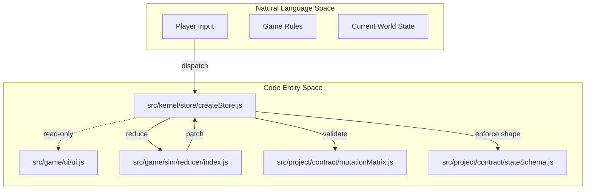
**Sources:** [docs/ARCHITECTURE.md:11-15](), [src/project/contract/manifest.js:1-20]()

### Action Lifecycle and Migration
The system uses an explicit lifecycle to manage the transition from legacy "Cell" logic to the new "Worker" RTS logic.

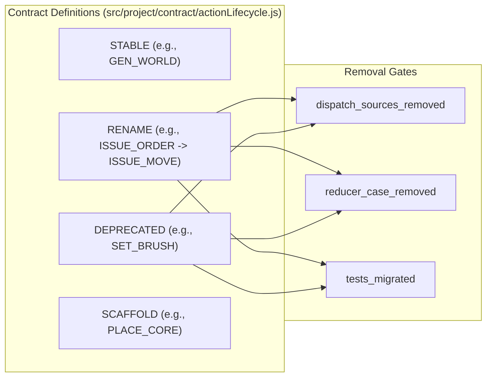
**Sources:** [src/project/contract/actionLifecycle.js:1-13](), [docs/traceability/rebuild-string-matrix.md:7-20]()

## 5. Subsystem Relations

The major subsystems relate through a strict unidirectional flow:
1.  **Contracts** define the allowed state shape and action payloads [src/project/contract/manifest.js]().
2.  **Kernel** provides the execution environment, ensuring that the **Simulation** logic (Reducers/Step) only modifies state via approved patches [docs/ARCHITECTURE.md:18]().
3.  **Renderer** observes the state to draw the grid but has no knowledge of the underlying business logic [docs/ARCHITECTURE.md:14]().
4.  **Testing/Evidence** framework validates that the entire chain remains deterministic and that migrations do not break existing replays [docs/ARCHITECTURE.md:76-81]().

For further exploration, visit the child pages:
*   [Project Purpose and Game Design](#1.1)
*   [Repository Structure and Module Map](#1.2)
*   [Architecture Invariants and Design Principles](#1.3)

---

# Page: Project Purpose and Game Design

# Project Purpose and Game Design

<details>
<summary>Relevant source files</summary>

The following files were used as context for generating this wiki page:

- [README.md](README.md)
- [docs/ARCHITECTURE.md](docs/ARCHITECTURE.md)
- [docs/PRODUCT.md](docs/PRODUCT.md)
- [docs/STATUS.md](docs/STATUS.md)
- [docs/traceability/rebuild-preparation-inventory.md](docs/traceability/rebuild-preparation-inventory.md)
- [docs/traceability/rebuild-string-matrix.md](docs/traceability/rebuild-string-matrix.md)
- [index.html](index.html)
- [package.json](package.json)
- [src/project/contract/actionLifecycle.js](src/project/contract/actionLifecycle.js)
- [src/project/contract/manifest.js](src/project/contract/manifest.js)

</details>


LifeGameLab is a deterministic browser-based Real-Time Strategy (RTS) game built on a seed-based, reproducible simulation engine. The project emphasizes emergent complexity from simple cellular rules, where every game state transition is governed by a strict patch-based kernel to ensure mathematical consistency and replayability.

## 1. Core Concept and Design Philosophy

The game starts with a single worker (historically referred to as a "cell" in legacy code) [README.md:3-5](). Unlike traditional RTS games that rely on complex menus or hidden tutorials, LifeGameLab is designed to teach through consequence [docs/PRODUCT.md:10-12]().

### The Core Tension: Retention vs. Binding
The primary strategic driver is the opportunity cost of workers [README.md:9-14]().
*   **Worker Retention:** Keeping units mobile for manual resource harvesting and rapid expansion.
*   **Worker Binding:** Permanently committing workers into infrastructure, patterns, or automated systems [README.md:80-82]().

Too much early binding leads to economic stagnation, while too much retention prevents the transition to higher technology tiers (T2/T3) [README.md:83-85]().

### Determinism Invariants
The game maintains a "Hard Truth" line through several architectural invariants [docs/ARCHITECTURE.md:10-16]():
1.  **Seed-Based Generation:** The same seed and `MapSpec` always produce the identical world [docs/PRODUCT.md:18-20]().
2.  **No Entropy:** `Math.random()` and `Date.now()` are strictly forbidden within the reducer or simulation step [docs/ARCHITECTURE.md:15]().
3.  **Tick-Rate Stability:** The simulation runs at exactly 24 ticks per second [docs/PRODUCT.md:18]().

## 2. Match Structure and Progression

Matches are categorized by grid size, which defines the "identity" of the gameplay session rather than being a cosmetic setting [docs/PRODUCT.md:23-30]().

| Mode | Grid Size | Description |
| :--- | :--- | :--- |
| **Blitz** | 32x32 | Rapid, small-scale skirmish. |
| **Standard** | 64x64 | Balanced RTS experience. |
| **Krieg** | 128x128 | Large-scale territorial control. |
| **Custom** | Variable | Defined via the `MapBuilder` and `MapSpec`. |

### Phase Progression
The game progresses through distinct phases, beginning with **Phase 0**, which is a locked state where energy does not yet exist [docs/PRODUCT.md:47-50]().

1.  **Phase 0 (Founding):** The player manually delivers five raw plants to found the first Core [docs/PRODUCT.md:15]().
2.  **T1 (Stabilization):** Basic worker-based harvesting and energy generation [README.md:109]().
3.  **T2 (Automation):** Introduction of production infrastructure like harvesters, sawmills, and conveyors. Conveyors consume one worker permanently [docs/PRODUCT.md:63-71]().
4.  **T3 (Mutation):** High-level topology-based combat and specialization using the Mutator building [docs/PRODUCT.md:78-82]().

## 3. Economic Pillars and Infrastructure

The economy is centered around the **Core**, a 4x4 footprint building that serves as the primary resource hub [docs/PRODUCT.md:52-54]().

### Resource Hierarchy
*   **Plants:** Harvested for energy (1 energy per 120 ticks) [docs/PRODUCT.md:39-42]().
*   **Wood:** Produced by processing reproduced trees; competes with plants for Core space [docs/PRODUCT.md:43, 74-75]().
*   **Stone:** A high-tier physical resource becoming relevant at T3 [docs/PRODUCT.md:44]().

### Automation and Patterns
Infrastructure is not selected from a menu. Instead, functions are discovered through patterns formed by worker placement [README.md:88-95](). In T3, specific topology classes (Triangle, Square, Star, etc.) drive combat mutations [docs/PRODUCT.md:89-98]().

## 4. Technical Implementation and Data Flow

The game uses a "Manifest-First" design where the state schema and allowed mutations are defined in a central contract layer [docs/ARCHITECTURE.md:11, 19]().

### System-to-Code Mapping: Action Lifecycle
The transition from legacy "cell" mechanics to the new RTS "worker" mechanics is managed by `actionLifecycle.js`. This file defines the migration status of every gameplay action.

**Action Mapping Diagram**
Title: Action Migration and Reducer Routing
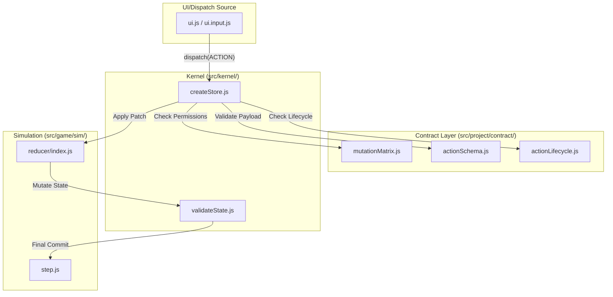
Sources: [src/project/contract/actionLifecycle.js:1-6]() [src/project/contract/manifest.js:11-20]() [docs/ARCHITECTURE.md:18-24]()

### Data Flow: MapSpec to World Generation
World generation is no longer a direct mutation but a deterministic compilation process starting from a `MapSpec`.

**World Generation Pipeline**
Title: Deterministic World Boot Flow
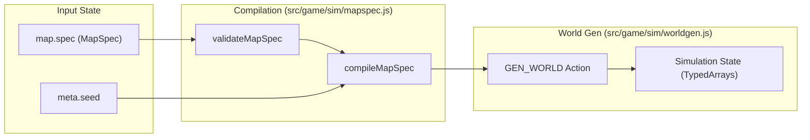
Sources: [docs/STATUS.md:10-12]() [docs/ARCHITECTURE.md:48-52]() [src/project/contract/actionLifecycle.js:60-64]()

### State Domains
The state is divided into four primary domains to ensure persistence and validation boundaries [src/project/contract/actionLifecycle.js:63, 194]():
*   **meta:** Configuration, seed, and grid dimensions.
*   **map:** The `MapSpec` and tile-level design data (persisted) [docs/STATUS.md:17-18]().
*   **world:** Runtime entities (Cores, Workers, Buildings) and resource fields.
*   **sim:** Volatile simulation data (ticks, run phase, current orders).

Sources: [README.md:1-176](), [docs/PRODUCT.md:1-153](), [docs/ARCHITECTURE.md:1-90](), [docs/STATUS.md:1-68](), [src/project/contract/actionLifecycle.js:1-221](), [src/project/contract/manifest.js:1-30]().

---

# Page: Repository Structure and Module Map

# Repository Structure and Module Map

<details>
<summary>Relevant source files</summary>

The following files were used as context for generating this wiki page:

- [docs/ARCHITECTURE.md](docs/ARCHITECTURE.md)
- [docs/ARCHITECTURE_SOT.md](docs/ARCHITECTURE_SOT.md)
- [docs/STATUS.md](docs/STATUS.md)
- [docs/llm/entry/IMPLEMENTATION_CONSTRAINTS.md](docs/llm/entry/IMPLEMENTATION_CONSTRAINTS.md)
- [docs/sot/00_INDEX.md](docs/sot/00_INDEX.md)
- [docs/sot/01_KERNEL_GATES.md](docs/sot/01_KERNEL_GATES.md)
- [docs/sot/02_CONTRACTS.md](docs/sot/02_CONTRACTS.md)
- [docs/sot/03_SIMULATION.md](docs/sot/03_SIMULATION.md)
- [docs/sot/04_RUNTIME_RENDER_UI.md](docs/sot/04_RUNTIME_RENDER_UI.md)
- [docs/sot/05_LLM.md](docs/sot/05_LLM.md)
- [docs/sot/06_TESTS_EVIDENCE_GOVERNANCE.md](docs/sot/06_TESTS_EVIDENCE_GOVERNANCE.md)
- [docs/sot/99_FUNCTION_MATRIX.md](docs/sot/99_FUNCTION_MATRIX.md)
- [docs/traceability/rebuild-preparation-inventory.md](docs/traceability/rebuild-preparation-inventory.md)
- [docs/traceability/rebuild-string-matrix.md](docs/traceability/rebuild-string-matrix.md)
- [package.json](package.json)
- [src/project/contract/actionLifecycle.js](src/project/contract/actionLifecycle.js)
- [src/project/contract/manifest.js](src/project/contract/manifest.js)

</details>


The LifeGameLab repository is organized to enforce a strict separation between the deterministic gameplay kernel, the executable contract definitions, and the read-only presentation layers. This structure ensures that simulation logic remains reproducible across different environments while providing a clear migration path for evolving the game from a cellular automata sandbox into a real-time strategy (RTS) engine.

## Top-Level Directory Layout

The repository follows a manifest-first design where the `src/project/` directory defines the "laws" of the state, and `src/kernel/` enforces them.

| Directory | Purpose | Key Content |
| :--- | :--- | :--- |
| `src/kernel/` | Sole write authority for state. | Store, Patching, Validation, RNG. |
| `src/project/` | Executable Source of Truth (SoT). | Manifest, State/Action Schemas, Mutation Matrix. |
| `src/game/` | Runtime implementation. | Simulation loop, Renderer, UI adapters, Enums. |
| `src/app/` | Orchestration. | Bootstrap, Main Loop, Crash handling. |
| `docs/` | Documentation and Decision Logs. | Product SoT, Architecture SoT, Status, Traceability. |
| `tests/` | Verification suites. | Determinism, Replay, and Contract hardening tests. |
| `tools/` | Developer and LLM tooling. | Evidence runner, Preflight system, Playwright loops. |

**Sources:** [docs/ARCHITECTURE.md:82-90](), [docs/ARCHITECTURE.md:17-24]()

## Module Roles and Data Flow

The system operates on a "Patch-Only" state update model. Data flows from the UI/Sim through a validation pipeline before being committed to the store.

### Module Map Diagram
Title: System Data Flow and Module Boundaries
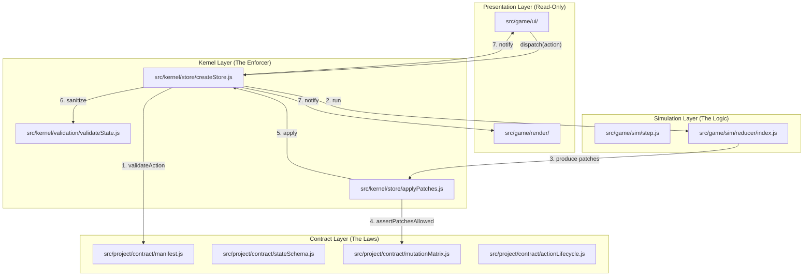
**Sources:** [docs/sot/01_KERNEL_GATES.md:3-10](), [src/kernel/store/createStore.js:58-109](), [docs/ARCHITECTURE.md:10-16]()

## Canonical Module Definitions

### 1. Kernel (`src/kernel/`)
The Kernel is the deterministic heart of the application. It handles the `createStore` lifecycle, ensuring that no non-deterministic entropy (like `Math.random()`) enters the state.
*   **Store:** `createStore.js` manages the state tree and the subscriber model [src/kernel/store/createStore.js:10-109]().
*   **Patching:** `applyPatches.js` implements a subset of JSON Patch with strict path validation [src/kernel/store/applyPatches.js:1-50]().
*   **Validation:** `validateState.js` and `validateAction.js` ensure state remains within schema bounds and actions are well-formed [src/kernel/validation/validateState.js:1-115]().

### 2. Contracts (`src/project/contract/`)
This module is the executable Source of Truth.
*   **Action Lifecycle:** `actionLifecycle.js` tracks the migration status of actions (e.g., `STABLE`, `RENAME`, `DEPRECATED`) and defines "Removal Gates" for legacy code [src/project/contract/actionLifecycle.js:1-57]().
*   **Mutation Matrix:** `mutationMatrix.js` defines which actions are allowed to modify which parts of the state [src/project/contract/manifest.js:3]().
*   **Sim Gate:** `simGate.js` defines the TypedArray memory layout for the simulation world [docs/STATUS.md:37-38]().

### 3. Simulation (`src/game/sim/`)
The simulation implements the game rules.
*   **Reducer:** `reducer/index.js` is the operative path for processing actions into state patches [docs/ARCHITECTURE.md:46-47]().
*   **Step Loop:** Handles the per-tick metabolism, field dynamics, and world systems [docs/sot/03_SIMULATION.md]().
*   **MapSpec:** `mapspec.js` provides deterministic world compilation from high-level descriptors [docs/STATUS.md:39]().

### 4. Rendering & UI (`src/game/render/`, `src/game/ui/`)
*   **Renderer:** A high-performance canvas renderer with motion interpolation [docs/ARCHITECTURE.md:49]().
*   **UI:** A minimal adapter shell that dispatches actions to the store and reads state for display [docs/ARCHITECTURE.md:33-38]().

## Navigation Guide for Contributors

### Mapping System Concepts to Code Entities
Title: Conceptual Mapping to Code Entities
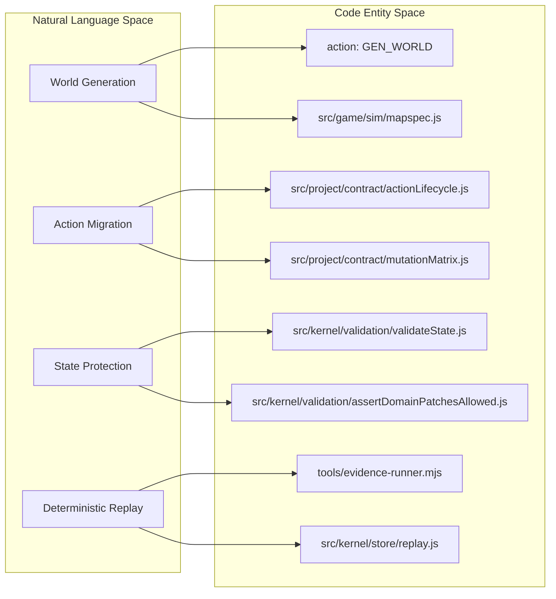
**Sources:** [docs/traceability/rebuild-preparation-inventory.md:11-30](), [docs/sot/06_TESTS_EVIDENCE_GOVERNANCE.md:24-32]()

### Workflow Entry Points
1.  **Adding an Action:** Define it in `actionSchema.js`, set its lifecycle in `actionLifecycle.js`, permit its paths in `mutationMatrix.js`, and implement the logic in `reducer/index.js`.
2.  **Modifying State:** Update `stateSchema.js` and ensure `simGate.js` covers any new world-domain buffers.
3.  **Running Tests:** Use `npm run test:quick` for local validation or `npm run test:truth` to verify against the current deterministic baseline [package.json:12-18]().
4.  **LLM Development:** Contributors using AI must follow the `llm:preflight:start` protocol to synchronize with the task-gate system [package.json:9-11]().

### Traceability Documents
New contributors should consult the `docs/traceability/` directory to understand the current state of the "Slice" migration:
*   `rebuild-string-matrix.md`: Shows the mapping of legacy terms (e.g., `cell`) to new terms (e.g., `worker`) [docs/traceability/rebuild-string-matrix.md:41-55]().
*   `rebuild-preparation-inventory.md`: Lists which modules are scheduled for retirement vs. adaptation [docs/traceability/rebuild-preparation-inventory.md:24-29]().

**Sources:** [docs/STATUS.md:24-25](), [docs/traceability/rebuild-preparation-inventory.md:1-45]()

---

# Page: Architecture Invariants and Design Principles

# Architecture Invariants and Design Principles

<details>
<summary>Relevant source files</summary>

The following files were used as context for generating this wiki page:

- [docs/ARCHITECTURE.md](docs/ARCHITECTURE.md)
- [docs/STATUS.md](docs/STATUS.md)
- [docs/traceability/rebuild-preparation-inventory.md](docs/traceability/rebuild-preparation-inventory.md)
- [docs/traceability/rebuild-string-matrix.md](docs/traceability/rebuild-string-matrix.md)
- [package.json](package.json)
- [src/game/contracts/ids.js](src/game/contracts/ids.js)
- [src/kernel/store/createStore.js](src/kernel/store/createStore.js)
- [src/kernel/store/signature.js](src/kernel/store/signature.js)
- [src/kernel/validation/assertDomainPatchesAllowed.js](src/kernel/validation/assertDomainPatchesAllowed.js)
- [src/kernel/validation/validateState.js](src/kernel/validation/validateState.js)
- [src/project/contract/actionLifecycle.js](src/project/contract/actionLifecycle.js)
- [src/project/contract/actionSchema.js](src/project/contract/actionSchema.js)
- [src/project/contract/dataflow.js](src/project/contract/dataflow.js)
- [src/project/contract/manifest.js](src/project/contract/manifest.js)
- [src/project/contract/mutationMatrix.js](src/project/contract/mutationMatrix.js)
- [src/project/contract/simGate.js](src/project/contract/simGate.js)
- [src/project/contract/stateSchema.js](src/project/contract/stateSchema.js)
- [src/project/project.manifest.js](src/project/project.manifest.js)
- [tests/test-dispatch-error-state-stability.mjs](tests/test-dispatch-error-state-stability.mjs)
- [tests/test-slice-a-contract-scaffold.mjs](tests/test-slice-a-contract-scaffold.mjs)

</details>


This page documents the non-negotiable architectural rules of the LifeGameLab codebase. These invariants ensure system determinism, state integrity, and a clear separation between simulation logic and presentation.

## Core Architectural Invariants

The system is built on five foundational pillars that govern all data flow and state mutations.

| Principle | Description | Implementation Mechanism |
| :--- | :--- | :--- |
| **Manifest-First Design** | The structure and permissions of the system are defined in executable contracts before implementation. | `src/project/contract/` [src/project/contract/manifest.js:1-20]() |
| **Patch-Only Updates** | State cannot be mutated directly; it is updated via atomic JSON-like patches. | `applyPatches` in `src/kernel/store/` [src/kernel/store/createStore.js:70-80]() |
| **Sole Write Authority** | The Kernel is the only component allowed to commit changes to the gameplay state. | `createStore` closure [src/kernel/store/createStore.js:58-118]() |
| **Read-Only UI/Renderer** | Presentation layers receive a frozen state and cannot dispatch direct mutations. | `deepFreeze` on state [src/kernel/store/createStore.js:112-120]() |
| **Zero Entropy** | Non-deterministic sources (e.g., `Math.random`) are strictly forbidden in logic. | `runWithDeterminismGuard` [src/kernel/store/createStore.js:67-70]() |

**Sources:** [docs/ARCHITECTURE.md:10-15](), [src/kernel/store/createStore.js:10-122]()

---

## Data Flow and Authority Model

The system follows a unidirectional data flow where the **Kernel** acts as the arbiter, enforcing constraints defined in the **Contract Layer**.

### System Authority Mapping
This diagram bridges the natural language concepts of "Input" and "Execution" to specific code entities and files.

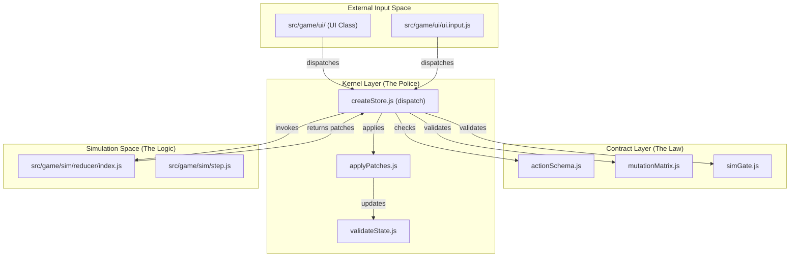
**Sources:** [src/project/contract/dataflow.js:5-45](), [src/kernel/store/createStore.js:58-102](), [docs/ARCHITECTURE.md:17-24]()

---

## Manifest-First Design and Action Lifecycle

LifeGameLab uses a "Manifest-First" approach. Every action must be registered in the `actionSchema` and its allowed mutation paths defined in the `mutationMatrix` before any logic is written in the reducer.

### Action Migration (The Slice Model)
To facilitate the transition from a legacy prototype to a clean RTS architecture, the system uses **Slices** (A, B, C, etc.) and an `actionLifecycle` ledger.

*   **STABLE**: Production-ready actions (e.g., `GEN_WORLD`). [src/project/contract/actionLifecycle.js:60-64]()
*   **RENAME/DEPRECATED**: Actions slated for removal or replacement (e.g., `SET_BRUSH` -> `SELECT_ENTITY`). [src/project/contract/actionLifecycle.js:130-135]()
*   **SCAFFOLD**: New actions defined for future slices but not yet wired to a reducer (e.g., `PLACE_CORE`). [src/project/contract/actionLifecycle.js:211-215]()

### Removal Gates
An action cannot be deleted until it passes four mandatory gates:
1. `dispatch_sources_removed`: No UI or app code triggers it.
2. `reducer_case_removed`: The logic is gone from the simulation.
3. `tests_migrated`: Regression tests cover the replacement.
4. `replacement_wired`: The new action is fully functional.

**Sources:** [src/project/contract/actionLifecycle.js:1-59](), [docs/ARCHITECTURE.md:29-32](), [docs/STATUS.md:49-52]()

---

## State Integrity and Hardening

The Kernel enforces strict isolation to prevent "state drift" or non-deterministic crashes.

### The Validation Pipeline
When an action is dispatched, the following sequence occurs in `createStore.js`:

1.  **Adaptation**: `adaptAction` normalizes legacy inputs. [src/kernel/store/createStore.js:59]()
2.  **Schema Validation**: `validateActionAgainstSchema` rejects invalid payloads. [src/kernel/store/createStore.js:60]()
3.  **Input Guarding**: The current state is cloned and its signature hashed. [src/kernel/store/createStore.js:64-65]()
4.  **Deterministic Execution**: The reducer runs inside `runWithDeterminismGuard` with a scoped RNG. [src/kernel/store/createStore.js:67-70]()
5.  **Mutation Matrix Check**: Patches are compared against `mutationMatrix.js` to ensure the action only touches authorized paths. [src/kernel/store/createStore.js:77]()
6.  **Domain Gate**: `simGate.js` enforces specific data types (e.g., `Float32Array`) and dimensions for the `world` and `sim` domains. [src/kernel/store/createStore.js:78]()
7.  **Sanitization**: `sanitizeBySchema` clamps values and removes non-serializable data. [src/kernel/store/createStore.js:81]()

### Failure Modes (Fail-Closed)
*   **Circular References**: Rejects state with circularity to ensure persistence is always possible. [src/kernel/store/createStore.js:145-160]()
*   **Direct Mutation**: If a reducer modifies the input state instead of returning patches, the Kernel throws an error and rolls back. [tests/test-dispatch-error-state-stability.mjs:53-58]()
*   **Persistence Isolation**: The `storageDriver` receives a deep clone of the state; any mutations inside the driver (e.g., by a malicious plugin) cannot affect the runtime state. [tests/test-dispatch-error-state-stability.mjs:109-114]()

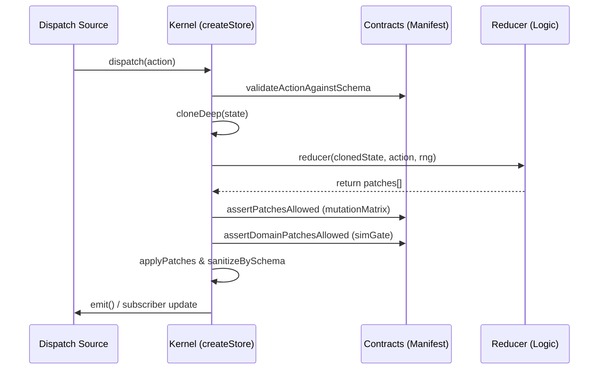
**Sources:** [src/kernel/store/createStore.js:58-118](), [src/project/contract/mutationMatrix.js:1-79](), [tests/test-dispatch-error-state-stability.mjs:9-37]()

---

## Determinism and Entropy Control

To guarantee that a game can be perfectly replayed from a seed, all sources of entropy are replaced by a **Scoped Deterministic RNG**.

*   **Seed Propagation**: The `meta.seed` is combined with the `revisionCount` to create unique, stable entropy for every tick. [src/kernel/store/createStore.js:66]()
*   **Forbidden Globals**: Use of `Math.random()`, `Date.now()`, or `performance.now()` inside the simulation or reducer is strictly prohibited and caught by the `runWithDeterminismGuard`. [docs/ARCHITECTURE.md:15]()
*   **Signature Stability**: Every state change results in a unique FNV-1a hash. If two clients have different hashes for the same `revisionCount`, a "desync" has occurred. [src/kernel/store/createStore.js:44-46]()

**Sources:** [src/kernel/store/createStore.js:66-70](), [docs/ARCHITECTURE.md:15](), [src/kernel/store/signature.js:1-2]()

---

# Page: Deterministic Kernel

# Deterministic Kernel

<details>
<summary>Relevant source files</summary>

The following files were used as context for generating this wiki page:

- [src/core/kernel/hash32.js](src/core/kernel/hash32.js)
- [src/core/kernel/patches.js](src/core/kernel/patches.js)
- [src/core/kernel/persistence.js](src/core/kernel/persistence.js)
- [src/core/kernel/physics.js](src/core/kernel/physics.js)
- [src/core/kernel/rng.js](src/core/kernel/rng.js)
- [src/core/kernel/schema.js](src/core/kernel/schema.js)
- [src/core/kernel/stableStringify.js](src/core/kernel/stableStringify.js)
- [src/core/kernel/store.js](src/core/kernel/store.js)
- [src/game/contracts/ids.js](src/game/contracts/ids.js)
- [src/kernel/determinism/rng.js](src/kernel/determinism/rng.js)
- [src/kernel/store/applyPatches.js](src/kernel/store/applyPatches.js)
- [src/kernel/store/createStore.js](src/kernel/store/createStore.js)
- [src/kernel/store/signature.js](src/kernel/store/signature.js)
- [src/kernel/validation/assertDomainPatchesAllowed.js](src/kernel/validation/assertDomainPatchesAllowed.js)
- [src/kernel/validation/validateState.js](src/kernel/validation/validateState.js)
- [src/project/llm/policy.js](src/project/llm/policy.js)
- [src/project/project.manifest.js](src/project/project.manifest.js)
- [tests/test-dispatch-error-state-stability.mjs](tests/test-dispatch-error-state-stability.mjs)

</details>


The **Deterministic Kernel** is the foundational architectural layer of LifeGameLab. It serves as the **sole write authority** for the game state, ensuring that all mutations are predictable, validated, and reproducible across different environments. By enforcing a strict dispatch-only update pattern and isolating side effects, the kernel guarantees that the simulation remains in sync with the defined contracts.

### Core Responsibilities
- **State Management**: Maintaining the canonical `doc` containing `schemaVersion`, `revisionCount`, and the `state` object [src/kernel/store/createStore.js:24-27]().
- **Action Processing**: Orchestrating the lifecycle of an action from adaptation and validation to patch application [src/kernel/store/createStore.js:58-118]().
- **Integrity Enforcement**: Guarding against non-deterministic entropy (e.g., `Math.random`) and preventing direct state mutations by the reducer or simulation [src/kernel/store/createStore.js:71-73]().
- **Persistence**: Interfacing with storage drivers to save and load state snapshots [src/kernel/store/createStore.js:114]().

### Kernel Architecture Overview

The following diagram illustrates the relationship between the Kernel's internal components and the project-specific logic it executes.

**Kernel Component Interaction**
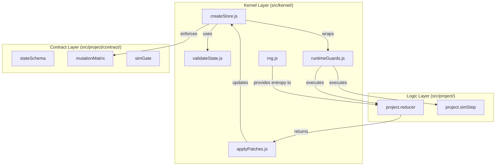
**Sources:** [src/kernel/store/createStore.js:1-8](), [src/project/project.manifest.js:1-12]()

---

### Store and Dispatch Lifecycle
The `createStore` function is the entry point for the kernel. It manages a `dispatch` pipeline that ensures every state change is the result of a discrete, logged action. The lifecycle follows a rigid sequence:
1. **Adapt & Validate**: The action is cleaned via `actionSchema` [src/kernel/store/createStore.js:59-60]().
2. **Reduce**: The `project.reducer` generates a list of JSON patches. This is executed inside a `runWithDeterminismGuard` to block non-deterministic global calls [src/kernel/store/createStore.js:67-70]().
3. **Patch Validation**: Patches are checked against the `mutationMatrix` (path-based permissions) and the `domainPatchGate` (business logic constraints) [src/kernel/store/createStore.js:77-78]().
4. **Apply & Sanitize**: Patches are applied to a draft state, which is then passed through `sanitizeBySchema` to enforce type safety and clamping [src/kernel/store/createStore.js:80-81]().
5. **Sim Step**: If the action is a `SIM_STEP`, the simulation logic is executed to generate further environmental patches [src/kernel/store/createStore.js:83-102]().

For details, see [Store and Dispatch Lifecycle](#2.1).

---

### State Validation and Schema Sanitization
The kernel does not trust the output of the reducer or simulation engine. Every update is forced through a sanitization pipeline defined in `validateState.js`.
- **Fail-Closed Logic**: If a reducer attempts to mutate input state directly instead of returning patches, the dispatch fails and the state is rolled back [tests/test-dispatch-error-state-stability.mjs:54-58]().
- **TypedArray Coercion**: The `sanitizeBySchema` function handles the complex task of resizing and re-allocating `TypedArray` buffers (used for the game grid) based on the `simGate` configuration [src/kernel/validation/validateState.js:36-57]().
- **Mutation Matrix**: Defines exactly which state paths (e.g., `/meta/seed` or `/sim/entities`) a specific action type is allowed to modify [src/kernel/store/createStore.js:61-62]().

For details, see [State Validation and Schema Sanitization](#2.2).

---

### Persistence, Signature, and RNG
To ensure cross-platform determinism and save-game compatibility, the kernel implements a specialized utility suite:
- **State Signatures**: Uses FNV-1a 32-bit hashing and `stableStringify` to create a unique fingerprint of the state. This is used to detect "desyncs" in multiplayer or replay scenarios [src/kernel/store/signature.js:1-14]().
- **Deterministic RNG**: Instead of `Math.random`, the kernel provides `createRngStreamsScoped`. This generator is seeded by the state's `meta.seed` combined with the `revisionCount`, ensuring that the same action at the same point in time always yields the same "random" result [src/kernel/store/createStore.js:66]().
- **Storage Isolation**: The `storageDriver` interface abstracts the persistence layer (e.g., LocalStorage or IndexedDB). The kernel clones the state before passing it to the driver to prevent driver-side mutations from tainting the runtime state [tests/test-dispatch-error-state-stability.mjs:109-114]().

**Dataflow to Persistence**
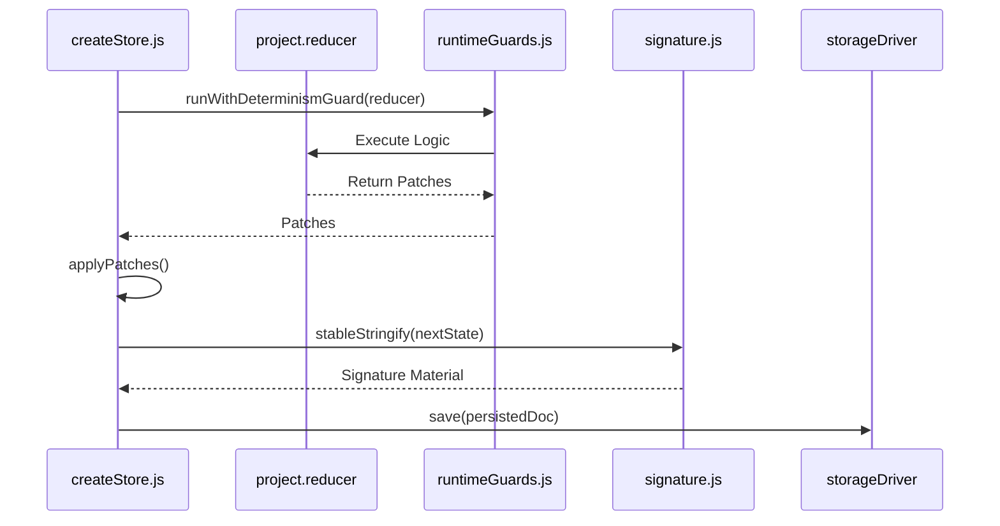
**Sources:** [src/kernel/store/createStore.js:67-114](), [src/kernel/store/signature.js:11-15]()

For details, see [Persistence, Signature, and RNG](#2.3).

---

# Page: Store and Dispatch Lifecycle

# Store and Dispatch Lifecycle

<details>
<summary>Relevant source files</summary>

The following files were used as context for generating this wiki page:

- [src/core/kernel/schema.js](src/core/kernel/schema.js)
- [src/core/kernel/store.js](src/core/kernel/store.js)
- [src/game/contracts/ids.js](src/game/contracts/ids.js)
- [src/kernel/determinism/runtimeGuards.js](src/kernel/determinism/runtimeGuards.js)
- [src/kernel/store/createStore.js](src/kernel/store/createStore.js)
- [src/kernel/store/signature.js](src/kernel/store/signature.js)
- [src/kernel/validation/assertDomainPatchesAllowed.js](src/kernel/validation/assertDomainPatchesAllowed.js)
- [src/kernel/validation/validateState.js](src/kernel/validation/validateState.js)
- [src/project/llm/policy.js](src/project/llm/policy.js)
- [src/project/project.manifest.js](src/project/project.manifest.js)
- [tests/test-contract-no-bypass.mjs](tests/test-contract-no-bypass.mjs)
- [tests/test-dispatch-error-state-stability.mjs](tests/test-dispatch-error-state-stability.mjs)

</details>


The `createStore.js` module implements the core state management engine for LifeGameLab. It enforces a strict, deterministic pipeline for state updates, ensuring that all changes to the game world are traceable, validated against schemas, and isolated from side effects. The store acts as the sole write authority in the system, managing the transition from the current state to the next through a multi-stage dispatch process.

## Dispatch Pipeline Overview

The dispatch process is a synchronous, linear pipeline that transforms an incoming action into a new, committed state. It incorporates validation, deterministic execution, and safety checks to prevent state corruption.

### Pipeline Stages

1.  **Adaptation**: The raw action is passed through an `adaptAction` function to normalize inputs before processing [src/kernel/store/createStore.js:59-59]().
2.  **Validation**: The adapted action is validated against the `actionSchema` to ensure it contains only allowed keys and valid data types [src/kernel/store/createStore.js:60-60]().
3.  **Matrix Check**: The system verifies that the action type exists within the `mutationMatrix`, which defines the allowed state paths the action may modify [src/kernel/store/createStore.js:61-62]().
4.  **Reduction (Deterministic)**: The `project.reducer` is called within a `runWithDeterminismGuard`. It receives a deep clone of the current state and returns a set of patches [src/kernel/store/createStore.js:64-70]().
5.  **Patch Validation**: The generated patches are checked against the `mutationMatrix` [src/kernel/store/createStore.js:77-77]() and the `domainPatchGate` [src/kernel/store/createStore.js:78-78]() to ensure they do not violate architectural boundaries.
6.  **Application & Sanitization**: Patches are applied to create a `nextState`, which is then immediately sanitized via `sanitizeBySchema` to enforce type safety and clamping [src/kernel/store/createStore.js:80-81]().
7.  **Simulation Step (Optional)**: If the action is `SIM_STEP`, the `project.simStep` function is executed to perform physics and cellular logic, generating a second set of patches that follow the same validation and application flow [src/kernel/store/createStore.js:83-102]().
8.  **Commit**: The `revisionCount` is incremented, the new state is frozen, persisted via the `storageDriver`, and listeners are notified [src/kernel/store/createStore.js:104-116]().

### Pipeline Data Flow

Title: Store Dispatch Data Flow
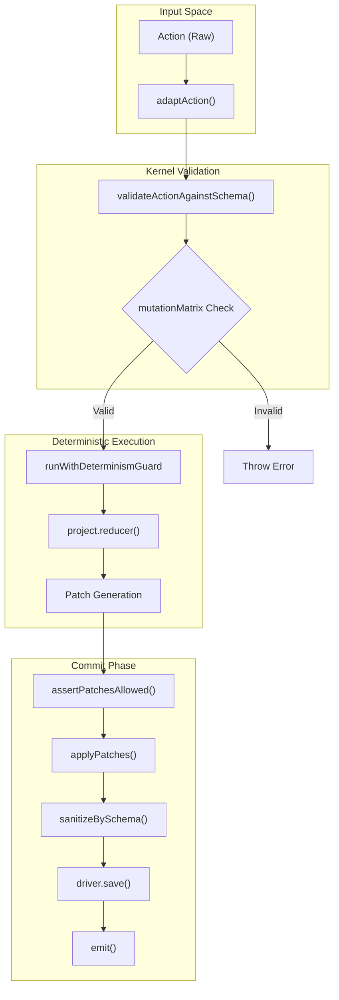
**Sources:** [src/kernel/store/createStore.js:58-118](), [src/kernel/determinism/runtimeGuards.js:1-127]()

## State Isolation and Rollback

The store provides strong guarantees that the state remains stable even if a reducer or simulation step fails.

*   **Deep Cloning**: Before entering the reducer or simulation step, the state is deep-cloned using `cloneDeep` [src/kernel/store/createStore.js:64, 84](). This prevents "leaky" mutations where a function modifies its input object directly.
*   **Mutation Guard**: After the reducer/simStep execution, the kernel verifies that the input state's hash has not changed. If a mutation is detected, an error is thrown [src/kernel/store/createStore.js:71-73, 91-93]().
*   **Rollback on Error**: Because the `doc` variable (holding the current state) is only updated at the very end of the `dispatch` function [src/kernel/store/createStore.js:115](), any error thrown during validation or reduction effectively rolls back the transaction. The internal state remains at the previous `revisionCount` [tests/test-dispatch-error-state-stability.mjs:31-35]().
*   **Deep Freeze**: Once a state is committed, it is passed through `deepFreeze` to prevent any asynchronous or external modifications [src/kernel/store/createStore.js:112, 120]().

### Logic Entity Association

Title: Isolation and Guard Entities
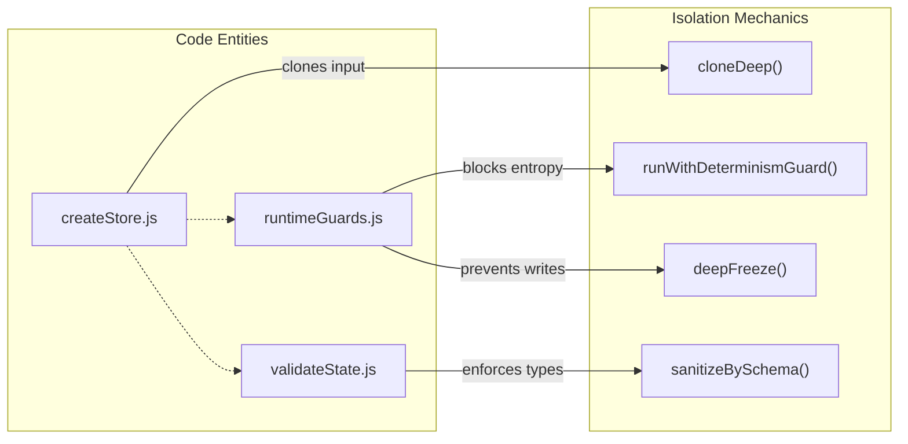
**Sources:** [src/kernel/store/createStore.js:10-20](), [src/kernel/determinism/runtimeGuards.js:129-139](), [src/kernel/validation/validateState.js:1-3]()

## Revision and Signatures

Every successful dispatch increments the `revisionCount`, which serves as the logical clock for the simulation [src/kernel/store/createStore.js:104-108]().

*   **revisionCount**: An integer that tracks the number of committed actions. It is used as part of the salt for the scoped RNG to ensure that the same action type dispatched at different times produces different (but deterministic) results [src/kernel/store/createStore.js:66]().
*   **Signatures**: The store calculates a 32-bit FNV-1a hash of the state (the "signature"). This is used for drift detection and verifying determinism across different environments [src/kernel/store/createStore.js:44-46, 50]().
*   **Signature Material**: A stable, stringified version of the state used to generate the hash, ensuring that key order in objects does not affect the signature [src/kernel/store/createStore.js:51-53]().

## Determinism Guard

The `runWithDeterminismGuard` function wraps execution to block non-deterministic JavaScript features [src/kernel/determinism/runtimeGuards.js:1-12](). During the reducer or simulation phase, the following are disabled:
*   `Math.random()`
*   `Date` (constructors and `Date.now()`)
*   `performance.now()`
*   `crypto.getRandomValues()` and `crypto.randomUUID()`
*   `process.hrtime()` and `process.uptime()` [src/kernel/determinism/runtimeGuards.js:14-111]().

Instead, reducers must use the `rng` provided in the context, which is a deterministic stream seeded by the state's `meta.seed` and the current `revisionCount` [src/kernel/store/createStore.js:66-68]().

## Subscriber Model

The store implements a simple synchronous subscriber model [src/kernel/store/createStore.js:22, 55-56]().
*   **`subscribe(fn)`**: Adds a callback to a `Set` of listeners. Returns an unsubscribe function.
*   **`emit()`**: Iterates through all listeners and executes them after a successful state commit.
*   **Read-Only Access**: Subscribers typically use `getState()` or `getDoc()`, which return clones or frozen copies of the state to maintain isolation [src/kernel/store/createStore.js:48-49]().

**Sources:**
*   `src/kernel/store/createStore.js`
*   `src/kernel/determinism/runtimeGuards.js`
*   `src/kernel/validation/validateState.js`
*   `src/kernel/store/signature.js`
*   `tests/test-dispatch-error-state-stability.mjs`

---

# Page: State Validation and Schema Sanitization

# State Validation and Schema Sanitization

<details>
<summary>Relevant source files</summary>

The following files were used as context for generating this wiki page:

- [src/game/contracts/ids.js](src/game/contracts/ids.js)
- [src/kernel/determinism/runtimeGuards.js](src/kernel/determinism/runtimeGuards.js)
- [src/kernel/store/createStore.js](src/kernel/store/createStore.js)
- [src/kernel/store/signature.js](src/kernel/store/signature.js)
- [src/kernel/validation/assertDomainPatchesAllowed.js](src/kernel/validation/assertDomainPatchesAllowed.js)
- [src/kernel/validation/validateState.js](src/kernel/validation/validateState.js)
- [src/project/contract/actionSchema.js](src/project/contract/actionSchema.js)
- [src/project/contract/dataflow.js](src/project/contract/dataflow.js)
- [src/project/contract/mutationMatrix.js](src/project/contract/mutationMatrix.js)
- [src/project/contract/simGate.js](src/project/contract/simGate.js)
- [src/project/contract/stateSchema.js](src/project/contract/stateSchema.js)
- [src/project/project.manifest.js](src/project/project.manifest.js)
- [tests/test-contract-no-bypass.mjs](tests/test-contract-no-bypass.mjs)
- [tests/test-dispatch-error-state-stability.mjs](tests/test-dispatch-error-state-stability.mjs)
- [tests/test-slice-a-contract-scaffold.mjs](tests/test-slice-a-contract-scaffold.mjs)

</details>


The State Validation and Schema Sanitization subsystem acts as the final gatekeeper for the LifeGameLab kernel. It ensures that any proposed change to the game state—whether from a player action or a simulation step—conforms to the structural, type, and security constraints defined in the project contracts. This layer implements a **fail-closed** architecture where any violation results in an immediate rollback to the last known valid state.

## Validation Pipeline Overview

The validation process is integrated directly into the `dispatch` lifecycle within the kernel's store. It operates in two primary stages: **Structural Sanitization** (ensuring types and defaults) and **Domain Enforcement** (ensuring the logic has permission to write to specific paths).

### Data Flow Diagram: Validation Gate
This diagram shows how an action payload is transformed and verified before being committed to the state.

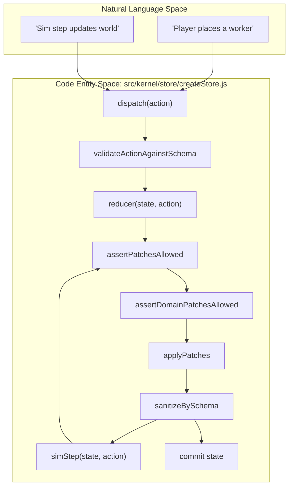
**Sources:** [src/kernel/store/createStore.js:58-118](), [src/project/contract/dataflow.js:47-61]()

---

## Structural Sanitization (`sanitizeBySchema`)

The `sanitizeBySchema` function (imported into `createStore.js`) is responsible for ensuring the state tree matches the shape defined in `stateSchema.js`. It performs several critical tasks:

1.  **Defaulting**: If a key is missing in the current state, the value defined in `stateSchema` is injected [src/project/contract/stateSchema.js:10-100]().
2.  **Clamping and Truncation**: For numeric values with `min`/`max` constraints or strings with `maxLen`, the sanitizer enforces these limits [src/project/contract/actionSchema.js:19-21]().
3.  **TypedArray Coercion**: The kernel uses `TypedArrays` (e.g., `Float32Array`, `Uint8Array`) for high-performance simulation data. The sanitizer ensures these buffers are correctly allocated and sized based on the grid dimensions [src/project/contract/simGate.js:43-65]().
4.  **Deep Freezing**: After sanitization and before the state is made available to the rest of the system, `deepFreeze` is called to prevent accidental mutations outside the dispatch pipeline [src/kernel/store/createStore.js:112-120]().

**Sources:** [src/kernel/store/createStore.js:25-42](), [src/project/contract/stateSchema.js:10-120](), [src/kernel/determinism/runtimeGuards.js:129-140]()

---

## Domain Patch Enforcement

The kernel does not allow arbitrary state updates. Every action is audited against a **Mutation Matrix** and a **Domain Patch Gate**.

### Mutation Matrix Path Enforcement
The `mutationMatrix.js` file defines exactly which state paths an action is permitted to modify. For example, the `SET_SEED` action is only allowed to touch `/meta/seed` [src/project/contract/mutationMatrix.js:48-48](). If a reducer returns a patch for `/world/E` during a `SET_SEED` dispatch, the kernel throws an error and rolls back [src/kernel/store/createStore.js:77-78]().

### Domain Patch Gate (`assertDomainPatchesAllowed`)
While the mutation matrix handles path-level permissions, `assertDomainPatchesAllowed.js` provides logic-based enforcement. It prevents "impossible" transitions, such as:
*   Writing to `world` domains before `GEN_WORLD` has been called.
*   Modifying `sim` counters during a read-only phase.
*   Enforcing `TypedArray` length invariants (e.g., ensuring a `Uint8Array` for the grid matches `gridW * gridH`) [src/project/contract/simGate.js:33-36]().

### Mapping Actions to Permissions
The following diagram bridges the intent of an action to its enforced code-level write permissions.

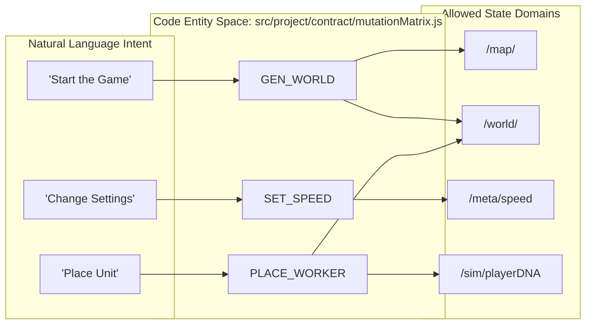
**Sources:** [src/project/contract/mutationMatrix.js:1-79](), [src/project/contract/actionSchema.js:1-64]()

---

## Fail-Closed Logic and Stability

The kernel implements strict isolation to ensure that failed validations do not corrupt the state.

| Security Layer | Implementation Detail | File Reference |
| :--- | :--- | :--- |
| **Input Mutation Guard** | Reducers are passed a deep clone of the state; the kernel verifies the original state remains unchanged after the reducer execution. | [src/kernel/store/createStore.js:64-73]() |
| **Patch Isolation** | Patches returned by reducers are cloned before being applied to prevent reference leaks. | [src/kernel/store/createStore.js:74-75]() |
| **Determinism Guard** | Global non-deterministic objects like `Math.random`, `Date`, and `process.hrtime` are blocked during the validation and reduction phases. | [src/kernel/determinism/runtimeGuards.js:1-111]() |
| **Signature Verification** | After every dispatch, a FNV-1a hash is generated. If validation fails, the signature remains identical to the pre-dispatch state. | [src/kernel/store/createStore.js:44-53]() |

**Sources:** [tests/test-dispatch-error-state-stability.mjs:9-91](), [src/kernel/determinism/runtimeGuards.js:1-127](), [src/kernel/store/createStore.js:128-170]()

---

# Page: Persistence, Signature, and RNG

# Persistence, Signature, and RNG

<details>
<summary>Relevant source files</summary>

The following files were used as context for generating this wiki page:

- [src/core/kernel/hash32.js](src/core/kernel/hash32.js)
- [src/core/kernel/patches.js](src/core/kernel/patches.js)
- [src/core/kernel/persistence.js](src/core/kernel/persistence.js)
- [src/core/kernel/physics.js](src/core/kernel/physics.js)
- [src/core/kernel/rng.js](src/core/kernel/rng.js)
- [src/core/kernel/stableStringify.js](src/core/kernel/stableStringify.js)
- [src/game/contracts/ids.js](src/game/contracts/ids.js)
- [src/kernel/determinism/rng.js](src/kernel/determinism/rng.js)
- [src/kernel/store/applyPatches.js](src/kernel/store/applyPatches.js)
- [src/kernel/store/createStore.js](src/kernel/store/createStore.js)
- [src/kernel/store/persistence.js](src/kernel/store/persistence.js)
- [src/kernel/store/signature.js](src/kernel/store/signature.js)
- [src/kernel/validation/assertDomainPatchesAllowed.js](src/kernel/validation/assertDomainPatchesAllowed.js)
- [src/kernel/validation/validateState.js](src/kernel/validation/validateState.js)
- [src/project/project.manifest.js](src/project/project.manifest.js)
- [tests/test-dispatch-error-state-stability.mjs](tests/test-dispatch-error-state-stability.mjs)

</details>


This page documents the mechanisms ensuring the LifeGameLab kernel remains deterministic, verifiable, and persistent. It covers the platform-agnostic storage interface, the cryptographic-style state signatures used for drift detection, and the scoped random number generation system.

## 1. Persistence and the Storage Driver

The kernel uses a `storageDriver` interface to decouple state management from the underlying environment (Browser, Node.js, or Headless). The driver is responsible for serializing the `doc` object, which contains the `schemaVersion`, `revisionCount`, and the `state` itself.

### Persistence Strategy: Meta vs. Full
To optimize performance and avoid data corruption, the system distinguishes between persistent and ephemeral data:
*   **Persisted (Meta + Map):** Includes user settings, seeds, and map specifications.
*   **Regenerated (World + Sim):** Large `TypedArray` buffers (World) and tick-based statistics (Sim) are not saved to `localStorage` because JSON serialization corrupts `TypedArray` objects and the payload size would impact the frame budget [src/kernel/store/persistence.js:45-55]().

### Driver Implementations
| Driver | Use Case | Behavior |
| :--- | :--- | :--- |
| `createNullDriver` | Headless / Tests | No-op; loads `null` [src/kernel/store/persistence.js:9-13](). |
| `createWebDriver` | Full Persistence | Saves everything to `localStorage`. Warning: Corrupts TypedArrays [src/kernel/store/persistence.js:20-42](). |
| `createMetaOnlyWebDriver` | **Default** | Saves `meta` and `map`. Clears `world` and `sim` on load to trigger regeneration [src/kernel/store/persistence.js:56-90](). |

### Data Flow: Persistence and Store Initialization
The `createStore` function initializes by attempting to load from the driver and then running the state through `sanitizeBySchema` to fill in defaults for missing (ephemeral) domains [src/kernel/store/createStore.js:40-42]().

**Sources:** [src/kernel/store/persistence.js:1-100](), [src/kernel/store/createStore.js:10-43]()

---

## 2. State Signature and Verification

LifeGameLab uses a 32-bit FNV-1a hash to generate a unique "Signature" for the game state. This signature is used to detect non-deterministic drift between different clients or during replay.

### The Signature Pipeline
1.  **`stableStringify(value)`**: A deterministic JSON stringifier that sorts object keys alphabetically and removes all whitespace to ensure identical objects produce identical strings [src/kernel/signature.js:11-16]().
2.  **`hash32(str)`**: Implements the FNV-1a 32-bit algorithm to convert the stable string into an 8-character hex signature [src/kernel/signature.js:1-9]().

### Code Entity Mapping: Signature Logic
The diagram below shows how the signature utility functions are integrated into the `createStore` lifecycle.

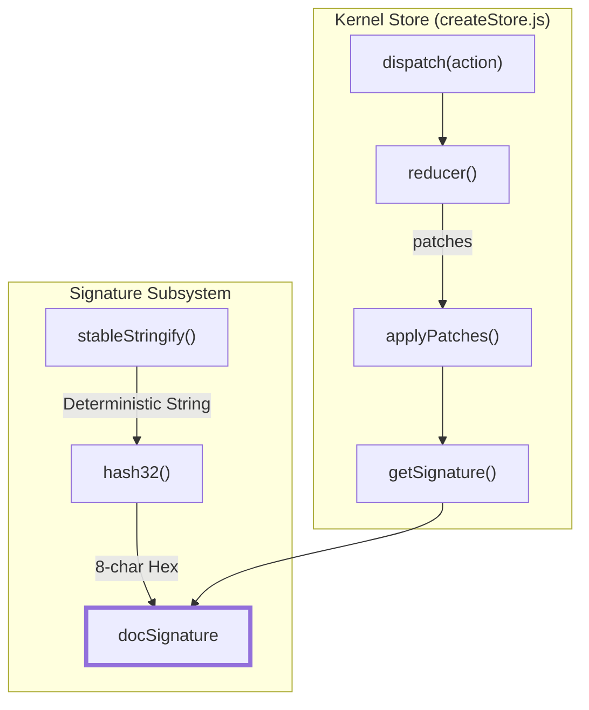
**Sources:** [src/kernel/store/signature.js:1-53](), [src/kernel/store/createStore.js:44-53]()

---

## 3. Scoped Deterministic RNG

To maintain total determinism, the simulation cannot use `Math.random()`. Instead, it uses a seed-based generator that is "scoped" to specific operations and revisions.

### Seeding Logic
The RNG is seeded by a combination of:
1.  **`meta.seed`**: The global seed for the specific match [src/kernel/store/createStore.js:66]().
2.  **`revisionCount`**: The current tick/action index, ensuring different results for the same action at different times [src/kernel/store/createStore.js:66]().
3.  **Scope String**: A unique identifier (e.g., `"reducer:SET_ZONE"`) to prevent cross-contamination between different logic branches [src/kernel/store/createStore.js:66]().

### RNG Lifecycle in Dispatch
During a `dispatch`, the kernel creates isolated RNG streams for both the `reducer` and the `simStep`:

| Phase | Scope Key Template | Context |
| :--- | :--- | :--- |
| **Reducer** | `reducer:${action.type}:${revisionCount}` | Used for probabilistic mutations or spawns [src/kernel/store/createStore.js:66](). |
| **SimStep** | `simStep:${action.type}:${revisionCount}` | Used for cellular metabolism and environmental entropy [src/kernel/store/createStore.js:86](). |

**Sources:** [src/kernel/store/createStore.js:58-102](), [src/kernel/determinism/rng.js:1-20]()

---

## 4. Integrity and Isolation Guarantees

The kernel enforces strict isolation to prevent "side-channel" state corruption.

### Input Mutation Guard
Before and after the `reducer` or `simStep` functions execute, the kernel verifies that the input state was not mutated in-place. It does this by comparing the `hash32` of the state before and after the call [src/kernel/store/createStore.js:65-73](). If a mutation is detected, the kernel throws an error and rolls back [tests/test-dispatch-error-state-stability.mjs:54-58]().

### Reference Copying
When the `storageDriver.save()` is called, the kernel passes a `cloneDeep` copy of the document. This ensures that any accidental mutations performed by the driver (e.g., during serialization) do not affect the live state held in memory [src/kernel/store/createStore.js:113-114]().

### Code Entity Mapping: Integrity Pipeline
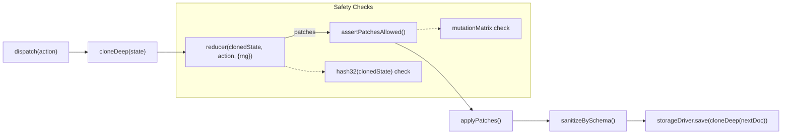
**Sources:** [src/kernel/store/createStore.js:58-118](), [tests/test-dispatch-error-state-stability.mjs:109-115]()

---

# Page: Contract Layer

# Contract Layer

<details>
<summary>Relevant source files</summary>

The following files were used as context for generating this wiki page:

- [docs/ARCHITECTURE.md](docs/ARCHITECTURE.md)
- [docs/STATUS.md](docs/STATUS.md)
- [docs/traceability/rebuild-preparation-inventory.md](docs/traceability/rebuild-preparation-inventory.md)
- [docs/traceability/rebuild-string-matrix.md](docs/traceability/rebuild-string-matrix.md)
- [package.json](package.json)
- [src/project/contract/actionLifecycle.js](src/project/contract/actionLifecycle.js)
- [src/project/contract/actionSchema.js](src/project/contract/actionSchema.js)
- [src/project/contract/dataflow.js](src/project/contract/dataflow.js)
- [src/project/contract/manifest.js](src/project/contract/manifest.js)
- [src/project/contract/mutationMatrix.js](src/project/contract/mutationMatrix.js)
- [src/project/contract/simGate.js](src/project/contract/simGate.js)
- [src/project/contract/stateSchema.js](src/project/contract/stateSchema.js)
- [tests/test-slice-a-contract-scaffold.mjs](tests/test-slice-a-contract-scaffold.mjs)

</details>


The **Contract Layer** serves as the executable Source of Truth (SoT) for the LifeGameLab architecture [docs/ARCHITECTURE.md:5-8](). It defines the shape of the game state, the rules for valid actions, and the permissions for state mutations. By centralizing these definitions in `src/project/contract/`, the system ensures that the [Deterministic Kernel](#2) can enforce strict validation and sanitization without needing to understand specific gameplay mechanics.

## Architecture Role

The contract layer is "Manifest-first" [docs/ARCHITECTURE.md:11](). This means that before a feature is implemented in the simulation or UI, its data structures and action payloads must be defined here. This layer bridges the gap between high-level product requirements and low-level code entities.

### System Mapping: Natural Language to Code Entities

The following diagram illustrates how product concepts map to specific code structures within the contract layer.

**Concept-to-Contract Mapping**
```mermaid
graph TD
    subgraph "Natural Language Space"
        A["'A Worker moves to a tile'"]
        B["'The Grid Size'"]
        C["'TypedArray Memory'"]
    end

    subgraph "Code Entity Space"
        A -->|Validated by| A1["actionSchema.ISSUE_MOVE"]
        A1 -->|Permitted by| A2["mutationMatrix.ISSUE_MOVE"]
        B -->|Defined in| B1["stateSchema.meta.gridW/H"]
        C -->|Layout in| C1["simGate.world.keys"]
    end

    [src/project/contract/actionSchema.js:48]()
    [src/project/contract/mutationMatrix.js:63]()
    [src/project/contract/stateSchema.js:17-18]()
    [src/project/contract/simGate.js:43-65]()

    Sources: [src/project/contract/actionSchema.js](), [src/project/contract/mutationMatrix.js](), [src/project/contract/stateSchema.js](), [src/project/contract/simGate.js]()
```

## Core Modules

The contract layer is composed of several specialized modules, all aggregated and exported via the central manifest [src/project/contract/manifest.js:11-20]().

| Module | Responsibility | Key File |
| :--- | :--- | :--- |
| **State Schema** | Defines the hierarchical shape and default values of the game state. | `stateSchema.js` |
| **Sim Gate** | Defines low-level `TypedArray` memory layouts and validation limits. | `simGate.js` |
| **Action Schema** | Defines the required payload shapes for all dispatchable actions. | `actionSchema.js` |
| **Mutation Matrix** | A whitelist of state paths each action is allowed to modify. | `mutationMatrix.js` |
| **Dataflow** | Audits where actions originate and what they are intended to write. | `dataflow.js` |
| **Action Lifecycle** | Manages the migration and deprecation status of actions. | `actionLifecycle.js` |
| **Identifiers** | Enumerable constants used across the entire codebase. | `ids.js` |

### Dataflow and Permission Pipeline

The kernel uses these contracts to create a "fail-closed" pipeline. If an action's payload does not match the `actionSchema`, or if the resulting state patch targets a path not listed in the `mutationMatrix`, the update is rejected [docs/STATUS.md:5-12]().

**Action Execution Flow**
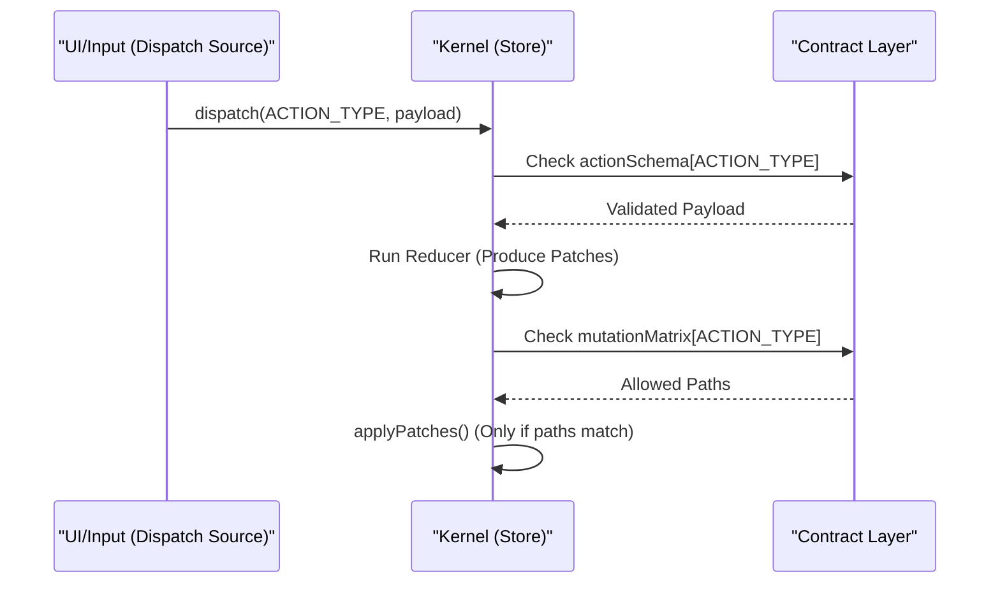
Sources: [src/project/contract/dataflow.js:5-45](), [src/project/contract/mutationMatrix.js:1-79]()

---

## Child Pages

### [State Schema and SimGate](#3.1)
Documents the structural definition of the `meta`, `map`, `world`, and `sim` domains. It details how `simGate.js` manages high-performance `TypedArray` buffers for simulation fields like Energy (`E`), Life (`L`), and Toxin (`P`) [src/project/contract/simGate.js:44-51]().

### [Action Schema, Mutation Matrix, and Dataflow](#3.2)
Covers the validation of action payloads (e.g., `SET_MAPSPEC` [src/project/contract/actionSchema.js:13-27]()) and the `mutationMatrix` which prevents unauthorized state writes (e.g., `SET_SPEED` only allowed to write to `/meta/speed` [src/project/contract/mutationMatrix.js:47]()).

### [Action Lifecycle and Migration Slices](#3.3)
Explains how the project migrates from legacy "Cell" logic to "RTS Worker" logic using `actionLifecycle.js`. It tracks statuses like `STABLE`, `RENAME`, and `DEPRECATED` [src/project/contract/actionLifecycle.js:1-6](), and enforces "Removal Gates" to ensure legacy code is only deleted after replacements are fully wired and tested [src/project/contract/actionLifecycle.js:8-13]().

### [Domain Identifiers and Enums](#3.4)
Centralized documentation for `src/game/contracts/ids.js`. This includes critical constants for game phases (`RUN_PHASE`), win conditions (`WIN_MODE`), and interaction modes (`BRUSH_MODE`) [src/project/contract/stateSchema.js:1-8]().

---
**Sources:**
- [docs/ARCHITECTURE.md:5-20]()
- [docs/STATUS.md:28-41]()
- [src/project/contract/manifest.js:1-30]()
- [src/project/contract/dataflow.js:47-61]()

---

# Page: State Schema and SimGate

# State Schema and SimGate

<details>
<summary>Relevant source files</summary>

The following files were used as context for generating this wiki page:

- [src/game/contracts/ids.js](src/game/contracts/ids.js)
- [src/kernel/store/createStore.js](src/kernel/store/createStore.js)
- [src/kernel/store/signature.js](src/kernel/store/signature.js)
- [src/kernel/validation/assertDomainPatchesAllowed.js](src/kernel/validation/assertDomainPatchesAllowed.js)
- [src/kernel/validation/validateState.js](src/kernel/validation/validateState.js)
- [src/project/contract/actionSchema.js](src/project/contract/actionSchema.js)
- [src/project/contract/dataflow.js](src/project/contract/dataflow.js)
- [src/project/contract/mutationMatrix.js](src/project/contract/mutationMatrix.js)
- [src/project/contract/simGate.js](src/project/contract/simGate.js)
- [src/project/contract/stateSchema.js](src/project/contract/stateSchema.js)
- [src/project/project.manifest.js](src/project/project.manifest.js)
- [tests/test-dispatch-error-state-stability.mjs](tests/test-dispatch-error-state-stability.mjs)
- [tests/test-slice-a-contract-scaffold.mjs](tests/test-slice-a-contract-scaffold.mjs)

</details>


This page documents the structural definition of the game state and the memory layout requirements for the simulation engine. The `stateSchema.js` file defines the high-level domains and default values, while `simGate.js` specifies the precise `TypedArray` requirements for high-performance simulation logic.

## State Schema Architecture

The game state is divided into four primary domains: `meta`, `map`, `world`, and `sim`. The schema enforces data types, default values, and structure during the `sanitizeBySchema` phase of the kernel dispatch cycle [src/kernel/store/createStore.js:81-81]().

### Domain Definitions

| Domain | Purpose | Persistence |
| :--- | :--- | :--- |
| `meta` | Global configuration, seeds, and UI state. | Persisted |
| `map` | Static map specifications and validation status. | Persisted |
| `world` | Dynamic entities and cellular fields (mostly `TypedArrays`). | Regenerated |
| `sim` | Simulation metrics, counters, and phase state. | Regenerated |

### Key Schema Configurations
- **Meta Domain**: Contains `seed` (default: `"life-light"`), `gridW`/`gridH`, and the `migrationSlice` (currently `"slice_b_mapspec"`) [src/project/contract/stateSchema.js:16-21]().
- **Map Domain**: Tracks the `activeSource` (e.g., `"legacy_preset"`) and holds the `compiledHash` for map integrity [src/project/contract/stateSchema.js:74-75]().
- **Sim Domain**: Manages the `runPhase` (using `RUN_PHASE` enums) and simulation counters like `aliveCount` and `playerDNA` [src/project/contract/stateSchema.js:94-170]().

Sources: [src/project/contract/stateSchema.js:10-170](), [src/game/contracts/ids.js:80-87]()

---

## SimGate and Memory Layout

`simGate.js` serves as the contract between the high-level state and the low-performance-sensitive simulation engine. it defines the `TypedArray` (TA) constructors and lengths for every spatial field in the `world` domain.

### World Field Specifications
Most spatial data is stored in flat `TypedArrays` of length `N` (where $N = gridW \times gridH$).

| Key | Type | Constructor | Description |
| :--- | :--- | :--- | :--- |
| `alive` | `ta` | `Uint8Array` | Binary state of cell existence. |
| `E` | `ta` | `Float32Array` | Current Energy levels. |
| `L` | `ta` | `Float32Array` | Light/Luminance field. |
| `R` | `ta` | `Float32Array` | Resource/Nutrient field. |
| `W` | `ta` | `Float32Array` | Waste/Toxin field. |
| `trait` | `ta` | `Float32Array` | Multi-dimensional traits ($N \times 7$). |
| `zoneId`| `ta` | `Uint16Array` | Mapping of cells to specific Zone IDs. |

### Simulation Key Registry
The `simGate.sim.keys` array explicitly lists every allowed property in the simulation domain, categorized by type (`booleanKeys`, `stringKeys`, `objectKeys`) to facilitate automated validation and serialization [src/project/contract/simGate.js:95-115]().

Sources: [src/project/contract/simGate.js:32-116]()

---

## Data Flow and Entity Mapping

The following diagrams illustrate how system names in natural language map to specific code entities and how data flows through the schema-gated pipeline.

### Entity Mapping: Natural Language to Code Space
This diagram maps conceptual game elements to their specific definitions in the contract layer.

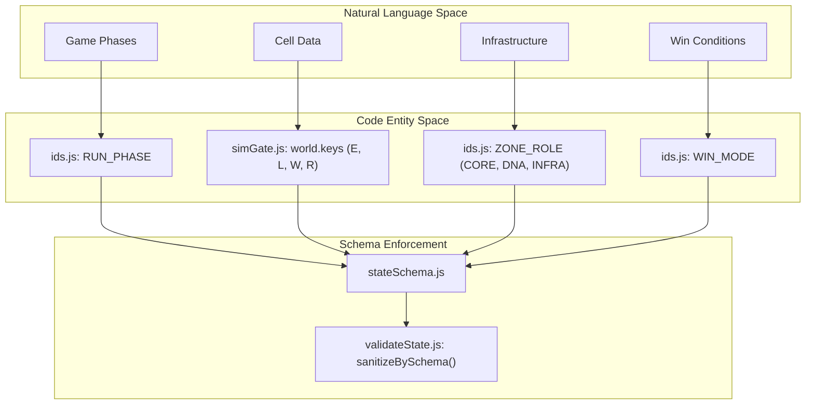
Sources: [src/game/contracts/ids.js:1-87](), [src/project/contract/simGate.js:43-52](), [src/project/contract/stateSchema.js:10-100]()

### State Mutation Pipeline
This diagram shows how the Kernel uses the `mutationMatrix` and `simGate` to protect the state during a `dispatch`.

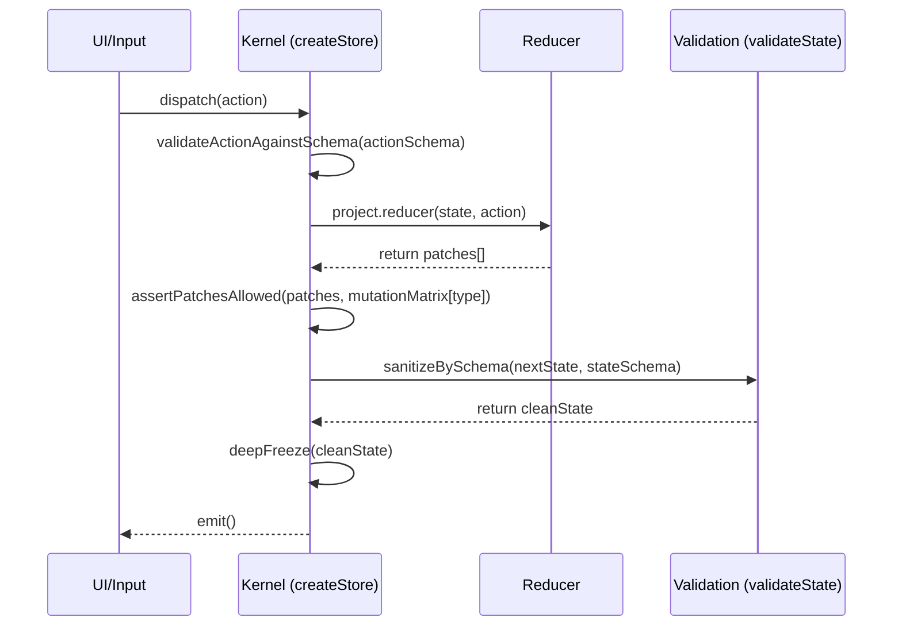
Sources: [src/kernel/store/createStore.js:58-117](), [src/project/contract/mutationMatrix.js:1-79](), [src/project/contract/actionSchema.js:1-64]()

---

## Technical Constraints and Limits

The `simGate` defines hard limits to prevent memory exhaustion and ensure deterministic performance across environments.

- **maxPatches**: 5,000 per dispatch [src/project/contract/simGate.js:34-34]().
- **maxTiles**: 250,000 (equivalent to a 500x500 grid) [src/project/contract/simGate.js:35-35]().
- **traitCount**: Fixed at 7 per cell for the `trait` `Float32Array` [src/project/contract/simGate.js:38-38]().

### Patch Isolation and Cloning
The kernel ensures that any object passed in a patch is deeply cloned and frozen. This prevents "reference leaks" where a reducer might accidentally hold a reference to the live state [tests/test-dispatch-error-state-stability.mjs:152-156]().

Sources: [src/project/contract/simGate.js:33-38](), [src/kernel/store/createStore.js:128-159]()

---

# Page: Action Schema, Mutation Matrix, and Dataflow

# Action Schema, Mutation Matrix, and Dataflow

<details>
<summary>Relevant source files</summary>

The following files were used as context for generating this wiki page:

- [docs/ARCHITECTURE.md](docs/ARCHITECTURE.md)
- [docs/STATUS.md](docs/STATUS.md)
- [docs/traceability/rebuild-preparation-inventory.md](docs/traceability/rebuild-preparation-inventory.md)
- [docs/traceability/rebuild-string-matrix.md](docs/traceability/rebuild-string-matrix.md)
- [package.json](package.json)
- [src/project/contract/actionLifecycle.js](src/project/contract/actionLifecycle.js)
- [src/project/contract/actionSchema.js](src/project/contract/actionSchema.js)
- [src/project/contract/dataflow.js](src/project/contract/dataflow.js)
- [src/project/contract/manifest.js](src/project/contract/manifest.js)
- [src/project/contract/mutationMatrix.js](src/project/contract/mutationMatrix.js)
- [src/project/contract/simGate.js](src/project/contract/simGate.js)
- [src/project/contract/stateSchema.js](src/project/contract/stateSchema.js)
- [tests/test-sim-gate-contract.mjs](tests/test-sim-gate-contract.mjs)
- [tests/test-slice-a-contract-scaffold.mjs](tests/test-slice-a-contract-scaffold.mjs)

</details>


This page documents the contract layer responsible for defining the shape of player interactions, the permissions for state modification, and the audit trail of dispatch sources. These mechanisms form the "Mutation Gate" enforced by the kernel to ensure that only valid, authorized, and serializable data enters the game state.

## 1. Action Schema (`actionSchema.js`)

The `actionSchema.js` file defines the structural requirements for every action payload dispatched to the kernel. It serves as a serialization guard, preventing non-serializable objects (like class instances or circular references) from poisoning the deterministic state [src/project/contract/actionSchema.js:1-64]().

### Implementation Details
Each action type is mapped to a schema object that specifies:
*   **Type**: Usually `object` or `string` [src/project/contract/actionSchema.js:14-63]().
*   **Shape**: A nested definition of allowed keys and their types (e.g., `number`, `boolean`, `string`) [src/project/contract/actionSchema.js:18-24]().
*   **Constraints**: Includes `min`, `max`, `default`, and `int` (integer) requirements for numeric fields [src/project/contract/actionSchema.js:20-22]().
*   **Hardening**: Actions like `SET_MAPSPEC` are strictly hardened to explicit JSON-safe fields rather than allowing unknown properties [docs/STATUS.md:30-31]().

### Payload Validation Flow
The kernel uses `sanitizeBySchema` during the dispatch lifecycle to coerce incoming payloads into the defined shape, clamping values and applying defaults where necessary [src/kernel/validation/validateState.js:31-31]().

Sources: [src/project/contract/actionSchema.js:1-64](), [docs/STATUS.md:30-31](), [src/kernel/validation/validateState.js:31-31]()

---

## 2. Mutation Matrix (`mutationMatrix.js`)

The `mutationMatrix.js` is a declarative map that defines exactly which parts of the state tree an action is permitted to modify. This is the primary "write authority" configuration used by the kernel's `assertDomainPatchesAllowed` check [src/project/contract/mutationMatrix.js:1-79]().

### Matrix Structure
The matrix maps an action type to an array of allowed JSON pointer paths:

| Action Type | Allowed Write Paths (Examples) |
| :--- | :--- |
| `GEN_WORLD` | `/map/`, `/meta/gridW`, `/world/`, `/sim/` |
| `PLACE_WORKER` | `/world/alive`, `/world/E`, `/sim/playerDNA`, `/sim/founderPlaced` |
| `SET_SPEED` | `/meta/speed` |
| `SIM_STEP` | `/meta/simStepCount`, `/world/`, `/sim/` |

### Enforcement Logic
1.  **Dispatch**: An action is sent to the reducer.
2.  **Patch Generation**: The reducer produces a set of RFC 6902 patches.
3.  **Gate Check**: The kernel iterates through every patch. If a patch's `path` does not start with one of the allowed strings in the `mutationMatrix` for that action, the entire transaction is rolled back [src/kernel/store/createStore.js:25-31]().

Sources: [src/project/contract/mutationMatrix.js:1-79](), [docs/STATUS.md:35-35](), [src/kernel/store/createStore.js:25-31]()

---

## 3. Dataflow and Dispatch Audit (`dataflow.js`)

The `dataflow.js` module provides a comprehensive audit of where actions originate within the codebase and links them to their lifecycle status. It is used for both runtime validation and generating developer traceability reports [src/project/contract/dataflow.js:47-60]().

### Dispatch Source Tracking
The `DISPATCH_SOURCES` constant explicitly lists the files allowed to trigger specific actions. This prevents "shadow dispatches" from unauthorized modules [src/project/contract/dataflow.js:5-45]().

**Example Mapping:**
*   `SET_MAPSPEC`: Authorized only from `src/game/ui/ui.js` [src/project/contract/dataflow.js:17-17]().
*   `SET_MAP_TILE`: Authorized only from `src/game/ui/ui.input.js` [src/project/contract/dataflow.js:18-18]().
*   `SIM_STEP`: Authorized from `src/app/main.js` (ticker) and `src/game/ui/ui.input.js` (manual step) [src/project/contract/dataflow.js:12-12]().

Sources: [src/project/contract/dataflow.js:5-60](), [docs/STATUS.md:33-33]()

---

## 4. Action Lifecycle and Migration

Actions in the contract layer carry metadata regarding their migration status from the legacy "Cell" model to the "Worker RTS" model. This is managed in `actionLifecycle.js` [src/project/contract/actionLifecycle.js:59-221]().

### Lifecycle Statuses
*   **STABLE**: Canonical actions (e.g., `GEN_WORLD`, `SIM_STEP`) [src/project/contract/actionLifecycle.js:15-24]().
*   **RENAME**: Actions being phased into new names (e.g., `SET_WORLD_PRESET` -> `SET_MAPSPEC`) [src/project/contract/actionLifecycle.js:26-35]().
*   **DEPRECATED**: Actions slated for removal (e.g., `CONFIRM_FOUNDATION`) [src/project/contract/actionLifecycle.js:37-46]().
*   **NEW_SLICE_A**: Scaffolded actions for future slices (e.g., `PLACE_CORE`) [src/project/contract/actionLifecycle.js:48-57]().

### Removal Gates
An action cannot be removed until it passes four "Removal Gates":
1.  `dispatch_sources_removed`
2.  `reducer_case_removed`
3.  `tests_migrated`
4.  `replacement_wired` [src/project/contract/actionLifecycle.js:8-13]()

Sources: [src/project/contract/actionLifecycle.js:1-221](), [docs/STATUS.md:8-8](), [docs/traceability/rebuild-preparation-inventory.md:37-43]()

---

## 5. Diagrams

### Dataflow: From UI Input to State Patch
This diagram shows how a user interaction is validated against the action schema and mutation matrix before being applied to the store.

Title: "Action Validation and Mutation Gate Dataflow"
```mermaid
graph TD
    subgraph "Natural Language Space (User Intent)"
        "UI_Click"["User clicks to place Worker"]
    end

    subgraph "Code Entity Space (Contract Layer)"
        "UI_Input"["src/game/ui/ui.input.js"]
        "ActionSchema"["src/project/contract/actionSchema.js"]
        "MutationMatrix"["src/project/contract/mutationMatrix.js"]
        "DataflowAudit"["src/project/contract/dataflow.js"]
    end

    subgraph "Kernel Space (Write Authority)"
        "Store_Dispatch"["src/kernel/store/createStore.js:dispatch()"]
        "Validate_State"["src/kernel/validation/validateState.js"]
        "Apply_Patches"["src/kernel/store/applyPatches.js"]
    end

    "UI_Click" --> "UI_Input"
    "UI_Input" -- "Action {type: PLACE_WORKER, payload}" --> "Store_Dispatch"
    
    "Store_Dispatch" -- "1. Check Source" --> "DataflowAudit"
    "Store_Dispatch" -- "2. Sanitize Payload" --> "ActionSchema"
    "Store_Dispatch" -- "3. Reduce to Patches" --> "Reducer"["src/game/sim/reducer/index.js"]
    
    "Reducer" -- "Generated Patches" --> "Validate_State"
    "Validate_State" -- "4. Check Path Permissions" --> "MutationMatrix"
    
    "Validate_State" -- "Approved Patches" --> "Apply_Patches"
    "Apply_Patches" --> "State_Tree"["Immutable State Tree"]
```
Sources: [src/kernel/store/createStore.js:21-40](), [src/project/contract/dataflow.js:5-10](), [src/project/contract/actionSchema.js:1-5](), [src/project/contract/mutationMatrix.js:1-5]()

### Action Migration Lifecycle
This diagram illustrates the transition of actions through different slices and the enforcement of removal gates.

Title: "Action Lifecycle and Migration State Machine"
```mermaid
stateDiagram-v2
    [*] --> "NEW_SLICE_A" : Scaffold defined in actionLifecycle.js
    "NEW_SLICE_A" --> "STABLE" : Reducer wired + Tests passing
    "STABLE" --> "RENAME" : Target replacement identified
    "STABLE" --> "DEPRECATED" : Functionality redundant
    
    state "Removal Gates Check" as Gates {
        direction LR
        "dispatch_sources_removed" --> "reducer_case_removed"
        "reducer_case_removed" --> "tests_migrated"
        "tests_migrated" --> "replacement_wired"
    }

    "RENAME" --> Gates
    "DEPRECATED" --> Gates
    Gates --> [*] : Action removed from actionSchema.js
```
Sources: [src/project/contract/actionLifecycle.js:1-57](), [docs/traceability/rebuild-preparation-inventory.md:37-43](), [docs/STATUS.md:49-52]()

---

# Page: Action Lifecycle and Migration Slices

# Action Lifecycle and Migration Slices

<details>
<summary>Relevant source files</summary>

The following files were used as context for generating this wiki page:

- [docs/ARCHITECTURE.md](docs/ARCHITECTURE.md)
- [docs/LEGACY_CODE_AUDIT.md](docs/LEGACY_CODE_AUDIT.md)
- [docs/STATUS.md](docs/STATUS.md)
- [docs/sot/90_ACTION_WRITE_MATRIX.md](docs/sot/90_ACTION_WRITE_MATRIX.md)
- [docs/traceability/rebuild-preparation-inventory.md](docs/traceability/rebuild-preparation-inventory.md)
- [docs/traceability/rebuild-string-matrix.md](docs/traceability/rebuild-string-matrix.md)
- [package.json](package.json)
- [src/project/contract/actionLifecycle.js](src/project/contract/actionLifecycle.js)
- [src/project/contract/actionSchema.js](src/project/contract/actionSchema.js)
- [src/project/contract/dataflow.js](src/project/contract/dataflow.js)
- [src/project/contract/manifest.js](src/project/contract/manifest.js)
- [src/project/contract/mutationMatrix.js](src/project/contract/mutationMatrix.js)
- [src/project/contract/simGate.js](src/project/contract/simGate.js)
- [src/project/contract/stateSchema.js](src/project/contract/stateSchema.js)
- [tests/test-slice-a-contract-scaffold.mjs](tests/test-slice-a-contract-scaffold.mjs)

</details>


This page documents the formal system for managing the transition from legacy RTS mechanics to the new Slice-based architecture. It details how actions are tracked, renamed, or retired using the `actionLifecycle.js` contract and how "Removal Gates" prevent premature deletion of code.

## Action Lifecycle Statuses

The codebase uses a machine-readable lifecycle state for every action defined in the contract. These statuses dictate whether an action is part of the long-term stable API or a temporary bridge during migration.

| Status | Code Symbol | Description |
| :--- | :--- | :--- |
| **Stable** | `ACTION_LIFECYCLE_STATUS.STABLE` | Canonical actions that remain active in the final architecture (e.g., `GEN_WORLD`, `SIM_STEP`). |
| **Rename** | `ACTION_LIFECYCLE_STATUS.RENAME` | Legacy actions being replaced by a new name with identical or expanded scope (e.g., `ISSUE_ORDER` -> `ISSUE_MOVE`). |
| **Deprecated** | `ACTION_LIFECYCLE_STATUS.DEPRECATED` | Actions slated for total removal once their replacement logic is fully wired (e.g., `CONFIRM_FOUNDATION`). |
| **New Slice A** | `ACTION_LIFECYCLE_STATUS.NEW_SLICE_A` | Scaffolded actions for the new RTS engine that may not yet have full reducer wiring. |

Sources: `[src/project/contract/actionLifecycle.js:1-6]()`, `[src/project/contract/actionLifecycle.js:15-57]()`

## Removal Gates and Metadata

To ensure architectural integrity, no legacy action can be removed from the codebase until it passes four mandatory **Removal Gates**. These gates are tracked in the `removalGates` array within the lifecycle metadata.

### The Four Gates
1.  **`dispatch_sources_removed`**: All UI components, scripts, or internal modules have stopped dispatching this action.
2.  **`reducer_case_removed`**: The logic for this action has been deleted from `src/game/sim/reducer/index.js`.
3.  **`tests_migrated`**: All regression and determinism tests now cover the replacement action instead.
4.  **`replacement_wired`**: The new action is fully functional and handles all responsibilities of the old one.

### Planned Writes
The `plannedWrites` metadata field in `actionLifecycle.js` lists the state paths an action *will* eventually be allowed to modify. This allows the `dataflow.js` module to provide a comprehensive view of the system's intended state-write matrix even before the `mutationMatrix.js` is fully updated.

Sources: `[src/project/contract/actionLifecycle.js:8-13]()`, `[src/project/contract/dataflow.js:47-61]()`, `[docs/STATUS.md:49-52]()`

## Migration Roadmap (Slices A/B/C)

The project migrates in discrete "Slices" to maintain a bootable system at all times.

### Slice A: Contract Scaffolding
Focuses on defining the new RTS action vocabulary (`PLACE_CORE`, `SELECT_ENTITY`, `QUEUE_WORKER`) without necessarily implementing the simulation logic. This establishes the interface for UI and Networking teams.

### Slice B: MapSpec Baseline
Introduces `SET_MAPSPEC` and `SET_MAP_TILE`. It transitions the world generation from opaque "Presets" to a deterministic compilation path where the `map` domain in the store becomes the primary input for `GEN_WORLD`.

### Slice C: Minimal RTS Runtime
The "Worker Hardening" phase. Legacy `PLACE_CELL` is retired in favor of `PLACE_WORKER`. Interaction moves from "Brush Painting" to "Direct RTS Placement" on the canvas.

### Data Flow: Action Lifecycle to Dataflow Registry
The following diagram shows how the `actionLifecycle` metadata is aggregated into the `dataflow` contract to provide a system-wide audit of migration progress.

**Action Metadata Aggregation**
```mermaid
graph TD
    subgraph "Contract Layer"
        AL["actionLifecycle.js"]
        AS["actionSchema.js"]
        MM["mutationMatrix.js"]
        DF["dataflow.js"]
    end

    subgraph "Lifecycle Entities"
        STABLE["STABLE"]
        RENAME["RENAME"]
        DEPR["DEPRECATED"]
        SCAF["NEW_SLICE_A"]
    end

    AL -->|Provides Status| DF
    AL -->|Provides plannedWrites| DF
    AS -->|Provides Payload Shape| DF
    MM -->|Provides Current Writes| DF

    STABLE -.-> AL
    RENAME -.-> AL
    DEPR -.-> AL
    SCAF -.-> AL

    DF -->|Exported as| MANIFEST["manifest.dataflow"]
```
Sources: `[src/project/contract/dataflow.js:1-61]()`, `[src/project/contract/manifest.js:1-20]()`

## Implementation Details

### Action Definition Pattern
Actions are defined using helper functions in `actionLifecycle.js` that enforce the structure of the metadata object.

```javascript
// Example: Deprecating a legacy action
CONFIRM_CORE_ZONE: deprecated(
  "PLACE_CORE",      // Replacement
  "slice_c",         // Target Slice
  "Legacy core-zone confirmation collapses into direct core placement.",
  ["/world/cores", "/sim/runPhase", "/sim/phase0CorePlaced"] // Planned Writes
)
```

### Traceability vs. Truth
While `actionLifecycle.js` is the executable Source of Truth (SoT), the project maintains derived documentation in `docs/traceability/` to assist human developers.
*   `rebuild-string-matrix.md`: Maps old string identifiers to new ones.
*   `rebuild-preparation-inventory.md`: Lists which state keys are being kept, adapted, or deleted.

Sources: `[src/project/contract/actionLifecycle.js:71-76]()`, `[docs/traceability/rebuild-string-matrix.md:1-20]()`, `[docs/traceability/rebuild-preparation-inventory.md:11-23]()`

### System State Transition: From Presets to MapSpec
This diagram illustrates the Slice B transition where `SET_WORLD_PRESET` is replaced by the `MapSpec` compilation flow.

**Slice B: MapSpec Compilation Logic**
```mermaid
graph LR
    subgraph "Legacy Path (Deprecated)"
        SWP["SET_WORLD_PRESET"] -->|Syncs| PRESET["meta.worldPresetId"]
    end

    subgraph "Slice B Path (Stable)"
        SMS["SET_MAPSPEC"] -->|Updates| MS["map.spec"]
        SMT["SET_MAP_TILE"] -->|Updates| MS
    end

    MS -->|Input to| COMP["mapspec.js: compileMapSpec"]
    PRESET -->|Fallback Input| COMP
    
    COMP -->|Produces| SNAP["world.mapSpecSnapshot"]
    SNAP -->|Triggered by| GW["GEN_WORLD"]
    GW -->|Initializes| WORLD["world.* TypedArrays"]
```
Sources: `[src/project/contract/actionLifecycle.js:114-119]()`, `[src/project/contract/actionLifecycle.js:191-200]()`, `[docs/STATUS.md:10-12]()`, `[docs/ARCHITECTURE.md:48-52]()`

## Summary of Active Slices

| Slice | Status | Key Changes |
| :--- | :--- | :--- |
| **Slice A** | Active | RTS Action Scaffolding, `SELECT_ENTITY` and `PLACE_CORE` definitions. |
| **Slice B** | Active | `MapSpec` wiring, `SET_MAP_TILE` builder logic, persistence of `map` state. |
| **Slice C** | In Progress | `PLACE_WORKER` implementation, removal of `PLACE_CELL`, direct canvas placement. |

Sources: `[docs/STATUS.md:3-26]()`, `[docs/ARCHITECTURE.md:26-44]()`

---

# Page: Domain Identifiers and Enums

# Domain Identifiers and Enums

<details>
<summary>Relevant source files</summary>

The following files were used as context for generating this wiki page:

- [src/game/contracts/ids.js](src/game/contracts/ids.js)
- [src/kernel/store/createStore.js](src/kernel/store/createStore.js)
- [src/kernel/store/signature.js](src/kernel/store/signature.js)
- [src/kernel/validation/assertDomainPatchesAllowed.js](src/kernel/validation/assertDomainPatchesAllowed.js)
- [src/kernel/validation/validateState.js](src/kernel/validation/validateState.js)
- [src/project/contract/actionSchema.js](src/project/contract/actionSchema.js)
- [src/project/contract/dataflow.js](src/project/contract/dataflow.js)
- [src/project/contract/mutationMatrix.js](src/project/contract/mutationMatrix.js)
- [src/project/contract/simGate.js](src/project/contract/simGate.js)
- [src/project/contract/stateSchema.js](src/project/contract/stateSchema.js)
- [src/project/project.manifest.js](src/project/project.manifest.js)
- [tests/test-dispatch-error-state-stability.mjs](tests/test-dispatch-error-state-stability.mjs)
- [tests/test-slice-a-contract-scaffold.mjs](tests/test-slice-a-contract-scaffold.mjs)

</details>


This page documents the enumerable constants and domain identifiers defined in `src/game/contracts/ids.js`. These constants serve as the formal vocabulary for the simulation, UI, and contract layers, ensuring that state transitions and logic comparisons remain type-safe and consistent across the codebase.

## Overview and Implementation

All domain identifiers are defined as frozen objects using `Object.freeze()` to prevent runtime mutations [src/game/contracts/ids.js:1-10](). These constants are heavily utilized in:
1.  **State Schema**: Defining default values for the game state [src/project/contract/stateSchema.js:16-26]().
2.  **Action Payloads**: Validating incoming dispatch data [src/project/contract/actionSchema.js:45-63]().
3.  **Simulation Logic**: Determining win/loss conditions and entity behaviors [src/game/contracts/ids.js:231-250]().
4.  **UI/Rendering**: Mapping internal states to user-facing labels and visual modes [src/game/contracts/ids.js:18-27]().

### Data Flow: From Constants to State
The following diagram illustrates how these identifiers propagate from the contract definition into the live game state.

**Identifier Propagation Diagram**
```mermaid
graph TD
    subgraph "Contract Space (ids.js)"
        ID_WIN["WIN_MODE"]
        ID_PHASE["RUN_PHASE"]
        ID_BRUSH["BRUSH_MODE"]
    end

    subgraph "Schema Space (stateSchema.js)"
        S_DEF["stateSchema.shape.meta.brushMode.default"]
        S_PHASE["stateSchema.shape.sim.runPhase.default"]
    end

    subgraph "Kernel Space (createStore.js)"
        K_INIT["sanitizeBySchema()"]
        K_STATE["doc.state"]
    end

    ID_BRUSH -->|"imported by"| S_DEF
    ID_PHASE -->|"imported by"| S_PHASE
    S_DEF -->|"used to initialize"| K_INIT
    S_PHASE -->|"used to initialize"| K_INIT
    K_INIT -->|"populates"| K_STATE
```
Sources: [src/game/contracts/ids.js:1-131](), [src/project/contract/stateSchema.js:1-100](), [src/kernel/store/createStore.js:24-26]()

---

## Core Enums

### WIN_MODE and GAME_RESULT
Defines the terminal states of a match. `WIN_MODE` includes both active player goals and passive failure modes (e.g., "collapses") [src/game/contracts/ids.js:1-10]().

| Constant | Value | Description |
| :--- | :--- | :--- |
| `SUPREMACY` | `"supremacy"` | Player achieves energy dominance. |
| `STOCKPILE` | `"stockpile"` | Territorial/Resource accumulation goal. |
| `EFFICIENCY` | `"efficiency"` | Optimization-based victory. |
| `EXTINCTION` | `"extinction"` | Complete removal of opposing lifeforms. |
| `ENERGY_COLLAPSE`| `"energy_collapse"`| Loss due to net negative energy metabolism. |
| `CORE_COLLAPSE` | `"core_collapse"` | Loss due to destruction of the primary core. |

**Selection & Labeling:**
- `WIN_MODE_SELECTABLE`: Only `SUPREMACY`, `STOCKPILE`, and `EFFICIENCY` can be chosen by players at start [src/game/contracts/ids.js:12-16]().
- `WIN_MODE_RESULT_LABEL`: Maps internal keys to German localized strings for the UI (e.g., `SUPREMACY` -> "Energie-Suprematie") [src/game/contracts/ids.js:18-27]().

### RUN_PHASE
Tracks the progression of the game lifecycle from initialization to the results screen [src/game/contracts/ids.js:80-87]().

- `GENESIS_SETUP`: Initial state before world generation.
- `GENESIS_ZONE`: Placement of the first founder cell.
- `DNA_ZONE_SETUP`: Transition phase where DNA infrastructure is established.
- `RUN_ACTIVE`: The main gameplay loop where the simulation step is active.
- `RESULT`: Post-game state where statistics are displayed.

### ENTITY_KIND and BUILDING_KIND
Used for selecting and identifying objects within the `world` domain [src/game/contracts/ids.js:47-53]().

- **Entity Kinds**: `WORKER`, `FIGHTER`, `CORE`, `BUILDING`.
- **Building Kinds**: Includes `PLANT_HARVESTER`, `REPRODUCER`, `DEFENSE_TOWER`, and `MUTATOR` [src/game/contracts/ids.js:64-78]().

---

## Interaction Enums

### BRUSH_MODE
Determines the behavior of user input (clicks/drags) on the game grid. This is stored in `meta.brushMode` [src/project/contract/stateSchema.js:22]().

| Mode | Context |
| :--- | :--- |
| `OBSERVE` | Default mode; clicking selects entities. |
| `FOUNDER_PLACE`| Initial placement of the first cell. |
| `ZONE_PAINT` | Defining areas for `CORE`, `DNA`, or `INFRA` roles. |
| `WORKER_HARVEST`| Manual removal of workers to reclaim DNA. |
| `LIGHT` / `TOXIN`| Debug/God-mode brushes for field manipulation. |

Sources: [src/game/contracts/ids.js:118-131]()

### ZONE_ROLE
A numerical enum used in the `world.zoneRole` TypedArray to define the functional purpose of a grid tile [src/game/contracts/ids.js:35-40]().

- `NONE` (0): Unassigned.
- `CORE` (1): Vital infrastructure area.
- `DNA` (2): Area dedicated to genetic storage/evolution.
- `INFRA` (3): Area for supportive structures.

---

## Logic and Normalization

### Derived Codes (Risk & Goal)
The system includes functions to derive high-level status codes from raw simulation metrics.

1.  **`deriveRiskCode(sim)`**: Evaluates `meanToxinField` and `playerEnergyNet` to return a `RISK_CODE` (`STABLE`, `TOXIC`, `CRITICAL`, etc.) [src/game/contracts/ids.js:231-240]().
2.  **`deriveGoalCode(sim, tick)`**: Analyzes `playerDNA` and `playerStage` to suggest the next logical objective (e.g., `EVOLUTION_READY` or `GROWTH`) [src/game/contracts/ids.js:242-250]().

### Normalization Functions
To ensure state integrity, the contract provides "normalize" helpers that enforce valid enum values, falling back to defaults if an invalid string is provided.

- `normalizeBrushMode(value, fallback)` [src/game/contracts/ids.js:206-209]()
- `normalizeRunPhase(value, fallback)` [src/game/contracts/ids.js:216-219]()
- `normalizeGameResult(value, fallback)` [src/game/contracts/ids.js:226-229]()

**Logic Flow: Action to Validated State**
```mermaid
graph LR
    A["UI Dispatch (SET_BRUSH)"] --> B["actionSchema Validation"]
    B --> C["Reducer Logic"]
    C --> D["normalizeBrushMode()"]
    D --> E["Kernel: applyPatches()"]
    E --> F["state.meta.brushMode"]
```
Sources: [src/game/contracts/ids.js:206-229](), [src/project/contract/actionSchema.js:40](), [src/kernel/store/createStore.js:78-81]()

---
Sources:
- `src/game/contracts/ids.js`
- `src/project/contract/stateSchema.js`
- `src/project/contract/actionSchema.js`
- `src/kernel/store/createStore.js`
- `src/project/contract/simGate.js`

---

# Page: Simulation Engine

# Simulation Engine

<details>
<summary>Relevant source files</summary>

The following files were used as context for generating this wiki page:

- [src/game/sim/mapspec.js](src/game/sim/mapspec.js)
- [src/game/sim/network.js](src/game/sim/network.js)
- [src/game/sim/playerActions.js](src/game/sim/playerActions.js)
- [src/game/sim/reducer/index.js](src/game/sim/reducer/index.js)
- [src/game/sim/reducer/metrics.js](src/game/sim/reducer/metrics.js)
- [src/game/sim/reducer/worldRules.js](src/game/sim/reducer/worldRules.js)
- [src/game/sim/resources.js](src/game/sim/resources.js)
- [src/game/sim/step.js](src/game/sim/step.js)
- [src/game/sim/stepPhases.js](src/game/sim/stepPhases.js)
- [src/game/sim/worldPresets.js](src/game/sim/worldPresets.js)
- [src/game/sim/worldgen.js](src/game/sim/worldgen.js)

</details>


The **Simulation Engine** is the core execution layer of LifeGameLab, responsible for maintaining the deterministic state of the cellular world. It encompasses world generation, the high-frequency tick loop, player-driven state reductions, and the autonomous AI behavior.

The engine operates on a patch-based model where the [Deterministic Kernel](#2) invokes the simulation's `simStep` and `reducer` to transition the world from one discrete state to the next.

## System Architecture

The simulation is divided into a generation pipeline and a runtime execution loop. The following diagram illustrates the relationship between high-level concepts and the code entities that implement them.

### Simulation Dataflow and Entities
```mermaid
graph TD
    subgraph "Natural Language Space"
        WorldGen["World Generation"]
        TickLoop["Per-Tick Step Loop"]
        PlayerAct["Player Actions"]
        AIOpponent["AI Opponent"]
    end

    subgraph "Code Entity Space"
        worldgen_js["src/game/sim/worldgen.js"]
        step_js["src/game/sim/step.js"]
        stepPhases_js["src/game/sim/stepPhases.js"]
        reducer_js["src/game/sim/reducer/index.js"]
        playerActions_js["src/game/sim/playerActions.js"]
        worldAi_js["src/game/sim/worldAi.js"]
    end

    WorldGen --> worldgen_js
    TickLoop --> step_js
    TickLoop --> stepPhases_js
    PlayerAct --> reducer_js
    PlayerAct --> playerActions_js
    AIOpponent --> worldAi_js

    worldgen_js -- "initializes" --> WorldState["World State (TypedArrays)"]
    step_js -- "updates" --> WorldState
    reducer_js -- "patches" --> WorldState
```
Sources: [src/game/sim/worldgen.js:1-5](), [src/game/sim/step.js:1-15](), [src/game/sim/reducer/index.js:1-30]()

---

## 4.1 World Generation and MapSpec
World generation is a deterministic pipeline that transforms a `MapSpec` (Map Specification) into a fully realized world state. It uses seed-based hashing to ensure that the same parameters always produce the exact same environment.

- **Deterministic Pipeline**: Uses `hashString` and `rng01` to generate descriptors for hotspots, channels, and oases [src/game/sim/worldgen.js:29-62]().
- **Field Synthesis**: Generates base fields for Light (`L`), Water (`water`), and Saturation (`Sat`) based on biome-specific biases [src/game/sim/worldgen.js:76-124]().
- **MapSpec Validation**: The `compileMapSpec` function validates grid dimensions and preset IDs, ensuring they fall within allowed constraints (e.g., 8x8 to 256x256) [src/game/sim/mapspec.js:16-25, 81-100]().

For details, see [World Generation and MapSpec](#4.1).

---

## 4.2 Simulation Step Loop
The `simStep` function is the heartbeat of the engine, executing at a fixed frequency (typically 24 TPS). It follows a multi-phase execution model to maintain stability and performance.

- **Field Phase**: Handles diffusion of light, nutrients, and toxins across the grid [src/game/sim/stepPhases.js:60-82]().
- **Cell Metabolism Phase**: Individual cells calculate energy intake (based on traits and environmental Light/Nutrients) and subtract upkeep costs influenced by toxins and crowding [src/game/sim/step.js:95-110]().
- **Loading Metabolism**: Energy and toxin changes are "smoothed" over time rather than jumping instantly, creating a more fluid simulation [src/game/sim/step.js:112-118]().
- **Network/Link Computation**: Cells build dynamic social links based on hue similarity and trait-based "tolerance," enabling energy sharing across the cluster [src/game/sim/network.js:26-53, 102-122]().

For details, see [Simulation Step Loop](#4.2).

---

## 4.3 Reducer and Player Actions
The `reducer` handles all asynchronous events and player inputs. Unlike the `simStep`, which is automatic, the reducer is triggered by `dispatch` calls.

- **Patch-Based Updates**: The reducer returns a list of RFC6902-like patches to the kernel, which are then applied to the state [src/game/sim/reducer/index.js:190-196]().
- **Player Interactions**: Functions like `handlePlaceWorker` and `handleSetZone` validate player moves against current resources (DNA/Energy) and spatial constraints (connectivity) [src/game/sim/playerActions.js:168-212]().
- **World Expansion**: Automatically triggers grid resizing when the population reaches edge pressure thresholds and sufficient "Expansion Work" has been accumulated [src/game/sim/reducer/worldRules.js:29-80]().

For details, see [Reducer and Player Actions](#4.3).

---

## 4.4 Zone Topology and Infrastructure
The simulation tracks higher-level spatial structures through the Zone system. This allows players to designate areas for specific roles.

- **Canonical Zones**: `deriveCanonicalZoneState` uses BFS (Breadth-First Search) to group contiguous cells into identified zones [src/game/sim/reducer/index.js:182-188]().
- **Zone Roles**: Includes `CORE` (survival), `DNA` (evolution), and `INFRA` (connectivity) [src/game/contracts/ids.js:16]().
- **Infrastructure**: "Committed" infrastructure is represented by a `link` value of 1.0, which persists even if the cell is not currently occupied by a living unit, provided it meets the `COMMITTED_INFRA_THRESHOLD` [src/game/sim/network.js:39-51]().

For details, see [Zone Topology and Infrastructure](#4.4).

---

## 4.5 Evolution, Tech Tree, and AI Opponent
The engine simulates biological progression and competitive pressure.

- **Lineage Memory**: Tracks the "learned" traits and environmental adaptations of a specific cell lineage [src/game/sim/step.js:160]().
- **Tech Tree Operations**: Global learning is merged from the world into a permanent bank, which then unlocks new capabilities or trait bonuses [src/game/sim/reducer/techTreeOps.js:35-39]().
- **AI Opponent**: The `worldAi.js` logic manages the CPU's expansion, resource management, and "Balance Governor" which adjusts difficulty based on player performance [src/game/sim/stepPhases.js:128]().

For details, see [Evolution, Tech Tree, and AI Opponent](#4.5).

---

## 4.6 Progression, Win Conditions, and Loss Modes
The simulation monitors state variables to determine match progression and termination.

- **Win Modes**: Supports multiple victory paths including `SUPREMACY`, `STOCKPILE`, and `EXTINCTION` [src/game/sim/reducer/winConditions.js:46]().
- **Stage Advancement**: Tracks `playerStage` based on "Command Score," which is derived from total population, energy stability, and tech progress [src/game/sim/reducer/progression.js:56]().
- **Loss Modes**: Matches can end in failure if the player's core network decays or vision is completely lost [src/game/contracts/ids.js:12-15]().

For details, see [Progression, Win Conditions, and Loss Modes](#4.6).

### Logic Mapping: Simulation State to Code
| System | Primary Code Entity | Role |
| :--- | :--- | :--- |
| **State Keys** | `WORLD_KEYS` | Defines the TypedArray buffers (E, L, R, W, etc.) [src/game/sim/reducer/metrics.js:3-32]() |
| **Action Handler** | `handlePlaceWorker` | Logic for manual cell placement and cost validation [src/game/sim/playerActions.js:168]() |
| **Physics** | `PHYSICS_DEFAULT` | Constants for diffusion, decay, and metabolic rates [src/game/sim/reducer/index.js:7]() |
| **Expansion** | `expandWorldPreserve` | Reallocates TypedArrays to a larger size while preserving data [src/game/sim/reducer/worldRules.js:82]() |

Sources: [src/game/sim/reducer/metrics.js:3-32](), [src/game/sim/playerActions.js:168](), [src/game/sim/reducer/worldRules.js:82]()

---

# Page: World Generation and MapSpec

# World Generation and MapSpec

<details>
<summary>Relevant source files</summary>

The following files were used as context for generating this wiki page:

- [src/game/sim/mapspec.js](src/game/sim/mapspec.js)
- [src/game/sim/playerActions.js](src/game/sim/playerActions.js)
- [src/game/sim/reducer/index.js](src/game/sim/reducer/index.js)
- [src/game/sim/reducer/metrics.js](src/game/sim/reducer/metrics.js)
- [src/game/sim/reducer/worldRules.js](src/game/sim/reducer/worldRules.js)
- [src/game/sim/worldPresets.js](src/game/sim/worldPresets.js)
- [src/game/sim/worldgen.js](src/game/sim/worldgen.js)
- [tests/test-mapspec-dispatch-sources.mjs](tests/test-mapspec-dispatch-sources.mjs)

</details>


The World Generation and MapSpec system provides a deterministic pipeline for creating and configuring the game environment. It bridges high-level biome definitions with low-level `TypedArray` memory allocations, ensuring that every player starts with an identical world state given the same seed and parameters.

## World Generation Pipeline

The generation process in `worldgen.js` follows a multi-stage deterministic sequence. It utilizes a seed-based RNG to create descriptors that influence the synthesis of environmental fields.

### 1. Descriptor Creation
The `makeWorldDescriptor` function generates a structural blueprint of the world [src/game/sim/worldgen.js:29-62](). This includes:
*   **Hotspots**: Gaussian centers that influence light and fertility [src/game/sim/worldgen.js:32-41]().
*   **Channels**: Linear segments defining water corridors or rivers [src/game/sim/worldgen.js:43-49]().
*   **Oases**: Localized water concentrations [src/game/sim/worldgen.js:51-60]().

### 2. Field Synthesis
Based on the descriptor, several `Float32Array` fields are synthesized:
*   **Light Field (`L`)**: Built using Gaussian hotspots and preset-specific biases [src/game/sim/worldgen.js:76-90]().
*   **Water Field (`water`)**: Determined by proximity to segments (channels) and oases [src/game/sim/worldgen.js:92-124]().
*   **Fertility Field (`baseSat`)**: Derived from moisture and light, providing the baseline saturation for cellular growth [src/game/sim/worldgen.js:136-160]().

### 3. Biome Assignment
Every tile is assigned a `biomeId` based on the local interaction of light, water, and fertility [src/game/sim/worldgen.js:126-134](). Biomes include `barren_flats`, `riverlands`, `wet_forest`, `dry_plains`, and `toxic_marsh` [src/game/sim/worldPresets.js:15-21]().

### Data Flow: Generation to State
The following diagram illustrates how natural language concepts (Presets) are transformed into Code Entities (Fields/TypedArrays).

**World Generation Data Flow**
```mermaid
graph TD
    subgraph "Natural Language Space"
        A["World Preset (e.g., 'river_delta')"]
        B["Seed String"]
    end

    subgraph "Code Entity Space: worldgen.js"
        A --> C["getWorldPreset()"]
        B --> D["hashString()"]
        C --> E["makeWorldDescriptor()"]
        D --> E
        E --> F["buildLightField()"]
        E --> G["buildWaterField()"]
        F --> H["deriveBaseFields()"]
        G --> H
        H --> I["assignBiome()"]
    end

    subgraph "State Domain: world"
        I --> J["world.biomeId (Int8Array)"]
        F --> K["world.L (Float32Array)"]
        G --> L["world.water (Float32Array)"]
        H --> M["world.baseSat (Float32Array)"]
    end
```
Sources: [src/game/sim/worldgen.js:1-160](), [src/game/sim/worldPresets.js:31-234]()

## MapSpec and Validation

The `MapSpec` (Map Specification) is a configuration object that defines the constraints and dimensions of a match. It is the primary interface for the UI to request specific world configurations.

### MapSpec Structure
A compiled `MapSpec` includes:
*   **`version`**: Canonical version string (e.g., `gdd_v1_1`) [src/game/sim/mapspec.js:4]().
*   **`mode`**: Either `legacy_preset` or `manual` [src/game/sim/mapspec.js:11-14]().
*   **`gridW` / `gridH`**: Dimensions clamped between 8 and 256 [src/game/sim/mapspec.js:17-25]().
*   **`compiledHash`**: An FNV-1a hash of the stable-stringified specification used for signature verification [src/game/sim/mapspec.js:83-89]().

### Compilation and Overrides
The function `compileMapSpec` validates the input and generates a snapshot [src/game/sim/mapspec.js:81-100](). During the `GEN_WORLD` action, `applyMapSpecOverrides` is called to merge preset-specific physics into the global state [src/game/sim/reducer/index.js:5-7](), [src/game/sim/worldPresets.js:258-265]().

**MapSpec Dispatch and Validation**
```mermaid
graph LR
    subgraph "UI Layer"
        UI["ui.js"] -- "dispatch({type: 'SET_MAPSPEC'})" --> K["Kernel Store"]
    end

    subgraph "Logic: mapspec.js"
        K --> V["validateMapSpec()"]
        V --> C["compileMapSpec()"]
        C --> H["hash32(stableStringify)"]
    end

    subgraph "State: map domain"
        H --> S["state.map.compiledHash"]
        C --> SP["state.map.spec"]
    end
```
Sources: [src/game/sim/mapspec.js:41-100](), [tests/test-mapspec-dispatch-sources.mjs:10-22]()

## World Presets and Phase Gates

Presets in `worldPresets.js` define not just environmental biases, but also gameplay constraints known as Phase Gates.

### Biome and Physics Configuration
Presets like `dry_basin` or `river_delta` override default physics constants (e.g., `L_mean`, `T_survive`) to create distinct difficulty profiles [src/game/sim/worldPresets.js:74-81](), [src/game/sim/worldPresets.js:125-131]().

### Phase Gate Definitions
Presets define specific costs and mechanics for different game phases:
*   **Phase C**: DNA placement budgets and yield scales [src/game/sim/worldPresets.js:43-48]().
*   **Phase D**: Infrastructure build costs and vision radii for different zone roles [src/game/sim/worldPresets.js:49-55]().
*   **Phase E**: Weights for pattern bonuses (e.g., `line`, `block`, `loop`) [src/game/sim/worldPresets.js:56-72]().

| Preset ID | Key Characteristic | Core Unlock Cost | Vision Radius (Core) |
| :--- | :--- | :--- | :--- |
| `river_delta` | High water corridor | 12 Energy | 2 |
| `dry_basin` | High light pressure | 16 Energy | 2 |
| `wet_meadow` | Organic growth | 10 Energy | 2 |
| `smoke_sprint` | Fast demo path | 8 Energy | 2 |

Sources: [src/game/sim/worldPresets.js:31-234](), [src/game/sim/reducer/index.js:217-220]()

## Dynamic World Expansion

The world can grow dynamically during simulation via `expandWorldPreserve`. This process reallocates all `TypedArray` buffers to new dimensions while preserving existing cell data and spatial relationships.

### Expansion Logic
1.  **Work Accumulation**: `expansionWorkGain` calculates progress based on births, diversity, and evolution stage [src/game/sim/reducer/worldRules.js:4-20]().
2.  **Cost Scaling**: `expansionWorkCost` increases the requirement based on current grid size and previous expansion counts [src/game/sim/reducer/worldRules.js:22-27]().
3.  **Trigger**: `shouldAutoExpand` checks if the work threshold is met and if there is "edge pressure" (cells touching the boundaries) [src/game/sim/reducer/worldRules.js:29-80]().
4.  **Preservation**: `expandWorldPreserve` creates new buffers and uses `.set()` on `TypedArray` subarrays to center the old map within the new, larger grid [src/game/sim/reducer/worldRules.js:82-149]().

Sources: [src/game/sim/reducer/worldRules.js:1-150]()

---

# Page: Simulation Step Loop

# Simulation Step Loop

<details>
<summary>Relevant source files</summary>

The following files were used as context for generating this wiki page:

- [src/game/sim/network.js](src/game/sim/network.js)
- [src/game/sim/reducer/metrics.js](src/game/sim/reducer/metrics.js)
- [src/game/sim/reducer/worldRules.js](src/game/sim/reducer/worldRules.js)
- [src/game/sim/resources.js](src/game/sim/resources.js)
- [src/game/sim/step.js](src/game/sim/step.js)
- [src/game/sim/stepPhases.js](src/game/sim/stepPhases.js)
- [src/game/sim/worldPresets.js](src/game/sim/worldPresets.js)
- [src/game/sim/worldgen.js](src/game/sim/worldgen.js)

</details>


The Simulation Step Loop is the core engine of LifeGameLab, responsible for advancing the game state by one discrete tick. It implements a deterministic, three-phase execution model that simulates field diffusion, cellular metabolism, and high-level world systems. The simulation is designed around a "Loading" metabolism where energy and toxin levels flow smoothly between states rather than jumping instantaneously.

## Three-Phase Execution Model

The simulation tick is orchestrated in `simStep` [src/game/sim/step.js:15-15](), which delegates work to three distinct phases defined in `stepPhases.js`. This separation ensures that field updates (like light and nutrients) are calculated consistently before cells consume them.

### 1. Field Phase
The Field Phase handles the "physics" of the environment. It calculates the availability of resources across the grid.
*   **Diffusion**: Light (`L`), Nutrients (`R`), and Toxins (`W`) are diffused across the grid using the `diffuse` function [src/game/sim/stepPhases.js:65-70]().
*   **Resource Generation**: Nutrients are generated based on plant density (`P`) and the physics constant `R_gen` [src/game/sim/stepPhases.js:68-68]().
*   **Biocharge**: The Biocharge field (`B`) is updated based on light levels and cellular metabolic activity [src/game/sim/stepPhases.js:72-78]().
*   **Saturation Recovery**: Soil saturation (`Sat`) moves toward its `baseSat` value, influenced by plant presence and light pressure [src/game/sim/stepPhases.js:94-94]().

### 2. Cell Metabolism Phase
This phase iterates through every cell to compute individual life cycles.
*   **Energy Intake**: Cells absorb energy based on light (`L`), nutrient uptake (`R`), and lineage-specific traits [src/game/sim/step.js:96-99]().
*   **Upkeep**: Energy is consumed by base upkeep, toxin pressure, and network maintenance costs. Crowding penalties are applied if a cell has many neighbors [src/game/sim/step.js:102-107]().
*   **Toxin Dynamics**: Toxins (`W`) accumulate based on cellular activity and are mitigated by lineage-specific toxin resistance traits [src/game/sim/step.js:112-117]().
*   **Birth Loading**: Instead of instant reproduction, cells accumulate energy in a "birth loading" mechanism. Once the `birthCostThreshold` is exceeded, a new cell is initialized in an adjacent empty tile [src/game/sim/step.js:161-167]().

### 3. World Systems Phase
The final phase handles aggregate logic and structural updates.
*   **Plant Lifecycle**: Updates the growth and decay of the plant field [src/game/sim/stepPhases.js:126-126]().
*   **Network & Links**: Recomputes social links between cells and updates the `clusterField` [src/game/sim/stepPhases.js:130-130]().
*   **Visibility**: Updates the player's `visibility` and `explored` masks based on the location of cells within specific Zone Roles (CORE, DNA, INFRA) [src/game/sim/stepPhases.js:33-58]().

**Sources:** [src/game/sim/step.js:15-170](), [src/game/sim/stepPhases.js:60-160](), [src/game/sim/network.js:26-122]()

## Cellular Lifecycle and Metabolism

The metabolism uses a "Loading" model where state changes are smoothed over time.

| Component | Logic | Code Entity |
| :--- | :--- | :--- |
| **Energy In** | `(Light * Trait + Nutrients * Uptake) * NexusBonus` | `energyPotIn` [src/game/sim/step.js:96]() |
| **Upkeep** | `Base + ToxinPenalty + NetworkCost + Activity + Crowding` | `upkeepVal` [src/game/sim/step.js:102]() |
| **Toxin Build** | `Activity * TransferRate / ToxinResistance` | `W[i]` [src/game/sim/step.js:117]() |
| **Death** | Triggered by starvation, toxin saturation, or isolation | `alive[i] = 0` [src/game/sim/step.js:150]() |

**Sources:** [src/game/sim/step.js:95-158](), [src/game/sim/resources.js:28-31]()

## Network and Visibility

### Network Computation
The network system computes `link` values between adjacent cells.
1.  **Social Pairing**: Cells check neighbors for "Social Similarity" based on `hue` distance and `tolerance` traits [src/game/sim/network.js:17-24]().
2.  **Link Building**: If similarity is high, cells spend energy to build a `link` [src/game/sim/network.js:82-100]().
3.  **Energy Transfer**: Established links allow energy to flow from high-energy cells to low-energy neighbors, stabilizing the cluster [src/game/sim/network.js:104-121]().

### Visibility (Fog of War)
Visibility is calculated every tick based on the player's infrastructure:
*   **CORE Zones**: Provide `visionRadiusCore`.
*   **DNA Zones**: Provide `visionRadiusDNA`.
*   **INFRA Zones**: Provide `visionRadiusInfra`.

The `recomputeVisibility` function clears the current visibility mask and performs a circular scan around every player-owned cell located in a valid zone [src/game/sim/stepPhases.js:45-54]().

**Sources:** [src/game/sim/network.js:26-122](), [src/game/sim/stepPhases.js:33-58]()

## Data Flow: Logic to State Entities

The following diagram bridges the natural language concepts of the simulation to the specific TypedArray entities in the `world` state.

### Simulation Entity Mapping
```mermaid
graph TD
    subgraph "Natural Language Space"
        N1["Light Exposure"]
        N2["Metabolic Energy"]
        N3["Environmental Toxins"]
        N4["Social Connectivity"]
        N5["Cellular Identity"]
    end

    subgraph "Code Entity Space (world state)"
        C1["world.L (Float32Array)"]
        C2["world.E (Float32Array)"]
        C3["world.W (Float32Array)"]
        C4["world.link (Float32Array)"]
        C5["world.lineageId (Uint32Array)"]
        C6["world.hue (Float32Array)"]
    end

    N1 --> C1
    N2 --> C2
    N3 --> C3
    N4 --> C4
    N5 --> C5
    N5 --> C6

    subgraph "Logic Functions"
        F1["runFieldPhase()"]
        F2["simStep()"]
        F3["computeClusterAndLinks()"]
    end

    F1 -- "updates" --> C1
    F1 -- "updates" --> C3
    F2 -- "updates" --> C2
    F3 -- "updates" --> C4
```
**Sources:** [src/game/sim/reducer/metrics.js:3-32](), [src/game/sim/step.js:15-22](), [src/game/sim/stepPhases.js:60-61]()

## Execution Sequence

This diagram illustrates the sequential flow of data through the three phases of the simulation loop.

### Simulation Execution Pipeline
```mermaid
sequenceDiagram
    participant K as Kernel (dispatch)
    participant S as simStep (step.js)
    participant FP as Field Phase (stepPhases.js)
    participant CM as Cell Metabolism (step.js)
    participant WS as World Systems (stepPhases.js)

    K->>S: Calls simStep(world, physics, tick)
    S->>FP: runFieldPhase()
    Note over FP: Diffuse L, R, W<br/>Update Saturation
    FP-->>S: Returns field sums (sumR, sumSat)

    loop Every Grid Tile
        S->>CM: Calculate Energy In/Out
        S->>CM: Update Toxin Pressure
        S->>CM: Check Death/Birth Conditions
    end

    S->>WS: runWorldSystemsPhase()
    Note over WS: applyPlantLifecycle()<br/>computeClusterAndLinks()<br/>recomputeVisibility()
    WS-->>S: Returns metrics (plantsPruned)
    
    S-->>K: Returns updated world state
```
**Sources:** [src/game/sim/step.js:15-58](), [src/game/sim/stepPhases.js:60-134]()

---

# Page: Reducer and Player Actions

# Reducer and Player Actions

<details>
<summary>Relevant source files</summary>

The following files were used as context for generating this wiki page:

- [src/game/plugin/gates.js](src/game/plugin/gates.js)
- [src/game/sim/mainRunActions.js](src/game/sim/mainRunActions.js)
- [src/game/sim/mapspec.js](src/game/sim/mapspec.js)
- [src/game/sim/playerActions.js](src/game/sim/playerActions.js)
- [src/game/sim/reducer.js](src/game/sim/reducer.js)
- [src/game/sim/reducer/index.js](src/game/sim/reducer/index.js)
- [src/game/sim/shared.js](src/game/sim/shared.js)

</details>


The simulation state in LifeGameLab is managed through a patch-based reducer pattern. Instead of returning a full new state object, the reducer generates a set of discrete operations (patches) that the kernel applies to the store. This architecture ensures strict validation of state transitions and enables deterministic replays.

## Reducer Pattern and Dispatch Paths

The primary reducer resides in `src/game/sim/reducer/index.js` [src/game/sim/reducer/index.js:1-6]() and handles high-level lifecycle actions and world-altering events.

### Key Dispatch Paths

| Action Type | Description | Primary Implementation |
|:---|:---|:---|
| `GEN_WORLD` | Triggers the deterministic world generation pipeline using a provided seed and MapSpec. | `generateWorld` [src/game/sim/reducer/index.js:5-5]() |
| `SIM_STEP` | Advances the simulation by one tick, executing field physics and cellular metabolism. | `simStep` [src/game/sim/reducer/index.js:6-6]() |
| `SET_MAPSPEC` | Updates the dimensions and biome configuration for the next world generation. | `compileMapSpec` [src/game/sim/mapspec.js:81-81]() |
| `PLACE_WORKER` | Handles player interaction for placing or removing cells. | `handlePlaceWorker` [src/game/sim/playerActions.js:168-168]() |
| `SET_ZONE` | Assigns specific roles (CORE, DNA, INFRA) to tiles within player-controlled territory. | `handleSetZone` [src/game/sim/playerActions.js:374-374]() |

### Data Flow: Action to Patch
The reducer follows a strict "Read-Transform-Patch" flow to maintain invariants:
1.  **Extract**: Pull current values from `state.world` (TypedArrays) and `state.sim` (Objects).
2.  **Validate**: Check action payloads against game rules (e.g., DNA costs, connectivity).
3.  **Compute**: Calculate new values or clone TypedArrays for modification.
4.  **Patch**: Return an array of objects with `{ op, path, value }` [src/game/plugin/gates.js:52-58]().

**Sources:** [src/game/sim/reducer/index.js:1-59](), [src/game/sim/playerActions.js:168-180](), [src/game/plugin/gates.js:30-60]()

---

## Player Actions and World Interaction

Player actions are encapsulated in `playerActions.js` and are responsible for mutating the game world while enforcing economic and spatial constraints.

### handlePlaceWorker
This function manages the lifecycle of manual cell placement. It supports two distinct phases:
*   **Genesis Setup**: Allows placement within a `startWindow` defined by the world preset [src/game/sim/playerActions.js:207-212](). It enforces connectivity using `areFounderTilesConnected8` to ensure the initial colony is a single contiguous cluster [src/game/sim/reducer/index.js:68-92]().
*   **Active Run**: During gameplay, placement requires a DNA cost (default 0.5) and must be adjacent to existing player-controlled cells [src/game/sim/playerActions.js:195-197]().

### handleSetZone
Assigns a `ZONE_ROLE` to specific coordinates.
*   **Connectivity Check**: Infrastructure and DNA zones must maintain a path to a `CORE` zone [src/game/sim/playerActions.js:400-410]().
*   **Infrastructure Pathing**: Uses BFS-based connectivity checks (`areIndicesConnected4`) to ensure the integrity of the power/data network [src/game/sim/reducer/index.js:129-153]().

### Action Logic Diagram
This diagram maps natural language player intents to the specific code entities that process them.

```mermaid
graph TD
    subgraph "Player Intent Space"
        A["'I want to place a cell'"]
        B["'I want to define a DNA zone'"]
        C["'I want to harvest resources'"]
    end

    subgraph "Code Entity Space (playerActions.js / reducer/index.js)"
        A --> D["handlePlaceWorker()"]
        B --> E["handleSetZone()"]
        C --> F["handleHarvestWorker()"]
        
        D --> G["populatePlayerCell()"]
        E --> H["deriveCanonicalZoneState()"]
        F --> I["handleHarvestPulse()"]
    end

    subgraph "Kernel Constraints"
        G -- "Check DNA Cost" --> J["state.sim.playerDNA"]
        H -- "BFS Connectivity" --> K["areIndicesConnected4()"]
        I -- "Apply Yield" --> L["finalizeAction()"]
    end
```
**Sources:** [src/game/sim/playerActions.js:168-230](), [src/game/sim/reducer/index.js:129-153](), [src/game/sim/mainRunActions.js:66-90]()

---

## Spatial Logic and Connectivity

The reducer relies on several BFS (Breadth-First Search) and adjacency utilities to maintain world topology.

### Connectivity Functions
*   **`areFounderTilesConnected8`**: Checks 8-way (Moore neighborhood) connectivity for the initial setup phase [src/game/sim/reducer/index.js:68-92]().
*   **`areIndicesConnected4`**: Checks 4-way (Von Neumann neighborhood) connectivity, primarily used for infrastructure paths where diagonal connections are invalid [src/game/sim/reducer/index.js:129-153]().
*   **`hasAdjacentRoleTile4`**: Determines if a tile is adjacent to a specific `ZONE_ROLE`, used for expanding existing zones [src/game/sim/reducer/index.js:159-176]().

### World Expansion
The simulation supports dynamic grid expansion via `expandWorldPreserve` [src/game/sim/reducer/index.js:44-44](). When the player reaches the edge of the current map and meets specific `expansionWorkCost` requirements, the reducer generates patches to resize all TypedArrays while preserving the relative positions of existing entities [src/game/sim/reducer/index.js:41-45]().

**Sources:** [src/game/sim/reducer/index.js:68-176](), [src/game/sim/reducer/worldRules.js:41-45]()

---

## Patch-Based State Updates

The `assertDomainPatchesAllowed` function acts as a "Sim Gate," ensuring that the reducer only emits valid patches.

### Validation Rules
1.  **Path Enforcement**: Patches must start with `/world/` or `/sim/` [src/game/plugin/gates.js:60-84]().
2.  **TypedArray Integrity**: If a patch targets a TypedArray (e.g., `/world/alive`), the value must be a `TypedArray` of the correct length `N` (width * height) [src/game/plugin/gates.js:72-77]().
3.  **Operation Limits**: A single dispatch cannot exceed `maxPatches` (default 5000) or `maxTiles` (default 250,000) [src/game/plugin/gates.js:34-36]().

### Reducer Execution Flow
```mermaid
sequenceDiagram
    participant K as Kernel Store
    participant R as Reducer (reducer/index.js)
    participant P as PlayerActions
    participant G as Sim Gate (gates.js)

    K->>R: dispatch(action)
    R->>P: Call specific handler (e.g., handlePlaceWorker)
    P->>P: Clone TypedArrays & Calculate changes
    P-->>R: Return Patch Array []
    R->>G: assertDomainPatchesAllowed(patches)
    G-->>R: Validated / Exception
    R-->>K: Return Final Patches
    K->>K: Apply Patches to State
```

**Sources:** [src/game/plugin/gates.js:30-102](), [src/game/sim/reducer/index.js:20-47](), [src/game/sim/playerActions.js:168-180]()

---

# Page: Zone Topology and Infrastructure

# Zone Topology and Infrastructure

<details>
<summary>Relevant source files</summary>

The following files were used as context for generating this wiki page:

- [src/game/render/fogOfWar.js](src/game/render/fogOfWar.js)
- [src/game/sim/foundationEligibility.js](src/game/sim/foundationEligibility.js)
- [src/game/sim/gate.js](src/game/sim/gate.js)
- [src/game/sim/infra.js](src/game/sim/infra.js)
- [src/game/ui/ui.lage.js](src/game/ui/ui.lage.js)
- [src/game/ui/ui.panels.js](src/game/ui/ui.panels.js)

</details>


This page documents the systems responsible for spatial organization and infrastructure development in LifeGameLab. It covers how the simulation partitions the world into logical zones, the roles these zones play, and the mechanics of infrastructure propagation.

## Zone Topology

The simulation uses a zone-based topology to manage territorial control and functional specialization. Zones are not static; they are derived from the connectivity of cells and the assigned `zoneRole` mask.

### Canonical Zone State
The function `deriveCanonicalZoneState` (located in `canonicalZones.js`) is responsible for calculating the current state of all zones. It uses a Breadth-First Search (BFS) algorithm to identify contiguous components of cells that share the same owner and are connected via infrastructure or adjacency.

**Key Concepts:**
*   **zoneId**: A unique identifier for a contiguous territorial component.
*   **zoneMeta**: A metadata object containing stats for a specific zone (e.g., total energy, cell count, toxin levels).
*   **BFS Component Collection**: The process of traversing the grid to group tiles into zones based on shared `lineageId` and connectivity.

### Zone Roles
Tiles are assigned specific roles via the `zoneRole` buffer in the `world` domain. These roles determine the primary function of the territory:

| Role | Constant (ids.js) | Description |
| :--- | :--- | :--- |
| **CORE** | `ZONE_ROLE.CORE` | The metabolic heart of a zone. Required for zone stability. |
| **DNA** | `ZONE_ROLE.DNA` | Responsible for lineage memory and evolution point generation. |
| **INFRA** | `ZONE_ROLE.INFRA` | Dedicated to resource transport and structural support. |

### Zone Data Flow
The following diagram illustrates how raw tile data is transformed into a logical zone map.

**Zone Derivation Flow**
```mermaid
graph TD
    subgraph "World State (TypedArrays)"
        A["world.alive"]
        B["world.lineageId"]
        C["world.zoneRole"]
        D["world.link (Infrastructure)"]
    end

    subgraph "canonicalZones.js"
        E["deriveCanonicalZoneState()"]
        F["BFS Component Search"]
        G["Component Aggregation"]
    end

    A & B & C & D --> E
    E --> F
    F --> G
    G --> H["zoneMeta (Map)"]
    G --> I["zoneId Mask (Uint16Array)"]
```
**Sources:** `src/game/contracts/ids.js` [2-2](), `src/game/ui/ui.lage.js` [38-45]()

---

## Infrastructure and Connectivity

Infrastructure represents the physical "cables" or "veins" that connect cells, allowing for energy distribution and zone cohesion. It is stored in the `world.link` buffer as a `Float32Array`.

### Infrastructure Thresholds
Infrastructure in LifeGameLab is not binary; it is a "building" value that must reach a specific threshold to be considered functional.

*   **COMMITTED_INFRA_THRESHOLD**: Defined as `0.999`. [src/game/sim/infra.js:1-1]()
*   **isCommittedInfraValue(value)**: Returns true if the infrastructure value meets or exceeds the threshold. [src/game/sim/infra.js:3-5]()

### Adjacency and Pathing
The simulation checks for infrastructure connectivity using 4-way adjacency (Von Neumann neighborhood).

*   **hasAdjacentCommittedInfra4(link, idx, w, h)**: Checks if any of the 4 cardinal neighbors of a tile have committed infrastructure. This is used to validate if a new infrastructure segment can be built (it must connect to an existing network). [src/game/sim/infra.js:7-22]()

**Infrastructure Logic Mapping**
```mermaid
graph LR
    subgraph "Logic (infra.js)"
        THR["COMMITTED_INFRA_THRESHOLD (0.999)"]
        CHK["isCommittedInfraValue()"]
        ADJ["hasAdjacentCommittedInfra4()"]
    end

    subgraph "State (simGate.js)"
        LNK["world.link (Float32Array)"]
    end

    LNK --> CHK
    CHK --> ADJ
    THR -.-> CHK
```
**Sources:** `src/game/sim/infra.js` [1-22](), `src/game/contracts/simGate.js` [1-5]()

---

## Infrastructure Path Build Flow

Building infrastructure is a multi-step process that transitions from UI interaction to kernel state updates.

1.  **UI Interaction**: The player selects the `BUILD_INFRA_PATH` brush mode. [src/game/ui/ui.input.js]()
2.  **Path Validation**: The system checks if the target tiles are within the player's influence and if the path is contiguous.
3.  **Action Dispatch**: An action is dispatched to the kernel.
4.  **Incremental Build**: Infrastructure does not appear instantly. During the `SIM_STEP`, tiles marked for infrastructure have their `world.link` values incremented until they reach `COMMITTED_INFRA_THRESHOLD`.
5.  **Zone Integration**: Once committed, the new infrastructure can merge previously separated components into a single `zoneId`.

### Foundation Eligibility
During the `GENESIS_SETUP` phase, the simulation enforces strict rules for the initial "founder" cells.

*   **evaluateFoundationEligibility(state)**: Ensures that the founder cells are placed within the designated `startWindow`, are alive, belong to the correct lineage, and are contiguous (8-way connectivity). [src/game/sim/foundationEligibility.js:30-145]()
*   **areFounderTilesConnected8(indices, w, h)**: A specific BFS implementation that uses an 8-way (Moore) neighborhood to ensure the colony's starting seed is a single connected unit. [src/game/sim/foundationEligibility.js:4-28]()

**Sources:** `src/game/sim/foundationEligibility.js` [4-145](), `src/game/sim/infra.js` [1-5](), `src/game/contracts/ids.js` [114-120]()

---

## Visibility and Fog of War

The topology of zones directly impacts the player's visibility. Zones with specific roles (like `CORE`) provide a larger visibility radius.

*   **getTileFogState(world, idx)**: Determines if a tile is `FOG_VISIBLE`, `FOG_MEMORY`, or `FOG_HIDDEN` based on the `world.visibility` and `world.explored` masks. [src/game/render/fogOfWar.js:9-18]()
*   **buildFogIntel(state)**: Aggregates visibility data to provide high-level "Intel" about the CPU opponent, including `signatureBand` (none, faint, cluster, strong) which indicates CPU activity even when not directly visible. [src/game/render/fogOfWar.js:41-93]()

**Visibility State Mapping**
| Constant | Value | Visual Effect |
| :--- | :--- | :--- |
| `FOG_VISIBLE` | `"visible"` | Full color/detail. |
| `FOG_MEMORY` | `"memory"` | Desaturated/darkened (via `applyFogToColor`). |
| `FOG_HIDDEN` | `"hidden"` | Dark background `[7, 10, 15]`. |

**Sources:** `src/game/render/fogOfWar.js` [1-32](), `src/game/render/fogOfWar.js` [41-93]()

---

# Page: Evolution, Tech Tree, and AI Opponent

# Evolution, Tech Tree, and AI Opponent

<details>
<summary>Relevant source files</summary>

The following files were used as context for generating this wiki page:

- [src/game/plugin/logic.js](src/game/plugin/logic.js)
- [src/game/sim/conflict.js](src/game/sim/conflict.js)
- [src/game/sim/lineage.js](src/game/sim/lineage.js)
- [src/game/sim/mapspec.js](src/game/sim/mapspec.js)
- [src/game/sim/playerActions.js](src/game/sim/playerActions.js)
- [src/game/sim/reducer/index.js](src/game/sim/reducer/index.js)
- [src/game/sim/reducer/progression.js](src/game/sim/reducer/progression.js)
- [src/game/sim/reducer/techTreeOps.js](src/game/sim/reducer/techTreeOps.js)
- [src/game/sim/reducer/winConditions.js](src/game/sim/reducer/winConditions.js)
- [src/game/sim/worldAi.js](src/game/sim/worldAi.js)
- [src/game/techTree.js](src/game/techTree.js)
- [src/project/project.logic.js](src/project/project.logic.js)

</details>


This section covers the mechanisms governing long-term progression, biological adaptation, and the strategic behavior of the automated opponent. It details how individual cell traits evolve, how players unlock global capabilities via the Tech Tree, and how the AI balances the world ecology while engaging in tactical conflict.

## Evolution and Lineage

The evolution system tracks the history and adaptation of different cell groups through "Lineages." Each lineage maintains a memory of its environmental exposure, which influences its future mutations and speciation.

### Lineage Memory and Adaptation
Lineage data is stored in `world.lineageMemory`, keyed by `lineageId` [src/game/sim/lineage.js:11-16](). As cells exist in the world, `updateLineageMemory` incrementally adjusts the lineage's "knowledge" of light, nutrients, and toxins based on the specific tiles its members occupy [src/game/sim/lineage.js:21-25]().

Key adaptation metrics include:
*   **Toxin Metabolism:** A learned skill that increases when cells survive in high-toxin areas, eventually enabling `remoteClusterAttacks` [src/game/sim/lineage.js:26-28]().
*   **XP and Stage:** Accumulation of XP leads to "Stage" advancement, which acts as a multiplier for evolutionary potential [src/game/sim/lineage.js:30-33]().
*   **Pruning:** To maintain performance, the system prunes lineages that haven't been seen for `LINEAGE_PRUNE_AGE` or when the memory exceeds `MAX_LINEAGE_MEMORY` [src/game/sim/lineage.js:36-57]().

### Mutation and Speciation
When a new cell is born, `mutateNewbornByEnvironment` determines if an evolutionary shift occurs [src/game/sim/lineage.js:59-60]().
1.  **Trait Mutation:** If a mutation check passes (influenced by local toxicity `W`), the child's traits are jittered relative to the parent [src/game/sim/lineage.js:63-73]().
2.  **Speciation:** If the mutation is significant enough (based on `specChance`), the child may branch off into a entirely new `lineageId` [src/game/sim/lineage.js:77-83](). This new lineage inherits a portion of the parent's XP but starts its own evolutionary path [src/game/sim/lineage.js:86-92]().

**Sources:** [src/game/sim/lineage.js:1-104](), [src/game/sim/life.data.js:1-10]()

---

## Tech Tree and Global Learning

The Tech Tree provides a structured progression path where players spend DNA to unlock permanent buffs and new action types.

### The Tech Tree Structure
The tree is defined in `TECH_TREE` and organized into lanes: `metabolism`, `survival`, `cluster`, `growth`, and `evolution` [src/game/tech.js:55-189]().
*   **Requirements:** Unlocks require a specific `playerStage`, `commandReq` (Command Score), and often prerequisite techs [src/game/tech.js:56-66]().
*   **Run Requirements:** Some high-tier techs require active simulation conditions, such as `minNetworkRatio` or `requiresInfra` [src/game/tech.js:67-78]().

### Global Learning Bank
The `GlobalLearning` system allows the world's collective "experience" to influence lineage development.
*   **mergeWorldLearningIntoBank:** Aggregates the `lineageMemory` of all active lineages into a global bank, weighted by `strength` and current mutation drive [src/game/sim/reducer/techTreeOps.js:131-171]().
*   **applyGlobalLearningToWorld:** Injects the banked values back into the world state, effectively raising the "floor" for all lineages in the simulation [src/game/sim/reducer/techTreeOps.js:174-184]().

### Mutation Catalog
The `DEV_MUTATION_CATALOG` contains 100 predefined mutation "buffs" and "traitBlocks" [src/game/sim/reducer/techTreeOps.js:101](). These serve as the source of truth for the visual and functional variety seen in evolved cells, mapping specific environmental profiles to trait biases [src/game/sim/reducer/techTreeOps.js:34-98]().

**Sources:** [src/game/techTree.js:1-210](), [src/game/sim/reducer/techTreeOps.js:1-184]()

---

## AI Opponent and World Governance

The AI serves two roles: a competitive opponent and a "Balance Governor" that ensures the cellular ecosystem remains viable.

### The Balance Governor
The `getBalanceGovernor` function monitors global averages of Resources (R), Waste (W), Toxins (P), and Saturation (Sat) [src/game/sim/worldAi.js:10-14](). It calculates a `desiredPlants` value to modulate plant growth rates, preventing the simulation from spiraling into total extinction or resource overflow [src/game/sim/worldAi.js:19-29]().

### AI Strategic Modes
The AI opponent (usually `lineageId: 2`) operates in three modes resolved by `resolveAiMode` [src/game/sim/worldAi.js:135-141]():
1.  **AI_MODE_HOLD:** Passive maintenance.
2.  **AI_MODE_EXPAND:** Actively spawns new cells toward the player's centroid using `spawnCpuExpansionCells` [src/game/sim/worldAi.js:93-133]().
3.  **AI_MODE_PRESSURE:** Triggered if the player is significantly stronger; the AI focuses on `clusterField` attacks [src/game/sim/worldAi.js:154-157]().

### Conflict: Remote Cluster Attacks
The `conflict.js` module handles inter-lineage combat.
*   **Attack Eligibility:** A lineage must have sufficient `toxinMetabolism` (skill) and `cohesion` (link strength) to launch a remote attack [src/game/sim/conflict.js:19-27]().
*   **Execution:** The AI selects a target cell within a `jump` range and applies toxin pressure `W`. If the target's energy `E` drops below a threshold, the cell dies and its resources `R` are looted by the attacker [src/game/sim/conflict.js:37-74]().
*   **Defense Readiness:** Lineages track incoming threats in `lineageThreatMemory`, which increases their `lineageDefenseReadiness` over time, reducing damage from subsequent attacks [src/game/sim/conflict.js:57-61]().

**Sources:** [src/game/sim/worldAi.js:1-158](), [src/game/sim/conflict.js:1-83]()

---

## System Architecture Diagrams

### Evolutionary Data Flow
This diagram illustrates how environmental data is processed into lineage memory and eventually triggers speciation.

```mermaid
graph TD
    subgraph "Simulation Step"
        A["world.alive/world.W"] -- "Environmental Exposure" --> B["updateLineageMemory"]
    end

    subgraph "Lineage State"
        B --> C["world.lineageMemory[lid]"]
        C -- "XP / Stage" --> D["mutateNewbornByEnvironment"]
    end

    subgraph "Mutation Logic"
        D -- "RNG Check (W influence)" --> E{"Is Mutation?"}
        E -- "Yes" --> F["Trait Jitter"]
        F -- "High Magnitude" --> G["Speciation: New lineageId"]
        G --> H["world.nextLineageId++"]
    end
```
**Sources:** [src/game/sim/lineage.js:8-34](), [src/game/sim/lineage.js:59-96]()

### AI Decision and Conflict Pipeline
This diagram shows the relationship between the `worldAi.js` governor and the `conflict.js` attack logic.

```mermaid
graph LR
    subgraph "worldAi.js"
        A["getBalanceGovernor"] -- "Global R/W/P" --> B["world.balanceGovernor"]
        C["resolveAiMode"] -- "Player vs CPU Count" --> D{"AI Mode"}
    end

    subgraph "Strategic Actions"
        D -- "EXPAND" --> E["spawnCpuExpansionCells"]
        D -- "PRESSURE" --> F["ensureClusterAttackState"]
    end

    subgraph "conflict.js"
        F --> G["runRemoteClusterAttacks"]
        G -- "Check Skill" --> H["toxinMetabolism > 0.22"]
        H -- "Apply Damage" --> I["world.W[target] / world.E[target]"]
        I -- "Death" --> J["Loot Resources R"]
    end
```
**Sources:** [src/game/sim/worldAi.js:10-30](), [src/game/sim/worldAi.js:143-158](), [src/game/sim/conflict.js:5-83]()

### Tech Tree and Progression Summary
| Component | Responsibility | Key File |
| :--- | :--- | :--- |
| **Tech Tree** | Static definitions of upgrades and requirements. | [src/game/techTree.js]() |
| **TechTreeOps** | Logic for merging world learning into the global bank. | [src/game/sim/reducer/techTreeOps.js]() |
| **Progression** | Calculation of `playerStage` and `stageProgressScore`. | [src/game/sim/reducer/progression.js]() |
| **Win Conditions** | Logic for detecting `SUPREMACY`, `STOCKPILE`, or `EXTINCTION`. | [src/game/sim/reducer/winConditions.js]() |

**Sources:** [src/game/sim/reducer/progression.js:75-167](), [src/game/sim/reducer/winConditions.js:79-167]()

---

# Page: Progression, Win Conditions, and Loss Modes

# Progression, Win Conditions, and Loss Modes

<details>
<summary>Relevant source files</summary>

The following files were used as context for generating this wiki page:

- [src/game/sim/canonicalZones.js](src/game/sim/canonicalZones.js)
- [src/game/sim/reducer.js](src/game/sim/reducer.js)
- [src/game/sim/reducer/progression.js](src/game/sim/reducer/progression.js)
- [src/game/sim/reducer/winConditions.js](src/game/sim/reducer/winConditions.js)
- [src/game/sim/shared.js](src/game/sim/shared.js)
- [src/game/techTree.js](src/game/techTree.js)

</details>


This page documents the systems governing game advancement, victory determination, and failure states within LifeGameLab. These systems are primarily implemented in the simulation reducer layer to ensure deterministic state transitions across all clients.

## Progression and Stage Advancement

Progression in LifeGameLab is measured through a numerical `playerStage` (1-5) and a normalized `stageProgressScore`. Advancement is not purely linear based on time; it requires meeting specific ecological and infrastructure "gates" while maintaining a sufficient "Command Score."

### Stage Score Calculation
The `stageProgressScore` is a weighted composite of four sub-scores, calculated in `progression.js`:

| Sub-score | Weight | Metrics Involved |
| :--- | :--- | :--- |
| **DNA Score** | 30% | `playerDNA` / 70 [src/game/sim/reducer/progression.js:91-91]() |
| **Yield Score** | 25% | Sum of harvest, prune, recycle, and seed yields / 56 [src/game/sim/reducer/progression.js:81-92]() |
| **Stability Score** | 25% | `playerAliveCount`, `clusterRatio`, `playerEnergyNet`, and `lineageDiversity` [src/game/sim/reducer/progression.js:93-98]() |
| **Ecology Score** | 20% | `meanWaterField`, `plantTileRatio`, `activeBiomes`, and `meanToxinField` [src/game/sim/reducer/progression.js:99-104]() |

### Stage Gates and Thresholds
To advance to a higher `playerStage`, the simulation must satisfy both a numerical `threshold` for the `stageProgressScore` and a set of boolean `gates` [src/game/sim/reducer/progression.js:137-152]().

*   **Stage 2:** Progress > 0.22. Gate: 8+ alive cells and positive energy net [src/game/sim/reducer/progression.js:138-148]().
*   **Stage 3:** Progress > 0.44. Gate: 2+ yield categories, water > 0.10, and `dnaZoneCommitted` [src/game/sim/reducer/progression.js:139-149]().
*   **Stage 4:** Progress > 0.68. Gate: Cluster ratio > 0.12, 2+ active biomes, and `infrastructureUnlocked` [src/game/sim/reducer/progression.js:140-150]().
*   **Stage 5:** Progress > 0.86. Gate: All sub-scores >= 0.60, no critical risk, and positive pattern bonuses [src/game/sim/reducer/progression.js:141-151]().

### Biome Usage Tracking
The system tracks how long a player maintains a presence (>= 10% of population) in specific biomes. If a player occupies a biome for 50+ ticks, it counts as an `activeBiome` for progression requirements [src/game/sim/reducer/progression.js:48-59]().

**Sources:**
* [src/game/sim/reducer/progression.js:75-167]() (deriveStageState implementation)
* [src/game/sim/reducer/progression.js:23-73]() (updateBiomeUsage implementation)
* [src/game/sim/shared.js:58-79]() (defaultLineageMemory structure)

---

## Win Conditions (WIN_MODE)

The game supports multiple victory paths defined by `WIN_MODE`. The `applyWinConditions` function evaluates the state of the world against these modes to transition the `runPhase` to `RESULT`.

### Victory Modes
Victory is achieved by maintaining specific performance leads over the CPU opponent for a sustained duration (measured in ticks).

| Mode | Identifier | Requirement | Duration |
| :--- | :--- | :--- | :--- |
| **Supremacy** | `SUPREMACY` | Player Energy In > CPU Energy In * 1.5 [src/game/sim/reducer/winConditions.js:93-93]() | 200 Ticks |
| **Stockpile** | `STOCKPILE` | Player Alive > CPU Alive * 1.5 AND Player Alive > 30 [src/game/sim/reducer/winConditions.js:99-99]() | 200 Ticks |
| **Efficiency** | `EFFICIENCY` | Energy In / Alive > 0.18 AND Player Alive > 20 [src/game/sim/reducer/winConditions.js:105-105]() | 100 Ticks |

### Logic Flow: Win Condition Evaluation
The following diagram illustrates how the `applyWinConditions` function bridges the simulation output to the final `runSummary`.

**Win Condition Data Flow**
```mermaid
graph TD
    subgraph "Simulation Output (simOut)"
        A["playerEnergyIn"]
        B["playerAliveCount"]
        C["cpuEnergyIn"]
    end

    subgraph "Logic: winConditions.js"
        D{"Check winMode"}
        E["Increment supTicks"]
        F["Increment stockTicks"]
        G["Increment effTicks"]
        H{"Threshold Met?"}
    end

    subgraph "State Update"
        I["gameResult = WIN"]
        J["buildRunSummary()"]
    end

    A & C --> E
    B --> F
    A & B --> G
    D --> E & F & G
    E & F & G --> H
    H -- "Yes" --> I
    I --> J
```
**Sources:**
* [src/game/sim/reducer/winConditions.js:79-145]() (applyWinConditions logic)
* [src/game/sim/reducer/winConditions.js:56-77]() (buildRunSummary implementation)
* [src/game/contracts/ids.js:1-8]() (WIN_MODE and GAME_RESULT enums)

---

## Loss Modes and Critical Risks

Failure in LifeGameLab occurs through five distinct "Loss Modes." Unlike victory, which is often a race against the CPU, loss modes test the player's ability to maintain the structural integrity of their colony.

### Loss Mode Definitions
1.  **Extinction (`EXTINCTION`):** All player cells are dead (after tick 20) [src/game/sim/reducer/winConditions.js:121-123]().
2.  **Energy Collapse (`ENERGY_COLLAPSE`):** `playerEnergyNet` remains below -5 for a continuous "loss streak" of 150 ticks [src/game/sim/reducer/winConditions.js:124-126]().
3.  **Core Collapse (`CORE_COLLAPSE`):** The player has unlocked Tier 1 zones but has zero cells with the `ZONE_ROLE.CORE` role [src/game/sim/reducer/winConditions.js:127-129]().
4.  **Vision Break (`VISION_BREAK`):** The player has unlocked Tier 2 zones but has zero `visibleTiles` in the fog of war [src/game/sim/reducer/winConditions.js:130-132]().
5.  **Network Decay (`NETWORK_DECAY`):** The player has unlocked Tier 3 zones and infrastructure, but has zero cells with the `ZONE_ROLE.INFRA` role [src/game/sim/reducer/winConditions.js:133-135]().

### Risk Codes
The `deriveRiskCode` function (called by progression logic) provides early warnings for these loss modes:
*   `RISK_CODE.CRITICAL`: Immediate threat of extinction or energy depletion.
*   `RISK_CODE.COLLAPSE`: Structural failure of zones or network connectivity.

**Loss Mode Logic Bridge**
```mermaid
graph TD
    subgraph "World State"
        W1["world.zoneRole"]
        W2["world.alive"]
        W3["world.visibility"]
    end

    subgraph "Code Entities: winConditions.js"
        F1["countAlivePlayerRoleCells()"]
        F2["countMaskOnes()"]
        F3["applyWinConditions()"]
    end

    W1 & W2 --> F1
    W3 --> F2
    F1 -- "Returns coreAlive / committedInfra" --> F3
    F2 -- "Returns visibleTiles" --> F3

    F3 -- "If 0 and Tier >= 3" --> L1["LOSS_MODE: NETWORK_DECAY"]
    F3 -- "If 0 and Tier >= 2" --> L2["LOSS_MODE: VISION_BREAK"]
    F3 -- "If 0 and Tier >= 1" --> L3["LOSS_MODE: CORE_COLLAPSE"]
```

**Sources:**
* [src/game/sim/reducer/winConditions.js:11-24]() (countAlivePlayerRoleCells implementation)
* [src/game/sim/reducer/winConditions.js:121-135]() (Loss mode triggers)
* [src/game/sim/canonicalZones.js:1-5]() (ZONE_ROLE definitions)

---

## Goal Selection and Preset Bias

The simulation periodically updates the `GOAL_CODE` to guide the AI or provide context for the UI. This is handled by `applyGoalCode`, which combines raw simulation metrics with world-specific biases [src/game/sim/reducer/winConditions.js:169-172]().

For example, on the `river_delta` preset, the system biases toward `GOAL_CODE.EXPANSION` if infrastructure is unlocked and the network ratio is above 10% [src/game/sim/reducer/progression.js:181-183](). This ensures that the "win condition" logic feels appropriate for the specific map geography.

**Sources:**
* [src/game/sim/reducer/winConditions.js:169-172]() (applyGoalCode)
* [src/game/sim/reducer/progression.js:169-184]() (deriveGoalCodeWithPresetBias)

---

# Page: Rendering and UI Layer

# Rendering and UI Layer

<details>
<summary>Relevant source files</summary>

The following files were used as context for generating this wiki page:

- [src/app/main.js](src/app/main.js)
- [src/game/render/fogOfWar.js](src/game/render/fogOfWar.js)
- [src/game/render/renderer.js](src/game/render/renderer.js)
- [src/game/sim/foundationEligibility.js](src/game/sim/foundationEligibility.js)
- [src/game/sim/infra.js](src/game/sim/infra.js)
- [src/game/ui/ui.input.js](src/game/ui/ui.input.js)
- [src/game/ui/ui.js](src/game/ui/ui.js)
- [src/game/ui/ui.lage.js](src/game/ui/ui.lage.js)
- [src/game/ui/ui.panels.js](src/game/ui/ui.panels.js)

</details>


The Rendering and UI layer in LifeGameLab is a strictly **read-only presentation layer**. It is decoupled from the deterministic simulation kernel to ensure that UI state or rendering performance fluctuations cannot cause simulation drift. The layer is responsible for translating the complex `TypedArray` buffers of the world state into a visual representation and providing the interactive controls for player agency.

### Core Architecture

The system follows a one-way data flow where the `UI` and `Renderer` subscribe to the `Store`. When the state updates, the `UI` synchronizes its DOM elements and the `Renderer` redraws the Canvas.

#### High-Level Data Flow
```mermaid
graph TD
    subgraph "Kernel (Write Authority)"
        Store["createStore.js"]
    end

    subgraph "Presentation Layer (Read-Only)"
        RM["RenderManager (main.js)"]
        R["renderer.js"]
        U["UI Class (ui.js)"]
        Input["ui.input.js"]
    end

    Store -- "getState()" --> RM
    Store -- "getState()" --> U
    RM -- "draw(state)" --> R
    U -- "dispatch(action)" --> Store
    Input -- "Event Listeners" --> U
```
**Sources:** [src/app/main.js:23-44](), [src/game/ui/ui.js:18-43](), [src/game/render/renderer.js:1-4]()

---

## 5.1 Renderer Architecture and RenderManager
The `renderer.js` module contains a layered drawing pipeline that processes environmental fields (Light, Nutrients, Toxins) and cellular data. It uses a **Level of Detail (LOD)** system to maintain performance as the grid scales.

The `RenderManager` in `main.js` orchestrates the execution. Depending on the grid size and hardware capabilities, it can switch between rendering on the main thread or offloading to an `OffscreenCanvas` in a Web Worker to prevent UI jank.

*   **Layered Pipeline:** Draws the field surface, resource markers, cells, and the grid in sequence [src/game/render/renderer.js:131-185]().
*   **Motion Interpolation:** Uses `computeSingleMoveHint` to provide visual continuity between discrete simulation ticks [src/game/render/renderer.js:33-67]().
*   **Mutation Aesthetics:** Cell colors are dynamically calculated based on their genetic traits using `mutationIntensityFromTrait` [src/game/render/renderer.js:69-79]().

For details, see [Renderer Architecture and RenderManager](#5.1).

**Sources:** [src/game/render/renderer.js:11-22](), [src/app/main.js:83-161]()

---

## 5.2 Performance Tuning and Adaptive Quality
LifeGameLab utilizes a `PerfBudget` system to ensure a stable frame rate. It monitors `fpsEma` (Exponential Moving Average) and `frameMsEma` to adjust visual quality dynamically.

*   **Quality Levels:** The system can drop through four quality levels (0-3), disabling expensive effects like glow or reducing `dprCap` (Device Pixel Ratio) when performance dips [src/app/main.js:174-180]().
*   **Frame Skipping:** The `renderEvery` property allows the renderer to skip frames if the simulation complexity exceeds the rendering budget.
*   **Worker Threshold:** Grids exceeding a specific size (e.g., 96x96 on desktop) trigger an automatic switch to `OffscreenCanvas` rendering [src/app/main.js:176-179]().

For details, see [Performance Tuning and Adaptive Quality](#5.2).

**Sources:** [src/app/main.js:83-116](), [src/app/main.js:174-180]()

---

## 5.3 UI Class, Input Handling, and Panels
The `UI` class manages the DOM state and user interactions. It is partitioned into several modules for layout, input, and specific dashboard panels.

*   **Interaction Modes:** The `BRUSH_MODE` defines how clicks on the canvas are interpreted, ranging from `OBSERVE` to `ZONE_PAINT` and `BUILD_INFRA_PATH` [src/game/ui/ui.input.js:1-50]().
*   **Lagebericht (Status Report):** The `ui.lage.js` module provides a comprehensive dashboard showing advisor metrics, energy balance, and win-condition progress [src/game/ui/ui.lage.js:70-146]().
*   **Genesis Sequence:** Specific UI logic handles the `GENESIS_SETUP` phase, enforcing rules like `evaluateFoundationEligibility` before a game can start [src/game/sim/foundationEligibility.js:30-145]().

For details, see [UI Class, Input Handling, and Panels](#5.3).

**Sources:** [src/game/ui/ui.js:18-68](), [src/game/ui/ui.input.js:16-52](), [src/game/ui/ui.lage.js:1-16]()

---

## 5.4 Fog of War and Visibility System
The `fogOfWar.js` module implements a multi-state visibility system that limits the information available to the player and the UI.

*   **Visibility States:** Tiles are categorized as `FOG_VISIBLE`, `FOG_MEMORY` (explored but not currently seen), or `FOG_HIDDEN` [src/game/render/fogOfWar.js:1-3]().
*   **Intel Redaction:** The `applyFogIntelToAdvisorModel` function filters the global state, replacing precise CPU data with "signature bands" (faint, cluster, strong) if the opponent is in the fog [src/game/render/fogOfWar.js:113-123]().
*   **Visual Fog:** The renderer applies `applyFogToColor` to desaturate and darken tiles based on their visibility state [src/game/render/fogOfWar.js:20-32]().

For details, see [Fog of War and Visibility System](#5.4).

**Sources:** [src/game/render/fogOfWar.js:9-18](), [src/game/render/fogOfWar.js:34-40]()

---

### System Entity Mapping

The following diagram maps high-level UI/Render concepts to their specific code implementations.

```mermaid
classDiagram
    class Renderer {
        +drawFieldSurface()
        +drawRoundCells()
        +computeLodFromZoom()
    }
    class RenderManager {
        +worker: Worker
        +shouldUseOffscreen()
        +replaceCanvas()
    }
    class UI {
        +sync(state)
        +setRenderInfo(info)
        +_dispatch(action)
    }
    class FogOfWar {
        +getTileFogState()
        +applyFogIntelToAdvisorModel()
        +buildFogIntel()
    }

    UI ..> RenderManager : "Uses RenderInfo for tooltips"
    RenderManager ..> Renderer : "Calls in Main or Worker"
    UI --|> FogOfWar : "Redacts Advisor Data"
```
**Sources:** [src/game/render/renderer.js:1-22](), [src/app/main.js:83-116](), [src/game/ui/ui.js:18-73](), [src/game/render/fogOfWar.js:113-123]()

---

# Page: Renderer Architecture and RenderManager

# Renderer Architecture and RenderManager

<details>
<summary>Relevant source files</summary>

The following files were used as context for generating this wiki page:

- [src/app/main.js](src/app/main.js)
- [src/game/render/renderer.js](src/game/render/renderer.js)
- [src/game/ui/ui.input.js](src/game/ui/ui.input.js)
- [src/game/ui/ui.js](src/game/ui/ui.js)
- [src/game/ui/ui.layout.js](src/game/ui/ui.layout.js)
- [tests/support/liveTestKit.mjs](tests/support/liveTestKit.mjs)
- [tests/test-deterministic-genesis.mjs](tests/test-deterministic-genesis.mjs)
- [tests/test-kernel-replay-truth.mjs](tests/test-kernel-replay-truth.mjs)
- [tests/test-readmodel-determinism.mjs](tests/test-readmodel-determinism.mjs)
- [tests/test-step-chain-determinism.mjs](tests/test-step-chain-determinism.mjs)
- [tools/run-foundation-visual-playwright.mjs](tools/run-foundation-visual-playwright.mjs)

</details>


The rendering system in LifeGameLab is a read-only presentation layer designed to visualize complex cellular automata and environmental fields. It follows a strict separation of concerns: the renderer reads game state and writes pixels to a `<canvas>` without ever mutating the underlying state [src/game/render/renderer.js:1-4](). The architecture supports both main-thread rendering and offscreen rendering via Web Workers to maintain high performance on large grids [src/app/main.js:118-121]().

## RenderManager and Worker Orchestration

The `RenderManager` in `main.js` acts as the bridge between the Game Kernel and the visual output. It dynamically switches between main-thread rendering and `OffscreenCanvas` based on performance budgets and grid size [src/app/main.js:174-180]().

### Key Responsibilities
*   **Worker Lifecycle**: Initializes `render.worker.js` and transfers canvas control using `transferControlToOffscreen` [src/app/main.js:118-126]().
*   **Adaptive Quality**: Determines if offscreen rendering is necessary based on cell count (thresholds: 72x72 for mobile, 96x96 for desktop) [src/app/main.js:175-176]().
*   **State Synchronization**: Summarizes the world view into a transferable format to minimize postMessage overhead [src/app/main.js:182-190]().
*   **Error Recovery**: Automatically falls back to main-thread rendering if the Worker context crashes or fails to initialize [src/app/main.js:136-141]().

### Rendering Pipeline Data Flow

The following diagram illustrates how state flows from the Store through the RenderManager to the final Canvas output.

**Title: Render Pipeline Data Flow**
```mermaid
graph TD
    subgraph "Kernel Space"
        Store["Store (createStore.js)"]
        State["State (TypedArrays)"]
    end

    subgraph "Orchestration (main.js)"
        RM["RenderManager"]
        Perf["PerfBudget"]
    end

    subgraph "Execution Contexts"
        MainR["renderer.js (Main Thread)"]
        WorkerR["render.worker.js (Worker Thread)"]
    end

    Store -- "getState()" --> State
    State -- "summarizeWorldView()" --> RM
    RM -- "shouldUseOffscreen()" --> Perf
    
    RM -- "Direct Call" --> MainR
    RM -- "postMessage(INIT/RENDER)" --> WorkerR
    
    MainR -- "draw()" --> Canvas["HTMLCanvasElement"]
    WorkerR -- "draw()" --> OCanvas["OffscreenCanvas"]
```
Sources: [src/app/main.js:83-180](), [src/game/render/renderer.js:1-6]()

## Layered Drawing Pipeline

The `render` function in `renderer.js` executes a multi-pass drawing sequence. Each layer handles a specific domain of the game state, applying aesthetic filters and Level of Detail (LOD) optimizations.

### Drawing Passes
1.  **Field Surface (`drawFieldSurface`)**: Renders the environmental buffers (Light `L`, Nutrients `R`, Toxins `W`, Water, Saturation `Sat`, and Pheromones `P`) [src/game/render/renderer.js:131-185]().
2.  **Resource Markers (`drawResourceMarkers`)**: Visualizes concentrated resource nodes and environmental landmarks.
3.  **Round Cells (`drawRoundCells`)**: Draws the actual cellular entities. This layer uses mutation-based aesthetics where cell appearance (hue, glow) is derived from their genetic `trait` buffers [src/game/render/renderer.js:69-78]().
4.  **Grid Overlay (`drawGrid`)**: Renders the coordinate system, visibility masks (Fog of War), and UI-specific overlays like the Map Builder hover frame [src/game/render/renderer.js:200-210]().

### Motion Interpolation
To provide smooth visuals between discrete simulation ticks, the renderer implements `computeSingleMoveHint`. It compares the current `alive` snapshot with the previous one to detect single-cell displacements, enabling the UI to animate "jumps" or "slides" of workers across the grid [src/game/render/renderer.js:33-67]().

Sources: [src/game/render/renderer.js:33-67](), [src/game/render/renderer.js:131-185]()

## LOD and Aesthetic Systems

### Level of Detail (LOD)
The system calculates a stable LOD level based on the rendered pixel size of a tile (`tilePx`). This ensures that on large zoomed-out maps, expensive effects like detailed cell borders or glow are bypassed [src/game/render/renderer.js:11-22]().

| LOD Level | Zoom Threshold (tilePx * 32) | Characteristics |
| :--- | :--- | :--- |
| **LOD0** | >= 512 | Full detail, high-quality glow, cell outlines. |
| **LOD1** | >= 256 | Standard detail, simplified glow. |
| **LOD2** | >= 128 | Reduced detail, no sub-pixel anti-aliasing. |
| **LOD3** | < 128 | Block rendering, maximum performance. |

### Mutation-Based Aesthetics
Cell colors are not static. The renderer uses `mutationIntensityFromTrait` to calculate how much a cell's DNA has drifted from the "base" lineage [src/game/render/renderer.js:69-79]().
*   **Doctrine Palettes**: Different player doctrines (Expansion, Reserve, Network, etc.) map to specific HSL color spaces [src/game/render/renderer.js:93-101]().
*   **Synergy Bonus**: Visual glow intensity increases based on the number of active genetic synergies [src/game/render/renderer.js:102-108]().

### System Component Mapping

The following diagram maps high-level rendering concepts to specific code entities and data structures.

**Title: Renderer Entity Mapping**
```mermaid
graph LR
    subgraph "Visual Concepts"
        Env["Environmental Fields"]
        Genetics["Genetic Mutation"]
        Fog["Fog of War"]
    end

    subgraph "Code Entities (renderer.js)"
        F1["computeRenderModeFieldColor"]
        F2["mutationIntensityFromTrait"]
        F3["applyFogToColor"]
    end

    subgraph "Data Sources (simGate.js / ids.js)"
        D1["world.L, world.R, world.W"]
        D2["world.trait (Float32Array)"]
        D3["FOG_VISIBLE, FOG_MEMORY"]
    end

    Env --> F1
    F1 --> D1
    
    Genetics --> F2
    F2 --> D2
    
    Fog --> F3
    F3 --> D3
```
Sources: [src/game/render/renderer.js:7-10](), [src/game/render/renderer.js:69-79](), [src/game/render/renderer.js:131-150]()

## UI Integration and Feedback

The `UI` class interacts with the renderer by providing `RenderInfo` — a metadata object containing viewport coordinates and hover states.

*   **`setRenderInfo(info)`**: Updates the UI's internal knowledge of where grid elements are positioned on the screen, allowing for accurate tooltip placement and Map Builder highlights [src/game/ui/ui.js:70-73]().
*   **`sync(state)`**: Called after state updates to ensure the UI and Renderer are aligned with the latest simulation tick [src/game/ui/ui.js:88-96]().
*   **Canvas Switching**: When the `RenderManager` replaces the canvas (e.g., during a Worker crash), it calls `ui.setCanvas(replacement)` to rebind pointer listeners [src/game/ui/ui.js:75-86]().

Sources: [src/game/ui/ui.js:70-96](), [src/app/main.js:107-114]()

---

# Page: Performance Tuning and Adaptive Quality

# Performance Tuning and Adaptive Quality

<details>
<summary>Relevant source files</summary>

The following files were used as context for generating this wiki page:

- [.gitignore](.gitignore)
- [src/app/main.js](src/app/main.js)
- [src/game/render/renderer.js](src/game/render/renderer.js)
- [src/game/ui/ui.input.js](src/game/ui/ui.input.js)
- [src/game/ui/ui.js](src/game/ui/ui.js)

</details>


This page documents the **PerfBudget** system and the **RenderManager** logic within `main.js`. These systems collaborate to maintain a target frame rate (FPS) by monitoring execution times, adjusting visual fidelity, and dynamically offloading rendering to Web Workers based on grid complexity.

## System Purpose and Scope

The LifeGameLab performance engine is designed to handle grids ranging from 16x16 to 256x256+ cells. As the simulation complexity and cell count grow, the system employs three primary strategies:
1.  **Adaptive Quality:** Lowering resolution and skipping frames based on Exponential Moving Average (EMA) metrics.
2.  **Concurrency:** Switching from main-thread Canvas rendering to `OffscreenCanvas` in a dedicated Worker.
3.  **LOD (Level of Detail):** Reducing drawing complexity (e.g., omitting round cell borders) at high zoom levels or low quality settings.

## PerfBudget Monitoring

The `PerfBudget` object in `main.js` is the central controller for monitoring and adaptation. It tracks the time taken for simulation steps and rendering to calculate a "Quality Level."

### Key Metrics and Thresholds
The system uses Exponential Moving Averages (EMA) to prevent rapid "jittering" between quality levels due to transient OS spikes.

| Metric | Code Identifier | Purpose |
| :--- | :--- | :--- |
| **FPS EMA** | `fpsEma` | Tracks smoothed frames per second. |
| **Frame MS EMA** | `frameMsEma` | Tracks smoothed total processing time per frame. |
| **Quality Level** | `quality` | Integer (0-3). 3 is High, 0 is Low/Power-save. |
| **Render Skip** | `renderEvery` | Frequency of rendering (1 = every frame, 2 = every second frame). |

### Quality Level Logic
The quality level is updated in the main loop based on `frameMsEma` [src/app/main.js:336-350]().
- **Quality 3 (High):** Triggered if `frameMsEma` < 14ms. Full resolution, all effects.
- **Quality 2 (Medium):** Triggered if `frameMsEma` > 20ms. Reduces `dprCap`.
- **Quality 1 (Low):** Triggered if `frameMsEma` > 35ms. Increases `renderEvery` to 2 (skips frames).
- **Quality 0 (Minimal):** Triggered if `frameMsEma` > 50ms. Aggressive resolution downscaling.

**Sources:** [src/app/main.js:304-355]()

## RenderManager and Offscreen Switching

The `RenderManager` handles the lifecycle of the drawing surface. It can operate in "Main" mode (blocking UI thread) or "Worker" mode (asynchronous).

### Automatic Worker Threshold
The system automatically switches to Worker-based rendering when the grid size exceeds a specific threshold, or if the user forces it via UI settings [src/app/main.js:174-180]().

- **Mobile Threshold:** 72x72 cells (5,184 tiles).
- **Desktop Threshold:** 96x96 cells (9,216 tiles).

### Worker Lifecycle
1.  **Initialization:** Calls `transferControlToOffscreen()` on the canvas [src/app/main.js:122-126]().
2.  **Synchronization:** Sends a "World Summary" (TypedArrays) to the worker to avoid cloning the entire state object [src/app/main.js:182-212]().
3.  **Error Recovery:** If the worker crashes or the context is lost, `RenderManager.replaceCanvas()` generates a new DOM element and falls back to main-thread rendering [src/app/main.js:95-116]().

### Data Flow: Performance Adaptation
The following diagram illustrates how performance metrics flow from the game loop into the `PerfBudget` and eventually influence the `Renderer`.

**Adaptive Quality Data Flow**
```mermaid
graph TD
    subgraph "Game Loop (main.js)"
        LOOP["requestAnimationFrame"] --> STEP["store.dispatch(SIM_STEP)"]
        STEP --> REND["RenderManager.render(state)"]
        REND --> MEASURE["Update frameMsEma"]
    end

    subgraph "PerfBudget System"
        MEASURE --> EVAL["PerfBudget.update(ms)"]
        EVAL --> QSET["Set quality (0-3)"]
        QSET --> DPR["Set dprCap (0.5 - 1.5)"]
        QSET --> SKIP["Set renderEvery (1 or 2)"]
    end

    subgraph "Renderer (renderer.js)"
        DPR --> SCALE["Canvas Scaling"]
        QSET --> LOD["LOD Level Selection"]
        SKIP --> THROTTLE["Frame Skipping Logic"]
    end

    style EVAL stroke-width:2px
    style QSET stroke-width:2px
```
**Sources:** [src/app/main.js:336-360](), [src/game/render/renderer.js:15-22]()

## LOD and Visual Scaling

The `renderer.js` module implements Level of Detail (LOD) based on the zoom level and the `PerfBudget` quality setting.

### LOD Levels
The function `computeLodFromZoom` determines the complexity of tile rendering [src/game/render/renderer.js:15-22]().

- **LOD 0 (Close-up):** Draws high-resolution round cells with borders and detailed field gradients.
- **LOD 1-2 (Medium):** Simplifies cell shapes; begins using block-based rendering for fields.
- **LOD 3 (Far/Small):** Draws cells as single pixels or small squares; minimizes field calculations.

### Device Pixel Ratio (DPR) Capping
To save GPU fill-rate on high-density displays (like Retina), the system caps the DPR [src/app/main.js:311-315]().
- **High Quality:** DPR capped at 1.5x.
- **Low Quality:** DPR capped at 0.75x or 0.5x, significantly reducing the number of pixels the fragment shader must process.

## Code Entity Map: Performance Tuning

This diagram maps the natural language performance concepts to specific functions and variables in the codebase.

**Performance Entity Mapping**
```mermaid
classDiagram
    class main_js {
        +PerfBudget
        +RenderManager
        +fpsEma
        +frameMsEma
        +shouldUseOffscreen()
    }
    class renderer_js {
        +computeLodFromZoom()
        +drawRoundCells()
        +drawFieldSurface()
    }
    class render_worker_js {
        +onmessage(cmd:INIT)
        +onmessage(cmd:RENDER)
    }

    main_js --|> PerfBudget : manages
    main_js --|> RenderManager : triggers
    RenderManager ..> render_worker_js : spawns/communicates
    RenderManager ..> renderer_js : calls (main mode)
    render_worker_js ..> renderer_js : calls (worker mode)
```
**Sources:** [src/app/main.js:83-161](), [src/game/render/renderer.js:15-22](), [src/game/render/render.worker.js:1-10]()

## Implementation Summary Table

| Feature | Implementation Detail | Source |
| :--- | :--- | :--- |
| **Frame Skipping** | Controlled by `PerfBudget.renderEvery`. Skips rendering in `requestAnimationFrame` if `tick % renderEvery !== 0`. | [src/app/main.js:321]() |
| **EMA Calculation** | `ema = (current * alpha) + (ema * (1 - alpha))`. Alpha is typically 0.1 for stability. | [src/app/main.js:341]() |
| **Worker Offloading** | Uses `transferControlToOffscreen` and `postMessage` with `Transferables` (TypedArrays) for zero-copy. | [src/app/main.js:122-126]() |
| **DPR Capping** | Dynamic adjustment of `canvas.width/height` relative to `getBoundingClientRect()` and `dprCap`. | [src/app/main.js:311-315]() |
| **LOD Selection** | Calculated via `tilePx * 32` against `LOD_ZOOM_STEPS` [512, 256, 128, 64]. | [src/game/render/renderer.js:11-22]() |

**Sources:** [src/app/main.js:83-360](), [src/game/render/renderer.js:11-22]()

---

# Page: UI Class, Input Handling, and Panels

# UI Class, Input Handling, and Panels

<details>
<summary>Relevant source files</summary>

The following files were used as context for generating this wiki page:

- [src/app/main.js](src/app/main.js)
- [src/game/render/fogOfWar.js](src/game/render/fogOfWar.js)
- [src/game/render/renderer.js](src/game/render/renderer.js)
- [src/game/sim/foundationEligibility.js](src/game/sim/foundationEligibility.js)
- [src/game/sim/infra.js](src/game/sim/infra.js)
- [src/game/ui/ui.input.js](src/game/ui/ui.input.js)
- [src/game/ui/ui.js](src/game/ui/ui.js)
- [src/game/ui/ui.lage.js](src/game/ui/ui.lage.js)
- [src/game/ui/ui.model.js](src/game/ui/ui.model.js)
- [src/game/ui/ui.panels.js](src/game/ui/ui.panels.js)
- [src/project/llm/advisorModel.js](src/project/llm/advisorModel.js)
- [src/project/llm/readModel.js](src/project/llm/readModel.js)

</details>


The UI layer in LifeGameLab is a strictly read-only presentation and interaction system. It bridges the deterministic game state held in the `Store` with the browser DOM and user input events. The UI does not maintain its own game logic; instead, it dispatches actions to the kernel and synchronizes its visual state with the store's current state.

## UI Class Architecture

The `UI` class serves as the central orchestrator for the frontend. It manages DOM layout, input event listeners, and the synchronization loop between the game state and the dashboard panels.

### Key Responsibilities
- **State Synchronization**: Updates DOM elements and overlays whenever the store state changes [src/game/ui/ui.js:88-96]().
- **Action Dispatching**: Wraps `store.dispatch` to provide feedback and error handling for user interactions [src/game/ui/ui.js:36-43]().
- **Render Integration**: Receives `renderInfo` (coordinate mapping, hover data) from the `Renderer` to translate screen-space interactions into grid-space coordinates [src/game/ui/ui.js:70-73]().

### Data Flow: Store to DOM
The following diagram illustrates how the UI remains a reactive consumer of the `Store`.

**UI Synchronization Flow**
```mermaid
graph TD
    subgraph "Kernel Space"
        STORE["Store (createStore.js)"]
    end

    subgraph "UI Entity Space"
        UI_CLASS["UI Class (ui.js)"]
        UI_INPUT["Input Handler (ui.input.js)"]
        LAGE["Lagebericht (ui.lage.js)"]
    end

    STORE -- "sync(state)" --> UI_CLASS
    UI_CLASS -- "updates" --> LAGE
    UI_INPUT -- "dispatch(action)" --> STORE
    
    subgraph "Interaction"
        USER["User Event"] -- "click/keydown" --> UI_INPUT
    end
```
Sources: [src/game/ui/ui.js:18-68](), [src/app/main.js:74-81]()

## Input Handling and Brush Modes

Input handling is primarily defined in `ui.input.js` via the `installUiInput` function, which augments the `UI` prototype with control bindings [src/game/ui/ui.input.js:3-5]().

### Brush Interactions
The game utilizes different `BRUSH_MODE` constants to determine the effect of clicking or dragging on the canvas:
- **OBSERVE**: Default mode for inspecting entities.
- **ZONE_PAINT**: Used to assign roles (e.g., `HARVEST`, `BUFFER`) to specific tiles.
- **BUILD_INFRA_PATH**: Used to construct infrastructure links between zones.

### Genesis Sequence Controls
During the `GENESIS_SETUP` phase, the UI restricts standard gameplay (like pausing or stepping) until the "Founder" cells are correctly placed [src/game/ui/ui.input.js:72-80](). The `evaluateFoundationEligibility` function is used to validate if the player's placement meets the connectivity and start-window requirements [src/game/sim/foundationEligibility.js:30-145]().

### Global Key Bindings
- `Space`: Toggle running state [src/game/ui/ui.input.js:171]().
- `M`: Toggle Map Builder mode [src/game/ui/ui.input.js:173]().
- `N`: Generate a new world [src/game/ui/ui.input.js:172]().

Sources: [src/game/ui/ui.input.js:1-181](), [src/game/contracts/ids.js:1-20](), [src/game/sim/foundationEligibility.js:30-145]()

## Panels and Dashboard (Lagebericht)

The UI uses a panel-based system to display complex simulation data. The primary dashboard is the **Lagebericht** (Situation Report).

### Advisor Metrics and AdvisorModel
The `Lagebericht` panel uses the `advisorModel.js` to translate raw simulation numbers into human-readable "Strategic Advice" [src/project/llm/advisorModel.js:36-66]().
- **Bottlenecks**: Identifies the primary constraint on growth (e.g., `energy`, `toxin`, `collapse`) [src/game/ui/ui.model.js:61-75]().
- **Risk State**: Categorizes the colony's health from `Stable` to `Collapse` [src/game/ui/ui.model.js:25-31]().
- **Influence Phase**: Determines the level of control the player has based on the `commandScore` (Beobachten, Lenken, Kommandieren) [src/game/ui/ui.model.js:16-23]().

### Implementation: ui.lage.js
The `renderLagePanel` function dynamically generates DOM nodes using a utility helper `el`. It calculates:
1. **Fog Summary**: Percentage of the map explored vs. hidden [src/game/ui/ui.lage.js:28-36]().
2. **Resource Metrics**: Energy net, player alive count, and doctrine-specific bonuses [src/game/ui/ui.lage.js:78-85]().
3. **Genesis Progress**: Displays how many "Founder" tiles are placed against the required budget [src/game/ui/ui.lage.js:148-159]().

**Code Entity Mapping: Advisor Model to UI**
```mermaid
graph LR
    subgraph "Logic (advisorModel.js)"
        B_PRI["bottleneckPrimary"]
        G_CODE["goalCode"]
    end

    subgraph "UI Model (ui.model.js)"
        GET_B["getBottleneckState()"]
        GET_G["getGoalState()"]
    end

    subgraph "View (ui.lage.js)"
        RENDER["renderLagePanel()"]
    end

    B_PRI --> GET_B
    G_CODE --> GET_G
    GET_B --> RENDER
    GET_G --> RENDER
```
Sources: [src/game/ui/ui.lage.js:70-160](), [src/game/ui/ui.model.js:1-100](), [src/project/llm/advisorModel.js:20-66]()

## UI Overlay and Feedback

The UI provides immediate feedback for actions through a status badge and live region announcements for accessibility [src/game/ui/ui.js:44-52]().

### Render Overlays
The UI can request different visual overlays from the `Renderer` by updating the `renderMode` or `overlayMode` in the store:
- **Field Overlays**: Light, Nutrient, Water, and Toxin heatmaps [src/game/render/renderer.js:131-185]().
- **Conflict Overlay**: Visualizes attack and defense signals [src/game/render/renderer.js:119-129]().

### Fog of War Integration
The UI filters information based on the `visibility` mask. The `buildFogIntel` function calculates what information is redacted (e.g., CPU entity counts) before it is passed to the Advisor panels [src/game/render/fogOfWar.js:41-93]().

Sources: [src/game/ui/ui.js:149-165](), [src/game/render/renderer.js:131-187](), [src/game/render/fogOfWar.js:113-123]()

---

# Page: Fog of War and Visibility System

# Fog of War and Visibility System

<details>
<summary>Relevant source files</summary>

The following files were used as context for generating this wiki page:

- [src/game/render/fogOfWar.js](src/game/render/fogOfWar.js)
- [src/game/sim/foundationEligibility.js](src/game/sim/foundationEligibility.js)
- [src/game/sim/infra.js](src/game/sim/infra.js)
- [src/game/ui/ui.lage.js](src/game/ui/ui.lage.js)
- [src/game/ui/ui.panels.js](src/game/ui/ui.panels.js)

</details>


The Fog of War (FoW) system in LifeGameLab manages the player's visual access to the game world, redacts sensitive CPU opponent data based on visibility, and provides heuristic "signatures" for units detected in previously explored but currently unmonitored areas.

## Visibility States

The system defines three canonical visibility states for any given tile in the grid. These states determine both the rendering style and the level of data available to the player's advisor and UI.

| Constant | Value | Description |
| :--- | :--- | :--- |
| `FOG_VISIBLE` | `"visible"` | Tile is currently within the line-of-sight of a player-controlled zone or unit. Full data available. |
| `FOG_MEMORY` | `"memory"` | Tile was previously visible but is currently outside line-of-sight. Shows last known state (static). |
| `FOG_HIDDEN` | `"hidden"` | Tile has never been explored. No data available. |

The state of a tile is determined by checking the `visibility` and `explored` TypedArrays within the `world` domain [src/game/render/fogOfWar.js:9-18]().

### Visual Representation
The `applyFogToColor` function transforms base RGB colors into fog-affected colors. `FOG_MEMORY` tiles are desaturated and shifted toward a dark blue/grey luminance, while `FOG_HIDDEN` tiles are rendered as a near-black constant `[7, 10, 15]` [src/game/render/fogOfWar.js:20-32]().

## Data Flow: Visibility to Intel

Visibility is not merely a rendering concern; it actively redacts the `advisorModel` used by the UI. This ensures that the player cannot use the "Lagebericht" (Status Report) to gain unfair knowledge about the CPU's population or energy advantage if those units are not visible.

### CPU Intel Redaction
The `applyFogIntelToAdvisorModel` function is the primary gatekeeper. It takes the raw `advisorModel` and the current `state`, then wraps or redacts fields based on `buildFogIntel` [src/game/render/fogOfWar.js:113-123]().

1.  **Precise Mode**: If `visibleCpuAlive > 0`, the system provides exact counts [src/game/render/fogOfWar.js:64-64]().
2.  **Signature Mode**: If the CPU is only present in `FOG_MEMORY` tiles, the system returns a "signature band" instead of a count [src/game/render/fogOfWar.js:65-65]().
3.  **Redaction**: If the CPU is not visible, win-condition blockers like `energy_advantage_missing` are replaced with the generic `cpu_intel_limited` code to prevent players from "meter-reading" the CPU's strength through the UI [src/game/render/fogOfWar.js:95-111]().

### Signature Bands
When the CPU is detected in the "Memory" (explored but not visible) area, the system categorizes the threat into bands based on the count of detected units [src/game/render/fogOfWar.js:34-39]():

*   **None**: 0 units.
*   **Faint**: 1-2 units.
*   **Cluster**: 3-6 units.
*   **Strong**: 7+ units.

## Implementation Details

### Intel Computation
The `buildFogIntel` function iterates through the world grid to aggregate visibility statistics.

```mermaid
graph TD
    subgraph "buildFogIntel [src/game/render/fogOfWar.js]"
        A["Loop Grid (0..N)"] --> B{"getTileFogState"}
        B -->|"VISIBLE"| C["Increment visibleTiles"]
        B -->|"MEMORY"| D["Increment exploredTiles"]
        
        C --> E{"Is CPU Alive?"}
        D --> F{"Is CPU Alive?"}
        
        E -->|"Yes"| G["Increment visibleCpuAlive"]
        F -->|"Yes"| H["Increment exploredCpuAlive"]
        
        G & H --> I["Determine cpuSignatureBand"]
        I --> J["Construct cpuIntel Object"]
    end
```
**Sources:** [src/game/render/fogOfWar.js:41-93]()

### Integration with UI (Lagebericht)
The UI consumes this processed intel to display the colony's awareness of its surroundings. The `summarizeFog` helper in the UI layer calculates the total counts for the dashboard [src/game/ui/ui.lage.js:28-36]().

```mermaid
sequenceDiagram
    participant S as Store (State)
    participant F as fogOfWar.js
    participant U as ui.lage.js (Lagebericht)
    
    S->>F: buildFogIntel(state)
    F->>F: applyFogIntelToAdvisorModel(advisor, state)
    F-->>U: advisorModel with .cpuIntel
    U->>U: renderLagePanel()
    Note over U: Displays "Starke CPU-Signatur" if<br/>CPU is in FOG_MEMORY
```
**Sources:** [src/game/render/fogOfWar.js:113-123](), [src/game/ui/ui.lage.js:70-136]()

## Key Functions and Constants

| Entity | Location | Purpose |
| :--- | :--- | :--- |
| `getTileFogState` | [src/game/render/fogOfWar.js:9]() | Core logic for determining visibility status of a specific index. |
| `buildFogIntel` | [src/game/render/fogOfWar.js:41]() | Scans the world to produce the `cpuIntel` summary object. |
| `cpuSignatureBand` | [src/game/render/fogOfWar.js:34]() | Maps raw unit counts in memory to qualitative bands (faint/cluster/strong). |
| `redactCpuBlockerDetail`| [src/game/render/fogOfWar.js:95]() | Obfuscates win-condition progress when CPU intel is limited. |
| `summarizeFog` | [src/game/ui/ui.lage.js:28]() | Aggregates visibility counts for UI metrics. |

**Sources:** [src/game/render/fogOfWar.js:1-124](), [src/game/ui/ui.lage.js:1-146]()

---

# Page: Testing and Evidence Framework

# Testing and Evidence Framework

<details>
<summary>Relevant source files</summary>

The following files were used as context for generating this wiki page:

- [docs/ARCHITECTURE_SOT.md](docs/ARCHITECTURE_SOT.md)
- [docs/sot/00_INDEX.md](docs/sot/00_INDEX.md)
- [docs/sot/01_KERNEL_GATES.md](docs/sot/01_KERNEL_GATES.md)
- [docs/sot/02_CONTRACTS.md](docs/sot/02_CONTRACTS.md)
- [docs/sot/03_SIMULATION.md](docs/sot/03_SIMULATION.md)
- [docs/sot/04_RUNTIME_RENDER_UI.md](docs/sot/04_RUNTIME_RENDER_UI.md)
- [docs/sot/05_LLM.md](docs/sot/05_LLM.md)
- [docs/sot/06_TESTS_EVIDENCE_GOVERNANCE.md](docs/sot/06_TESTS_EVIDENCE_GOVERNANCE.md)
- [docs/sot/99_FUNCTION_MATRIX.md](docs/sot/99_FUNCTION_MATRIX.md)
- [tests/evidence/spec-map.mjs](tests/evidence/spec-map.mjs)
- [tests/test-mapspec-builder-pipeline.mjs](tests/test-mapspec-builder-pipeline.mjs)
- [tests/test-mapspec-gen-world.mjs](tests/test-mapspec-gen-world.mjs)
- [tests/test-redteam-kernel-hardening.mjs](tests/test-redteam-kernel-hardening.mjs)
- [tools/evidence-runner.mjs](tools/evidence-runner.mjs)
- [tools/test-suites.mjs](tools/test-suites.mjs)

</details>


The LifeGameLab Testing and Evidence Framework is a multi-layered verification system designed to ensure the absolute determinism and security of the game kernel. It transitions from standard unit testing into a formal "Evidence" model, where system claims are backed by cryptographic attestations and deterministic replays.

## Overview of Testing Layers

The framework is organized into four distinct layers, each increasing in rigor and scope.

| Layer | Focus | Key Tool/File |
|:---|:---|:---|
| **Unit/Functional** | Component logic and API surface. | `tests/*.mjs` |
| **Evidence Claims** | High-level behavioral invariants (e.g., "No Bypass"). | `tools/evidence-runner.mjs` |
| **Red-Team** | Kernel hardening and payload rejection. | `tests/test-redteam-kernel-hardening.mjs` |
| **Regression** | Determinism stability and drift detection. | `tests/evidence/spec-map.mjs` |

```mermaid
graph TD
    subgraph "Natural Language Space (Claims)"
        A["'Kernel is Deterministic'"]
        B["'No Action Bypass'"]
    end

    subgraph "Code Entity Space (Testing Infrastructure)"
        A --> C["CLAIM_SCENARIOS"]
        B --> D["EVIDENCE_POLICY"]
        
        C --> E["evidence-runner.mjs"]
        D --> F["validateAction.js"]
        
        E --> G["evidence-attestation.mjs"]
        G --> H[".signature-material"]
        H --> I["current-truth.json"]
    end
    
    style A stroke-dasharray: 5 5
    style B stroke-dasharray: 5 5
```
**Sources:** [tests/evidence/spec-map.mjs:1-127](), [tools/test-suites.mjs:24-77](), [docs/sot/06_TESTS_EVIDENCE_GOVERNANCE.md:1-18]()

---

## 6.1 Evidence Runner and Claim Scenarios
The `evidence-runner.mjs` is the primary execution engine for formal claims. It orchestrates a lifecycle that includes environment preflight, harness initialization, and step-by-step execution of `CLAIM_SCENARIOS`. 

Every scenario defines a `truthAnchor` (a known-good state) and a `counterProbe` to verify that the system correctly rejects invalid inputs or diverges predictably under perturbation. The runner produces `.state`, `.read-model`, and `.signature-material` artifacts, culminating in a `manifest.json` that serves as the Source of Truth (SoT) for the current build.

For details, see [Evidence Runner and Claim Scenarios](#6.1).

**Sources:** [tools/evidence-runner.mjs:165-216](), [tests/evidence/spec-map.mjs:10-65](), [docs/sot/06_TESTS_EVIDENCE_GOVERNANCE.md:10-15]()

---

## 6.2 Kernel Hardening and Red-Team Tests
The Kernel Hardening suite (specifically `test-redteam-kernel-hardening.mjs`) implements a fail-closed design. It subjects the `createStore` dispatch pipeline to malicious payloads, including:
* **Non-serializable data:** Rejection of functions and circular references within action payloads.
* **Invalid Dimensions:** Blocking negative or extreme grid sizes in `SET_SIZE` or `SET_MAPSPEC`.
* **Poisoned Persistence:** Ensuring the kernel falls back to the `life-light` seed if the storage driver returns corrupted state.

For details, see [Kernel Hardening and Red-Team Tests](#6.2).

**Sources:** [tests/test-redteam-kernel-hardening.mjs:12-61](), [src/kernel/store/createStore.js:58-100](), [src/kernel/validation/validateState.js:1-20]()

---

## 6.3 Determinism and Regression Tests
Determinism is verified through long-running simulation chains and interaction replays. The framework uses the `REGRESSION_TEST_STATUS` registry to track the verification state of every test file.
* **Drift Detection:** Comparing state signatures across different execution environments (e.g., Node.js vs. Browser).
* **Signature Stability:** Verifying that rejected actions do not cause the FNV-1a hash of the state to change.
* **Budget Constraints:** Each test is assigned a `budgetMs` gate; exceeding this time limit triggers a verification failure.

For details, see [Determinism and Regression Tests](#6.3).

**Sources:** [tests/evidence/spec-map.mjs:137-145](), [tools/test-suites.mjs:54-59](), [docs/sot/06_TESTS_EVIDENCE_GOVERNANCE.md:33-39]()

---

## 6.4 Test Infrastructure and Tooling
The testing ecosystem is supported by a variety of specialized tools:
* **`test-suites.mjs`:** Defines aliases like `quick`, `claims`, and `full` to manage test execution intensity.
* **`liveTestKit.mjs`:** Provides utilities for bootstrapping a deterministic store and capturing snapshots in a standardized format.
* **Playwright Integration:** Used for visual regression and E2E testing of the UI and Renderer layers.
* **Local Servers:** `localHttpServer.mjs` facilitates frozen-state visual captures.

For details, see [Test Infrastructure and Tooling](#6.4).

**Sources:** [tools/test-suites.mjs:41-52](), [tests/support/liveTestKit.mjs:1-60](), [tools/run-foundation-visual-playwright.mjs:1-50]()

---

## Mapping Framework to Code Entities

This diagram illustrates how the abstract testing requirements map to the concrete implementation files within the repository.

```mermaid
graph LR
    subgraph "Validation Gates"
        VA["validateAction.js"]
        VS["validateState.js"]
        DPG["assertDomainPatchesAllowed.js"]
    end

    subgraph "Evidence Pipeline"
        ER["evidence-runner.mjs"]
        EA["evidence-attestation.mjs"]
        SM["spec-map.mjs"]
    end

    subgraph "Test Suites"
        RTH["test-redteam-kernel-hardening.mjs"]
        DGN["test-deterministic-genesis.mjs"]
        KRT["test-kernel-replay-truth.mjs"]
    end

    SM -- "Defines" --> ER
    ER -- "Attests" --> EA
    ER -- "Runs" --> RTH
    ER -- "Runs" --> DGN
    
    RTH -- "Exercises" --> VA
    DGN -- "Exercises" --> VS
    KRT -- "Exercises" --> DPG
```

**Sources:** [docs/sot/01_KERNEL_GATES.md:1-18](), [docs/sot/06_TESTS_EVIDENCE_GOVERNANCE.md:24-32](), [tools/evidence-runner.mjs:7-26]()

---

# Page: Evidence Runner and Claim Scenarios

# Evidence Runner and Claim Scenarios

<details>
<summary>Relevant source files</summary>

The following files were used as context for generating this wiki page:

- [docs/sot/EVIDENCE_ATTESTATION_PUBLIC_KEY.pem](docs/sot/EVIDENCE_ATTESTATION_PUBLIC_KEY.pem)
- [tests/evidence/spec-map.mjs](tests/evidence/spec-map.mjs)
- [tests/test-mapspec-builder-pipeline.mjs](tests/test-mapspec-builder-pipeline.mjs)
- [tests/test-mapspec-gen-world.mjs](tests/test-mapspec-gen-world.mjs)
- [tests/test-redteam-kernel-hardening.mjs](tests/test-redteam-kernel-hardening.mjs)
- [tools/demo-live-attest.mjs](tools/demo-live-attest.mjs)
- [tools/evidence-attestation.mjs](tools/evidence-attestation.mjs)
- [tools/evidence-runner.mjs](tools/evidence-runner.mjs)
- [tools/keys/evidence-attestation-private.pem](tools/keys/evidence-attestation-private.pem)
- [tools/keys/evidence-attestation-public.pem](tools/keys/evidence-attestation-public.pem)
- [tools/run-verification-session.mjs](tools/run-verification-session.mjs)
- [tools/test-suites.mjs](tools/test-suites.mjs)

</details>


The Evidence Runner is the core engine for verifying the deterministic integrity and behavioral correctness of the LifeGameLab kernel. It executes structured "Claim Scenarios" that define a sequence of actions, expected state transitions, and cryptographic attestations to ensure the system adheres to its architectural invariants.

## Evidence Lifecycle and Runner Implementation

The `evidence-runner.mjs` script implements a multi-stage pipeline that transitions from environment preflight to the generation of signed verification artifacts.

### 1. Preflight and Registry Validation
Before execution, the runner validates the internal consistency of the test suite. It performs drift detection on the regression test inventory and ensures every scenario in `CLAIM_REGISTRY` follows the required schema [tools/evidence-runner.mjs:120-139]().

### 2. Harness Initialization
The runner initializes a headless `createStore` instance using a `createNullDriver` to prevent side effects on local persistence [tools/evidence-runner.mjs:7-8](). It loads the project `manifest`, `reducer`, and `simStepPatch` to create a canonical execution environment [tools/evidence-runner.mjs:10-11]().

### 3. Step Execution and Journaling
Scenarios consist of discrete `steps`. The runner iterates through these, appending each result to an `EvidenceJournal` which maintains a SHA-256 hash chain of all events [tools/evidence-runner.mjs:165-189]().
*   **Dispatch**: Executes a standard kernel action.
*   **DispatchExpectError**: Verifies that invalid actions (e.g., poisoned payloads) are rejected by the kernel with the correct error message [tests/evidence/spec-map.mjs:44-45]().
*   **CaptureState**: Serializes the current store state into an artifact for later assertion.

### 4. Deterministic Replay
To prove determinism, scenarios can specify a `replayCount` (e.g., 2). The runner executes the entire sequence multiple times and compares the `truthAnchor` snapshot across attempts to ensure bit-identical results [tests/evidence/spec-map.mjs:71-72](), [tests/evidence/spec-map.mjs:85-92]().

### 5. Attestation and Manifesting
Upon completion, the runner generates a `manifest.json` containing the outcome of all assertions and references to generated artifacts. This manifest is then signed using an Ed25519 private key to produce an attestation [tools/evidence-attestation.mjs:39-65]().

### Evidence Data Flow
The following diagram illustrates the flow from scenario definition to signed attestation.

**Evidence Generation Pipeline**
```mermaid
graph TD
    subgraph "Input Space"
        SC["CLAIM_SCENARIOS"]
        SOT["SOT_SOURCES"]
    end

    subgraph "Execution: evidence-runner.mjs"
        K["createStore()"]
        EJ["EvidenceJournal (Hash Chain)"]
        STEP["executeStep()"]
        REPLAY["Deterministic Replay Loop"]
    end

    subgraph "Artifact Space"
        ST[".state"]
        RM[".read-model"]
        SIG[".signature-material"]
        MAN["manifest.json"]
    end

    subgraph "Security: evidence-attestation.mjs"
        SIGN["createEvidenceAttestation()"]
        KEY["Private Key (Ed25519)"]
    end

    SC --> STEP
    STEP --> K
    K --> EJ
    EJ --> ST
    EJ --> RM
    EJ --> SIG
    ST & RM & SIG --> MAN
    MAN --> SIGN
    KEY --> SIGN
    SIGN --> ATT["attestation.json"]
```
Sources: `tools/evidence-runner.mjs`, `tools/evidence-attestation.mjs`, `tests/evidence/spec-map.mjs`

## CLAIM_SCENARIOS Structure

Claims are defined in `spec-map.mjs` as immutable objects that serve as the "Specification of Truth" (SoT) for specific kernel behaviors.

| Field | Description |
| :--- | :--- |
| `id` | Unique identifier (e.g., `claim.w1.no_bypass_surface`). |
| `truthAnchor` | The specific snapshot ID used for cross-replay consistency checks [tests/evidence/spec-map.mjs:17](). |
| `counterProbe` | Describes the intent and checks for "red-team" style perturbation testing [tests/evidence/spec-map.mjs:32-40](). |
| `counterexamplesBlocked` | A list of specific attack vectors (e.g., `state injection`, `direct reducer()`) that this scenario proves are impossible [tests/evidence/spec-map.mjs:23-31](). |
| `steps` | Array of actions to perform (dispatch, captureState, etc) [tests/evidence/spec-map.mjs:41-48](). |
| `assertions` | Validation logic (e.g., `statePathEquals`, `signatureStable`) [tests/evidence/spec-map.mjs:49-55](). |

### Association of Claims to Code Entities
This diagram bridges the natural language requirements of a "Claim" to the specific code functions and files that implement them.

**Claim to Code Mapping**
```mermaid
graph LR
    subgraph "Claim Scenario"
        ID["claim.w1.no_bypass_surface"]
        CP["counterProbe"]
        AS["assertions"]
    end

    subgraph "Kernel Enforcement"
        VAL["validateState.js"]
        MAT["mutationMatrix.js"]
        SIG["signature.js:stableStringify"]
    end

    subgraph "Runner Implementation"
        RUN["evidence-runner.mjs:executeStep"]
        ATT["evidence-attestation.mjs:verify"]
    end

    ID --> RUN
    CP -- "checks" --> VAL
    CP -- "checks" --> MAT
    AS -- "kind: signatureStable" --> SIG
    RUN -- "outputs" --> ATT
```
Sources: `tests/evidence/spec-map.mjs`, `tools/evidence-runner.mjs`, `src/kernel/store/createStore.js`

## Artifact Types

The runner produces a standardized set of artifacts for every scenario run, stored in `output/evidence/`.

*   **`.state`**: A full JSON serialization of the kernel store. TypedArrays are converted to standard arrays via `toSerializable` [tools/evidence-runner.mjs:82-89]().
*   **`.read-model`**: A simplified projection of the state generated by `buildLlmReadModel`, designed for LLM consumption and high-level verification [tools/evidence-runner.mjs:12]().
*   **`.signature-material`**: The raw data used to generate the FNV-1a state signature, allowing for deep audit of what triggered a signature change [tests/evidence/spec-map.mjs:121]().
*   **`manifest.json`**: The summary of the run, including `commitSha`, `runId`, and the pass/fail status of every assertion [tools/evidence-runner.mjs:218-223]().

## EVIDENCE_POLICY

The `EVIDENCE_POLICY` in `test-suites.mjs` defines the global constraints for what constitutes a valid proof of correctness [tools/test-suites.mjs:61-77]().

1.  **Scope**: Currently locked to `w1` (Slice A/B transition) [tools/test-suites.mjs:62]().
2.  **Trusted Sources**: Only specific files like `manifest.js` and `ARCHITECTURE.md` are allowed as SoT references [tools/test-suites.mjs:63]().
3.  **Forbidden Paths**: Explicitly lists strings and code patterns that must never appear in valid evidence or be accessible via dispatch, such as `direct reducer()`, `patch injection`, or `LAB_AUTORUN` [tools/test-suites.mjs:64-74]().
4.  **Official Suites**: Defines `claims` and `full` as the only suites capable of generating an "Official" attestation [tools/test-suites.mjs:75]().

### Verification Session Flow
A full verification session (`run-verification-session.mjs`) orchestrates the entire process:
1.  Runs `test:quick` for immediate regression feedback [tools/run-verification-session.mjs:67]().
2.  Runs `test:truth` to execute all `CLAIM_SCENARIOS` [tools/run-verification-session.mjs:68]().
3.  Runs `test:full` to generate the final signed manifest [tools/run-verification-session.mjs:69]().
4.  Calls `verifyEvidenceAttestation` to cryptographically confirm the result matches the public key in `docs/sot/` [tools/run-verification-session.mjs:70](), [tools/evidence-attestation.mjs:67-101]().

Sources: `tools/test-suites.mjs`, `tools/run-verification-session.mjs`, `tools/evidence-attestation.mjs`

---

# Page: Kernel Hardening and Red-Team Tests

# Kernel Hardening and Red-Team Tests

<details>
<summary>Relevant source files</summary>

The following files were used as context for generating this wiki page:

- [src/game/contracts/ids.js](src/game/contracts/ids.js)
- [src/kernel/determinism/runtimeGuards.js](src/kernel/determinism/runtimeGuards.js)
- [src/kernel/store/createStore.js](src/kernel/store/createStore.js)
- [src/kernel/store/signature.js](src/kernel/store/signature.js)
- [src/kernel/validation/assertDomainPatchesAllowed.js](src/kernel/validation/assertDomainPatchesAllowed.js)
- [src/kernel/validation/validateState.js](src/kernel/validation/validateState.js)
- [src/project/project.manifest.js](src/project/project.manifest.js)
- [tests/evidence/spec-map.mjs](tests/evidence/spec-map.mjs)
- [tests/test-contract-no-bypass.mjs](tests/test-contract-no-bypass.mjs)
- [tests/test-dispatch-error-state-stability.mjs](tests/test-dispatch-error-state-stability.mjs)
- [tests/test-mapspec-builder-pipeline.mjs](tests/test-mapspec-builder-pipeline.mjs)
- [tests/test-mapspec-gen-world.mjs](tests/test-mapspec-gen-world.mjs)
- [tests/test-redteam-kernel-hardening.mjs](tests/test-redteam-kernel-hardening.mjs)
- [tools/evidence-runner.mjs](tools/evidence-runner.mjs)
- [tools/test-suites.mjs](tools/test-suites.mjs)

</details>


The Kernel Hardening and Red-Team test suite ensures that the LifeGameLab kernel remains the sole, untamperable source of truth. It validates that the system fails closed when encountering non-serializable data, prevents state corruption from invalid dimensions, and recovers gracefully from poisoned persistence layers. These protections are verified by `test-redteam-kernel-hardening.mjs` and enforced through the `createStore` dispatch pipeline.

## Hardening Architecture

The kernel implements a multi-layered defense strategy to prevent "red-team" style attacks, such as prototype pollution, circular reference injection, and function-based payload execution.

### Fail-Closed Serialization
The `stableStringify` function serves as a primary gate. It is designed to throw an error immediately if it encounters non-serializable values (functions, symbols, bigints) or circular references [src/kernel/store/createStore.js:132-160](). This ensures that such payloads never reach the signature or persistence layers.

### Input Isolation and Mutation Guards
To prevent side-channel state mutations, the kernel performs several deep-copy and freeze operations:
1.  **Reducer/SimStep Isolation**: The input state is deep-cloned before being passed to the `reducer` or `simStep` [src/kernel/store/createStore.js:64-69]().
2.  **Input Mutation Detection**: The kernel hashes the input state before and after execution; if the reducer attempts to mutate its input directly instead of returning patches, the kernel throws an error and rolls back [src/kernel/store/createStore.js:71-73]().
3.  **Persistence Isolation**: The `driver.save()` call receives a deep clone of the next state, preventing the storage driver from leaking references or mutating the live store state [src/kernel/store/createStore.js:113-114]().

### Data Flow: Hardened Dispatch Pipeline
The following diagram illustrates how the `dispatch` function in `createStore.js` processes an action while enforcing hardening constraints.

**Hardened Dispatch Logic**
```mermaid
sequenceDiagram
    participant A as Action Source
    participant K as Kernel (createStore)
    participant V as Validation (validateAction)
    participant R as Reducer (project.logic)
    participant S as Signature (FNV-1a)

    A->>K: dispatch(action)
    K->>V: validateActionAgainstSchema(action)
    V-->>K: cleanAction
    Note over K: cloneDeep(doc.state) for isolation
    K->>R: reducer(clonedState, cleanAction)
    R-->>K: patches[]
    Note over K: assertPatchesAllowed (Mutation Matrix)
    Note over K: assertDomainPatchesAllowed (Domain Gate)
    K->>K: applyPatches & sanitizeBySchema
    K->>S: getSignature(nextState)
    S-->>K: newSignature
    K->>K: emit() & persist
```
Sources: `[src/kernel/store/createStore.js:58-118]()`, `[src/kernel/validation/validateAction.js:1-10]()`, `[src/kernel/store/signature.js:1-10]()`

## Red-Team Test Scenarios

The `test-redteam-kernel-hardening.mjs` suite executes specific "attacks" to verify the robustness of the kernel.

### Non-Serializable Payload Rejection
The kernel rejects payloads containing functions or circular references. This prevents logic injection where an attacker might try to pass executable code through a data channel.
*   **Function Rejection**: Attempting to dispatch a `SET_MAPSPEC` with a function in the `name` field triggers a "must be string" validation error [tests/test-redteam-kernel-hardening.mjs:12-27]().
*   **Circular Reference Rejection**: Payloads that point back to themselves are caught by the `cloneDeep` and `stableStringify` logic, throwing a "circular reference" error [tests/test-redteam-kernel-hardening.mjs:29-41]().

### Invalid Dimension Blocking
The kernel prevents "grid-bombing" or memory exhaustion by clamping dimensions.
*   **Negative Dimensions**: Actions like `SET_SIZE` with negative widths/heights are neutralized by the `sanitizeBySchema` logic, ensuring `meta.gridW` and `meta.gridH` remain within valid bounds [tests/test-redteam-kernel-hardening.mjs:43-50]().
*   **MapSpec Normalization**: Invalid `MapSpec` inputs (e.g., `gridW: -5`) are normalized to canonical minimums (e.g., 8) rather than causing a crash [tests/test-mapspec-gen-world.mjs:69-86]().

### Poisoned Persistence Recovery
If the persistence layer (e.g., `localStorage`) contains corrupted or "poisoned" data (like circular references in the saved state), the kernel must not crash on boot.
*   **Implementation**: `createStore` wraps the `driver.load()` and initial `sanitizeBySchema` in try-catch blocks [src/kernel/store/createStore.js:40-42]().
*   **Fallback**: If corruption is detected, the kernel reverts to `makeInitialDoc()` and uses the "life-light" seed fallback [tests/test-redteam-kernel-hardening.mjs:91-93]().

## Signature Stability Under Attack

A critical hardening invariant is that **rejected actions must not alter the state or signature**. This is verified by capturing a snapshot before the attack and comparing it after the kernel throws an error.

| Attack Type | Expected Kernel Behavior | Verification Metric |
| :--- | :--- | :--- |
| **Forbidden Action** | Throw `Unknown action type` | `after.signature === before.signature` |
| **Invalid Payload Key** | Throw `is not allowed` | `after.revisionCount === before.revisionCount` |
| **Input Mutation** | Throw `Reducer mutated input state` | `after.signatureMaterialHash === before.signatureMaterialHash` |
| **Non-Serializable** | Throw `non-cloneable value` | `after.state.meta === before.state.meta` |

Sources: `[tests/test-dispatch-error-state-stability.mjs:19-37]()`, `[tests/test-redteam-kernel-hardening.mjs:46-50]()`

## Code Entity Mapping

The following diagram maps the natural language "Hardening Requirements" to the specific code entities that implement them.

**Hardening Implementation Map**
```mermaid
graph TD
    subgraph "Hardening Requirements"
        R1["Fail-Closed Serialization"]
        R2["Input Isolation"]
        R3["Dimension Clamping"]
        R4["Persistence Recovery"]
    end

    subgraph "Code Entity Space"
        E1["stableStringify() in signature.js"]
        E2["cloneDeep() in createStore.js"]
        E3["sanitizeBySchema() in validateState.js"]
        E4["migrateIfNeeded() in createStore.js"]
        E5["runWithDeterminismGuard() in runtimeGuards.js"]
    end

    R1 --> E1
    R2 --> E2
    R2 --> E5
    R3 --> E3
    R4 --> E4
```
Sources: `[src/kernel/store/createStore.js:29-42]()`, `[src/kernel/store/signature.js:1-20]()`, `[src/kernel/validation/validateState.js:1-15]()`, `[src/kernel/determinism/runtimeGuards.js:1-10]()`

## Verification in Evidence Framework

Hardening is part of the "w1" evidence scope. The `claim.w1.no_bypass_surface` scenario specifically targets the rejection of forbidden payload perturbations [tests/evidence/spec-map.mjs:12-31]().

**Evidence Checkpoints:**
1.  **blocked-game-mode**: Verifies that `GEN_WORLD` with a `lab_autorun` payload is rejected [tests/evidence/spec-map.mjs:44]().
2.  **blocked-force**: Verifies that `SIM_STEP` with a `force: true` payload is rejected [tests/evidence/spec-map.mjs:45]().
3.  **signature-stable**: Ensures that the `before-invalid` signature matches the `after-invalid` signature exactly [tests/evidence/spec-map.mjs:51]().

Sources: `[tests/evidence/spec-map.mjs:10-65]()`, `[tools/test-suites.mjs:15-22]()`

---

# Page: Determinism and Regression Tests

# Determinism and Regression Tests

<details>
<summary>Relevant source files</summary>

The following files were used as context for generating this wiki page:

- [src/game/ui/ui.layout.js](src/game/ui/ui.layout.js)
- [tests/support/liveTestKit.mjs](tests/support/liveTestKit.mjs)
- [tests/test-deterministic-genesis.mjs](tests/test-deterministic-genesis.mjs)
- [tests/test-kernel-replay-truth.mjs](tests/test-kernel-replay-truth.mjs)
- [tests/test-readmodel-determinism.mjs](tests/test-readmodel-determinism.mjs)
- [tests/test-step-chain-determinism.mjs](tests/test-step-chain-determinism.mjs)
- [tools/run-foundation-visual-playwright.mjs](tools/run-foundation-visual-playwright.mjs)

</details>


The LifeGameLab kernel enforces a strict deterministic execution model where the game state is a pure function of an initial seed and a sequence of discrete actions. The **Determinism and Regression Test Suite** ensures that this invariant remains intact across code changes, preventing "drift" (divergence in state between different runs of the same action sequence).

## Purpose and Scope

The suite serves three primary functions:
1.  **Drift Detection**: Verifying that two identical action sequences on the same seed produce identical state signatures and `readModel` hashes [tests/test-readmodel-determinism.mjs:34-41]().
2.  **Replay Verification**: Ensuring that the `replayActions` utility can reconstruct any historical state perfectly from an action log [tests/test-kernel-replay-truth.mjs:38-49]().
3.  **Regression Guarding**: Validating that simulation logic (e.g., cell metabolism, movement) remains consistent with established "truth" anchors [tests/test-step-chain-determinism.mjs:30-65]().

### Determinism Test Flow
The following diagram illustrates the data flow during a standard determinism check using the `liveTestKit`.

**Determinism Verification Lifecycle**
```mermaid
graph TD
    subgraph "Test Harness (liveTestKit.mjs)"
        A["createDeterministicStore(seed)"] --> B["bootstrapMainRun()"]
        B --> C["dispatch(Action)"]
        C --> D["snapshotStore()"]
    end

    subgraph "Verification Logic"
        D --> E["Extract Signature"]
        D --> F["Build ReadModel"]
        D --> G["Compute SHA-256 Hashes"]
        
        G --> H{"Compare Runs"}
        H -- "Match" --> I["PASS: Deterministic"]
        H -- "Mismatch" --> J["FAIL: Drift Detected"]
    end

    subgraph "State Components"
        E -.-> K["Store.getSignature()"]
        F -.-> L["buildLlmReadModel()"]
    end
```
**Sources:** [tests/support/liveTestKit.mjs:15-72](), [tests/test-readmodel-determinism.mjs:5-28]()

---

## Core Determinism Tests

### 1. Per-Tick and Long-Chain Determinism
The `test-step-chain-determinism` suite executes a series of `SIM_STEP` actions and compares the state at every interval. It specifically checks `cellPatternCounts`, `simStepCount`, and the `runSummary` object to ensure the simulation engine's internal counters do not drift [tests/test-step-chain-determinism.mjs:32-55]().

### 2. Interaction Determinism
The `test-deterministic-genesis` suite validates that the transition from `genesis_setup` to `run_active` is deterministic. It ensures that the `CONFIRM_FOUNDATION` action only succeeds when `evaluateFoundationEligibility` returns `eligible: true`, and that failed attempts do not mutate the state signature [tests/test-deterministic-genesis.mjs:10-21]().

### 3. Kernel Replay Truth
This test uses `src/kernel/store/replay.js` to verify that the kernel can ingest a raw array of actions and arrive at the exact same state as a "live" store.
*   **Signature Chain**: It computes a `signatureChainHash` by joining all intermediate signatures with a pipe `|` character and hashing the result [tests/test-kernel-replay-truth.mjs:38-43]().
*   **Divergence Check**: It asserts that while same-seed replays must match, cross-seed replays **must** diverge to prove the seed is actually influencing the outcome [tests/test-kernel-replay-truth.mjs:71-73]().

**Kernel Replay Architecture**
```mermaid
sequenceDiagram
    participant T as Test Runner
    participant R as replay.js::replayActions
    participant S as Store (Kernel)
    participant M as Manifest/Logic

    T->>S: createStore(manifest, logic)
    T->>R: replayActions(store, actionList)
    loop For Each Action
        R->>S: dispatch(action)
        S->>M: reducer(state, action)
        M-->>S: patch
        S->>S: applyPatch()
        S-->>R: getSignature()
    end
    R-->>T: Array of Signatures
    T->>T: assert(Signatures match Reference)
```
**Sources:** [tests/test-kernel-replay-truth.mjs:3-50](), [tests/support/liveTestKit.mjs:15-25]()

---

## Regression Test Registry and Budget

The system tracks test health via a conceptual `REGRESSION_TEST_STATUS` registry (often output as `OK` strings in console logs for CI scraping).

### Test Budget Constraints
To maintain developer velocity, tests are categorized by execution cost:
*   **Quick/Unit**: Minimal steps, verified in milliseconds (e.g., `test-deterministic-genesis`).
*   **Claims/Regression**: Deep simulation runs (e.g., `test-step-chain-determinism` with 4+ steps) [tests/test-step-chain-determinism.mjs:22-24]().
*   **Visual Regression**: Playwright-based tests that capture screenshots and compare UI stability [tools/run-foundation-visual-playwright.mjs:123-151]().

### Visual Regression (Playwright)
The `run-foundation-visual-playwright.mjs` tool provides a bridge between the deterministic kernel and the DOM. It:
1.  Starts a local server and launches a headless Chromium instance [tools/run-foundation-visual-playwright.mjs:120-123]().
2.  Captures screenshots of specific UI components like `.nx-minimal-header` [tools/run-foundation-visual-playwright.mjs:133-135]().
3.  Logs the outcome to a JSON file for automated analysis [tools/run-foundation-visual-playwright.mjs:18-24]().

---

## Key Functions and Implementation

| Function | File | Description |
| :--- | :--- | :--- |
| `createDeterministicStore` | `liveTestKit.mjs` | Creates a store with a `NullDriver` to ensure no disk I/O interference [tests/support/liveTestKit.mjs:15-25](). |
| `snapshotStore` | `liveTestKit.mjs` | Captures state, `readModel`, signature, and their respective SHA-256 hashes [tests/support/liveTestKit.mjs:57-72](). |
| `bootstrapMainRun` | `liveTestKit.mjs` | Automates the sequence from `GEN_WORLD` to `CONFIRM_CORE_ZONE` to reach a runnable state [tests/support/liveTestKit.mjs:39-49](). |
| `replayActions` | `replay.js` | Iteratively dispatches actions to a store, returning a history of signatures [tests/test-kernel-replay-truth.mjs:3-3]() (import). |
| `evaluateFoundationEligibility` | `foundationEligibility.js` | Logic used by tests to verify if a simulation is ready to start [tests/test-deterministic-genesis.mjs:4-4]() (import). |

**Sources:** [tests/support/liveTestKit.mjs:1-72](), [tests/test-kernel-replay-truth.mjs:1-10](), [tools/run-foundation-visual-playwright.mjs:1-40]()

---

# Page: Test Infrastructure and Tooling

# Test Infrastructure and Tooling

<details>
<summary>Relevant source files</summary>

The following files were used as context for generating this wiki page:

- [docs/llm/entry/ENTRY_ENFORCEMENT.md](docs/llm/entry/ENTRY_ENFORCEMENT.md)
- [src/game/ui/ui.layout.js](src/game/ui/ui.layout.js)
- [tests/support/liveTestKit.mjs](tests/support/liveTestKit.mjs)
- [tests/support/localHttpServer.mjs](tests/support/localHttpServer.mjs)
- [tests/test-deterministic-genesis.mjs](tests/test-deterministic-genesis.mjs)
- [tests/test-kernel-replay-truth.mjs](tests/test-kernel-replay-truth.mjs)
- [tests/test-readmodel-determinism.mjs](tests/test-readmodel-determinism.mjs)
- [tests/test-step-chain-determinism.mjs](tests/test-step-chain-determinism.mjs)
- [tools/run-all-tests.mjs](tools/run-all-tests.mjs)
- [tools/run-foundation-visual-playwright.mjs](tools/run-foundation-visual-playwright.mjs)
- [tools/run-test-suite.mjs](tools/run-test-suite.mjs)

</details>


The LifeGameLab test infrastructure provides a multi-layered verification pipeline ranging from low-level deterministic kernel assertions to high-level Playwright-based visual E2E tests. The system is designed to enforce absolute determinism and LLM-assisted development protocols through mandatory preflight checks and evidence-based claim verification.

## Core Test Runners and Suites

The testing lifecycle is managed by two primary entry points that orchestrate the execution of test suites defined in the project manifest.

### run-all-tests.mjs and run-test-suite.mjs
`run-all-tests.mjs` serves as the primary CI entry point. It defaults to the `claims` suite but can be elevated to the `full` suite via the `--full` flag or the `npm run test:full` lifecycle event [tools/run-all-tests.mjs:26-28](). `run-test-suite.mjs` allows for targeted execution of specific suites such as `quick`, `claims`, `regression`, or `full` [tools/run-test-suite.mjs:9-15]().

### LLM Preflight Integration
Both runners enforce a mandatory `runPreflightAudit()` before any tests are executed [tools/run-all-tests.mjs:11-24](), [tools/run-test-suite.mjs:18-31](). This audit uses `llm-preflight.mjs` to verify that the current development session is authorized, the `ENTRY.md` hashes match the lockfile, and that a task-specific acknowledgment (Ack) exists for the files being modified [docs/llm/entry/ENTRY_ENFORCEMENT.md:8-19]().

### Evidence Runner Pipeline
The actual execution of gameplay logic tests is delegated to `evidence-runner.mjs`. This tool processes `CLAIM_SCENARIOS` by initializing a harness, executing simulation steps, and performing deterministic replay to attest that the state signatures remain stable across runs [tools/run-all-tests.mjs:28-33]().

**Sources:** [tools/run-all-tests.mjs:1-38](), [tools/run-test-suite.mjs:1-44](), [docs/llm/entry/ENTRY_ENFORCEMENT.md:1-35]()

## Deterministic Testing Kit (liveTestKit.mjs)

The `liveTestKit.mjs` provides the foundational utilities for creating isolated, reproducible test environments without side effects.

### Key Functions
*   **`createDeterministicStore(options)`**: Initializes a standard kernel store using `createNullDriver()` to prevent disk I/O [tests/support/liveTestKit.mjs:15-25](). It optionally sets a fixed seed for the RNG.
*   **`snapshotStore(store)`**: Captures a comprehensive state point-in-time, including the `readModel` (for LLM consumption), the FNV-1a `signature`, and `signatureMaterial` [tests/support/liveTestKit.mjs:57-72]().
*   **`bootstrapMainRun(store)`**: A macro that automates the transition from an empty world to an active simulation by dispatching `GEN_WORLD`, placing a founder, and confirming the foundation/core zones [tests/support/liveTestKit.mjs:39-49]().

### Data Flow: State Verification
The following diagram illustrates how `liveTestKit` facilitates the verification of deterministic transitions.

**Diagram: Deterministic Verification Flow**
```mermaid
graph TD
    subgraph "Natural Language Space"
        A["'The simulation must be reproducible'"]
        B["'State must match after replay'"]
    end

    subgraph "Code Entity Space"
        C["createDeterministicStore()"]
        D["store.dispatch(ACTION)"]
        E["snapshotStore()"]
        F["sha256Text(signature)"]
        G["replayActions()"]
    end

    A --> C
    C --> D
    D --> E
    E --> F
    F -- "Compare Hashes" --> G
    G -- "Verify" --> B
```
**Sources:** [tests/support/liveTestKit.mjs:1-72](), [tests/test-kernel-replay-truth.mjs:3-9]()

## Visual and E2E Testing (Playwright)

Visual regression and end-to-end UI stability are handled by Playwright-based tools that interact with the live application.

### localHttpServer.mjs
To support browser-based tests, `startLocalHttpServer` spawns a Python-based `http.server` on a dynamically discovered free port [tests/support/localHttpServer.mjs:16-40](). It includes a readiness probe that waits for a valid HTTP 200 response before resolving, ensuring the UI is actually reachable [tests/support/localHttpServer.mjs:51-74]().

### run-foundation-visual-playwright.mjs
This script performs "Foundation Block" testing, verifying that the UI remains functional during the critical genesis phase.
1.  **Environment Setup**: Starts the local server and launches a headless Chromium instance [tools/run-foundation-visual-playwright.mjs:120-125]().
2.  **Visual Capture**: Takes full-page and element-specific screenshots (e.g., of `.nx-minimal-header`) to verify layout integrity [tools/run-foundation-visual-playwright.mjs:131-135]().
3.  **State Assertion**: Uses `page.evaluate` to check for the presence and dimensions of the `canvas` element [tools/run-foundation-visual-playwright.mjs:159-164]().
4.  **Log Retention**: Maintains a JSON-based `run-log.json` and enforces a retention policy, keeping only the last 3 runs [tools/run-foundation-visual-playwright.mjs:79-103]().

**Sources:** [tests/support/localHttpServer.mjs:1-81](), [tools/run-foundation-visual-playwright.mjs:1-189](), [src/game/ui/ui.layout.js:23-36]()

## Determinism Regression Suites

Specific test files target different aspects of the kernel's deterministic guarantees.

### Replay and Drift Detection
*   **test-kernel-replay-truth.mjs**: Uses `replayActions` to ensure that a sequence of actions results in the exact same final state signature, even when replayed on a fresh store instance [tests/test-kernel-replay-truth.mjs:38-50]().
*   **test-step-chain-determinism.mjs**: Verifies that `SIM_STEP` operations produce identical `cellPatternCounts` and `signatureMaterialHash` across multiple ticks [tests/test-step-chain-determinism.mjs:32-65]().
*   **test-readmodel-determinism.mjs**: Ensures the `readModel` (the JSON representation used by LLMs) is stable and changes only when the underlying state changes [tests/test-readmodel-determinism.mjs:34-57]().

### Genesis Lifecycle Validation
`test-deterministic-genesis.mjs` validates the state machine transitions of the game's startup sequence. It asserts that `CONFIRM_FOUNDATION` is blocked until `evaluateFoundationEligibility` returns `eligible: true` [tests/test-deterministic-genesis.mjs:5-22](), and that the `runPhase` correctly transitions from `genesis_setup` to `run_active` [tests/test-deterministic-genesis.mjs:47-64]().

**Diagram: Genesis State Machine Testing**
```mermaid
graph LR
    subgraph "Natural Language Space"
        Start["'World Generation'"]
        Place["'Founder Placement'"]
        Active["'Active Simulation'"]
    end

    subgraph "Code Entity Space"
        GEN_WORLD["'dispatch(GEN_WORLD)'"]
        ELIG["evaluateFoundationEligibility()"]
        CONFIRM["'dispatch(CONFIRM_CORE_ZONE)'"]
        PHASE["state.sim.runPhase"]
    end

    Start --> GEN_WORLD
    GEN_WORLD --> Place
    Place --> ELIG
    ELIG -- "eligible: true" --> CONFIRM
    CONFIRM --> Active
    Active --> PHASE
```

**Sources:** [tests/test-deterministic-genesis.mjs:1-79](), [tests/test-readmodel-determinism.mjs:1-66](), [tests/test-step-chain-determinism.mjs:1-69](), [tests/test-kernel-replay-truth.mjs:1-78]()

---

# Page: LLM Governance and Preflight System

# LLM Governance and Preflight System

<details>
<summary>Relevant source files</summary>

The following files were used as context for generating this wiki page:

- [RUNBOOK.md](RUNBOOK.md)
- [docs/WORKFLOW.md](docs/WORKFLOW.md)
- [docs/llm/ENTRY.md](docs/llm/ENTRY.md)
- [docs/llm/OPERATING_PROTOCOL.md](docs/llm/OPERATING_PROTOCOL.md)
- [docs/llm/TASK_ENTRY_MATRIX.json](docs/llm/TASK_ENTRY_MATRIX.json)
- [docs/llm/contracts/CONTRACT_TASK_ENTRY.md](docs/llm/contracts/CONTRACT_TASK_ENTRY.md)
- [docs/llm/entry/LLM_ENTRY_LOCK.json](docs/llm/entry/LLM_ENTRY_LOCK.json)
- [docs/llm/sim/SIM_TASK_ENTRY.md](docs/llm/sim/SIM_TASK_ENTRY.md)
- [docs/llm/testing/TESTING_TASK_ENTRY.md](docs/llm/testing/TESTING_TASK_ENTRY.md)
- [docs/llm/ui/UI_TASK_ENTRY.md](docs/llm/ui/UI_TASK_ENTRY.md)
- [docs/llm/versioning/VERSIONING_TASK_ENTRY.md](docs/llm/versioning/VERSIONING_TASK_ENTRY.md)
- [tests/test-llm-contract.mjs](tests/test-llm-contract.mjs)
- [tools/llm-preflight.mjs](tools/llm-preflight.mjs)

</details>


The LLM Governance and Preflight System is a mandatory architectural layer designed to enforce safe, deterministic, and documented AI-assisted development. It prevents "hallucination-driven" code changes by forcing LLMs into a strict state machine of classification, mandatory reading, and cryptographic handshaking before any write operations are permitted.

## Core Philosophy: The Preflight Chain

The system operates on the principle of **LESEN -> PRUEFEN -> SCHREIBEN -> DOKU** (Read -> Verify -> Write -> Document) [docs/llm/OPERATING_PROTOCOL.md:3-4](). Every interaction with an LLM must follow a technical chain enforced by `tools/llm-preflight.mjs`.

### The Technical State Machine
All writes are blocked until the following sequence is completed:
1.  **Classify**: Determines the `taskScope[]` based on file paths [tools/llm-preflight.mjs:181-198]().
2.  **Entry**: Initiates the session and verifies the integrity of the entry documentation [tools/llm-preflight.mjs:220-240]().
3.  **Ack**: The LLM acknowledges the specific constraints of the classified scopes.
4.  **Check**: Final validation before allowing commits or state-changing operations.

### System Flow: Natural Language to Code Gates
The following diagram illustrates how the governance system bridges the gap between high-level task descriptions and low-level code enforcement.

**LLM Task Entry and Gate Enforcement**
```mermaid
graph TD
    subgraph "Natural Language Space"
        User["User 'entry' Prompt"]
        TaskEntry["Task Entry (MD)"]
        Protocol["Operating Protocol"]
    end

    subgraph "Governance Layer (tools/)"
        Preflight["llm-preflight.mjs"]
        Matrix["TASK_ENTRY_MATRIX.json"]
        Lock["LLM_ENTRY_LOCK.json"]
    end

    subgraph "Code Entity Space (Source of Truth)"
        Manifest["src/project/contract/manifest.js"]
        Store["src/kernel/store/createStore.js"]
        ApplyPatches["src/kernel/store/applyPatches.js"]
    end

    User --> Preflight
    Preflight --> Matrix
    Matrix --> TaskEntry
    Preflight --> Lock
    Lock -- "sha256 integrity" --> TaskEntry
    
    TaskEntry -- "Mandatory Read" --> Manifest
    TaskEntry -- "Mandatory Read" --> Store
    TaskEntry -- "Mandatory Read" --> ApplyPatches
```
Sources: [docs/llm/ENTRY.md:7-25](), [tools/llm-preflight.mjs:9-14](), [docs/llm/TASK_ENTRY_MATRIX.json:1-87]()

---

## 7.1 Preflight Chain and Task Scopes
The preflight chain is the technical implementation of the governance policy. It uses `docs/llm/TASK_ENTRY_MATRIX.json` to map file prefixes to specific functional scopes: `ui`, `sim`, `contracts`, `testing`, and `versioning` [docs/llm/TASK_ENTRY_MATRIX.json:1-87](). 

Key features include:
*   **Dependency Expansion**: If a task touches `ui`, the system automatically expands the scope to include `sim` and `contracts` [docs/llm/TASK_ENTRY_MATRIX.json:2-6]().
*   **Drift Detection**: The system compares the current `docs/llm/ENTRY.md` against `docs/llm/entry/LLM_ENTRY_LOCK.json` to ensure the LLM is working with the latest governance rules [tools/llm-preflight.mjs:200-218]().
*   **Auto-Reclassification**: Any change in file paths during a session triggers a mandatory re-classification to prevent out-of-scope writes [docs/llm/ENTRY.md:30-31]().

For details, see [Preflight Chain and Task Scopes](#7.1).

---

## 7.2 LLM Entry Lock and Mandatory Read Order
To ensure the LLM has sufficient context, the system enforces a **Mandatory Read Order**. This sequence prevents the LLM from attempting a "global scan" and instead directs it to the specific sources of truth required for the current task [docs/llm/ENTRY.md:7-25]().

### The 9-Step Read Sequence
1.  `docs/WORKFLOW.md`
2.  `docs/llm/ENTRY.md`
3.  `docs/llm/OPERATING_PROTOCOL.md`
4.  `docs/ARCHITECTURE.md`
5.  `docs/STATUS.md`
6.  `docs/llm/TASK_ENTRY_MATRIX.json` (Classification)
7.  `docs/llm/entry/TASK_GATE_INDEX.md` (Gate Selection)
8.  **Task-Specific Entries** (e.g., `UI_TASK_ENTRY.md`)
9.  **Global Minimum Gates**: `manifest.js`, `createStore.js`, and `applyPatches.js` [docs/llm/ENTRY.md:21-25]().

The integrity of this process is secured by `LLM_ENTRY_LOCK.json`, which tracks the `sha256` hash and the `requiredReadOrderCount` of the entry documentation [docs/llm/entry/LLM_ENTRY_LOCK.json:1-5]().

For details, see [LLM Entry Lock and Mandatory Read Order](#7.2).

---

## 7.3 Agent Orchestrator and Role System
The codebase supports a multi-agent architecture where specific roles are assigned to different LLM instances. These roles are defined in `agents/llm-entry-sequence/` and orchestrated via `agents/orchestrator/cli.mjs`.

### Role Mapping to Code Domains
The orchestrator ensures that an agent acting as a `Contract-Coder` follows different validation rules than a `UI-Coder`.

**Agent Role to Code Entity Mapping**
```mermaid
graph LR
    subgraph "Agent Roles"
        Orch["Task-Orchestrator"]
        Enforcer["Protocol-Enforcer"]
        Coder["Arbiter-Coder"]
    end

    subgraph "Code Enforcement"
        PreflightTool["tools/llm-preflight.mjs"]
        ManifestGate["src/project/contract/manifest.js"]
        KernelGate["src/kernel/store/createStore.js"]
    end

    Orch --> Enforcer
    Enforcer -- "validates" --> PreflightTool
    Coder -- "updates" --> ManifestGate
    Coder -- "respects" --> KernelGate
```
Sources: [docs/llm/ENTRY.md:15-20](), [docs/llm/TASK_ENTRY_MATRIX.json:1-87](), [docs/llm/OPERATING_PROTOCOL.md:30-34]()

For details, see [Agent Orchestrator and Role System](#7.3).

---

## 7.4 Trae Skills and IDE Integration
For developers using the Trae IDE, the governance system is integrated via `.trae/skills/`. These skill definitions map the 14 agent roles directly into the IDE's AI capabilities, ensuring that even "in-editor" AI assistance adheres to the mandatory preflight chain and read orders.

Each skill (e.g., `architecture-guardian`, `sim-coder`) is configured to automatically reference the relevant `TASK_ENTRY.md` and enforce the `OPERATING_PROTOCOL.md` during the IDE session.

For details, see [Trae Skills and IDE Integration](#7.4).

---

## Mandatory Invariants
*   **No Bypass**: Circumventing guards via `--no-verify` or `HUSKY=0` is strictly forbidden [docs/llm/ENTRY.md:49]().
*   **Slice Versioning**: Every completed task must increment the version by `0.0.1`. Sub-steps are documented as `a/b/c/d` [docs/llm/ENTRY.md:66]().
*   **Sot Hierarchy**: `src/project/contract/manifest.js` is the ultimate Source of Truth for the state and action schema [docs/llm/ENTRY.md:38]().

Sources: [docs/llm/ENTRY.md:42-51](), [docs/llm/OPERATING_PROTOCOL.md:43-52](), [docs/WORKFLOW.md:56-65]()

---

# Page: Preflight Chain and Task Scopes

# Preflight Chain and Task Scopes

<details>
<summary>Relevant source files</summary>

The following files were used as context for generating this wiki page:

- [RUNBOOK.md](RUNBOOK.md)
- [docs/WORKFLOW.md](docs/WORKFLOW.md)
- [docs/llm/ENTRY.md](docs/llm/ENTRY.md)
- [docs/llm/OPERATING_PROTOCOL.md](docs/llm/OPERATING_PROTOCOL.md)
- [docs/llm/TASK_ENTRY_MATRIX.json](docs/llm/TASK_ENTRY_MATRIX.json)
- [docs/llm/contracts/CONTRACT_TASK_ENTRY.md](docs/llm/contracts/CONTRACT_TASK_ENTRY.md)
- [docs/llm/entry/LLM_ENTRY_LOCK.json](docs/llm/entry/LLM_ENTRY_LOCK.json)
- [docs/llm/sim/SIM_TASK_ENTRY.md](docs/llm/sim/SIM_TASK_ENTRY.md)
- [docs/llm/testing/TESTING_TASK_ENTRY.md](docs/llm/testing/TESTING_TASK_ENTRY.md)
- [docs/llm/ui/UI_TASK_ENTRY.md](docs/llm/ui/UI_TASK_ENTRY.md)
- [docs/llm/versioning/VERSIONING_TASK_ENTRY.md](docs/llm/versioning/VERSIONING_TASK_ENTRY.md)
- [tests/test-llm-contract.mjs](tests/test-llm-contract.mjs)
- [tools/git-llm-guard.mjs](tools/git-llm-guard.mjs)
- [tools/llm-preflight.mjs](tools/llm-preflight.mjs)

</details>


The Preflight system is a mandatory LLM governance layer designed to enforce safe, AI-assisted development by preventing unauthorized state mutations, ensuring documentation synchronization, and validating task-specific read orders. It acts as a cryptographic handshake between the developer (or agent) and the codebase, ensuring that the LLM has processed the necessary architectural context before any write operations are permitted.

## The Preflight State Machine

The system implements a strict four-stage state machine defined in `tools/llm-preflight.mjs`. Every task involving code or documentation changes must traverse this chain in the exact order: `classify` → `entry` → `ack` → `check`.

### 1. Classify
The `classify` command maps a set of file paths to specific task scopes defined in `docs/llm/TASK_ENTRY_MATRIX.json` [tools/llm-preflight.mjs:147-161](). It uses prefix matching to determine which architectural domains (e.g., `sim`, `ui`, `contracts`) are affected by the proposed changes [tools/llm-preflight.mjs:115-124]().

### 2. Entry
The `entry` command initializes a session. It validates the integrity of the `LLM_ENTRY_LOCK.json` against the current `ENTRY.md` hash and read-order count [tools/llm-preflight.mjs:200-211](). This step ensures the LLM is operating on the latest governance protocols.

### 3. Ack (Acknowledgment)
The `ack` command serves as a cryptographic proof of context. The system generates a challenge (a set of random file paths from the classified scope) that the LLM must "acknowledge" by providing their current content hashes [tools/llm-preflight.mjs:338-356](). This proves the LLM has actually read the files in the required scope.

### 4. Check
The `check` command is the final gate. It verifies that the current session is valid, the `entry-ack.json` is intact, and no "drift" has occurred (i.e., files haven't changed since the `ack` step) [tools/llm-preflight.mjs:376-398]().

### Preflight Lifecycle Diagram
Title: LLM Preflight State Transition
```mermaid
graph TD
    Start["Start Task"] --> Classify["classify --paths"]
    Classify --> Matrix["TASK_ENTRY_MATRIX.json"]
    Matrix --> Entry["entry --mode work"]
    Entry --> Ack["ack (Challenge/Response)"]
    Ack --> Check["check (Final Validation)"]
    Check --> Write["Write Operations Allowed"]
    
    subgraph "Drift Detection"
    Check -- "Hash Mismatch" --> Entry
    Entry -- "Entry Hash Drift" --> UpdateLock["update-lock"]
    UpdateLock --> Start
    end

    subgraph "Artifacts"
    Entry -.-> Session[".llm/entry-session.json"]
    Ack -.-> AckFile[".llm/entry-ack.json"]
    end
```
Sources: [tools/llm-preflight.mjs:16-398](), [docs/llm/ENTRY.md:26-36]()

## Task Scope Matrix

Scopes are defined in `docs/llm/TASK_ENTRY_MATRIX.json`. Each scope defines its dependencies, the file prefixes that trigger it, and the mandatory `TASK_ENTRY.md` that must be read.

| Scope | Dependencies | Key Trigger Prefixes | Required Entry Document |
| :--- | :--- | :--- | :--- |
| `ui` | `sim`, `contracts` | `src/game/ui/`, `src/game/render/` | `docs/llm/ui/UI_TASK_ENTRY.md` |
| `sim` | `contracts` | `src/game/sim/`, `src/core/runtime/` | `docs/llm/sim/SIM_TASK_ENTRY.md` |
| `contracts` | (None) | `src/game/contracts/`, `src/kernel/` | `docs/llm/contracts/CONTRACT_TASK_ENTRY.md` |
| `testing` | `contracts` | `tests/`, `tools/` | `docs/llm/testing/TESTING_TASK_ENTRY.md` |
| `versioning`| `contracts` | `package.json`, `docs/`, `.trae/` | `docs/llm/versioning/VERSIONING_TASK_ENTRY.md` |

### Dependency Expansion
When a path is classified, the system automatically expands the scope to include all dependencies. For example, a change to a UI file will trigger the `ui` scope, which automatically pulls in `sim` and `contracts` as mandatory context [tools/llm-preflight.mjs:126-145]().

Sources: [docs/llm/TASK_ENTRY_MATRIX.json:1-87](), [tools/llm-preflight.mjs:181-198]()

## Mandatory Read Order and Drift Detection

The system enforces a strict 9-step read order to prevent "hallucinations" caused by missing context [docs/llm/ENTRY.md:7-25]().

1. `docs/WORKFLOW.md`
2. `docs/llm/ENTRY.md`
3. `docs/llm/OPERATING_PROTOCOL.md`
4. `docs/ARCHITECTURE.md`
5. `docs/STATUS.md`
6. `docs/llm/TASK_ENTRY_MATRIX.json`
7. `docs/llm/entry/TASK_GATE_INDEX.md`
8. Task-specific entries (e.g., `UI_TASK_ENTRY.md`)
9. Global Minimum Gates (`manifest.js`, `createStore.js`, `applyPatches.js`)

### Drift Mechanisms
- **Entry Hash Drift**: Triggered if `ENTRY.md` is modified without updating the `LLM_ENTRY_LOCK.json` [tools/llm-preflight.mjs:205-208]().
- **Read-Order Drift**: Triggered if the number of mandatory read steps in `ENTRY.md` changes [tools/llm-preflight.mjs:212-215]().
- **Path Drift**: If a developer starts editing files outside the classified scope, the system requires an "Auto-Reclassify" to ensure the new paths are covered by a valid `ack` [docs/llm/ENTRY.md:30-31]().

Sources: [docs/llm/ENTRY.md:7-25](), [docs/llm/OPERATING_PROTOCOL.md:26-35](), [tools/llm-preflight.mjs:45-64]()

## Integration with Git Hooks

The preflight status is enforced at the OS level via Git hooks. The `tools/git-llm-guard.mjs` script runs during `pre-commit` and `pre-push` to ensure that all staged changes have passed a valid `check` [tools/git-llm-guard.mjs:173-181]().

Title: Git Hook Enforcement Logic
```mermaid
graph LR
    Git["git commit"] --> Guard["git-llm-guard.mjs"]
    Guard --> ChangedPaths["listChangedPathsForPreCommit()"]
    ChangedPaths --> PreflightCheck["llm-preflight.mjs check"]
    PreflightCheck -- "Success" --> Commit["Commit Allowed"]
    PreflightCheck -- "Failure" --> Block["Commit Blocked"]
    Block -- "Drift Detected" --> Update["update-lock"]
```

Sources: [tools/git-llm-guard.mjs:1-123](), [package.json:122-128] (via test references)

## Technical Implementation Details

### Key Functions in `llm-preflight.mjs`
- `classifyScopeByPaths(paths, matrix)`: Uses `matchesPrefix` to find all applicable scopes for a list of files [tools/llm-preflight.mjs:147-161]().
- `expandScopeDependencies(seedScopes, matrix)`: Performs a breadth-first search through the `dependsOn` fields in the matrix to ensure all required context is included [tools/llm-preflight.mjs:126-145]().
- `resolveTaskContext(args, matrix, options)`: The main orchestrator that combines CLI flags (`--paths`, `--task-scope`) with matrix logic to produce a `taskScope[]` [tools/llm-preflight.mjs:181-198]().
- `updateEntryLock(lock)`: Recalculates the SHA256 and read-order count for the entry lock [tools/llm-preflight.mjs:45-64]().

### Integrity Checks in `test-llm-contract.mjs`
The `tests/test-llm-contract.mjs` file serves as a meta-test for the preflight system itself. It ensures:
- The `TASK_ENTRY_MATRIX.json` contains valid file paths [tests/test-llm-contract.mjs:103-107]().
- Every scope that depends on `contracts` actually includes it in the `dependsOn` array [tests/test-llm-contract.mjs:99-100]().
- The `package.json` scripts correctly reference the preflight tool for all mandatory steps [tests/test-llm-contract.mjs:122-128]().

Sources: [tools/llm-preflight.mjs:1-198](), [tests/test-llm-contract.mjs:1-167]()

---

# Page: LLM Entry Lock and Mandatory Read Order

# LLM Entry Lock and Mandatory Read Order

<details>
<summary>Relevant source files</summary>

The following files were used as context for generating this wiki page:

- [MANDATORY_READING.md](MANDATORY_READING.md)
- [RUNBOOK.md](RUNBOOK.md)
- [docs/WORKFLOW.md](docs/WORKFLOW.md)
- [docs/llm/ENTRY.md](docs/llm/ENTRY.md)
- [docs/llm/OPERATING_PROTOCOL.md](docs/llm/OPERATING_PROTOCOL.md)
- [docs/llm/TASK_ENTRY_MATRIX.json](docs/llm/TASK_ENTRY_MATRIX.json)
- [docs/llm/entry/LLM_ENTRY_LOCK.json](docs/llm/entry/LLM_ENTRY_LOCK.json)
- [docs/llm/entry/TASK_GATE_INDEX.md](docs/llm/entry/TASK_GATE_INDEX.md)

</details>


This section documents the mandatory governance layer for Large Language Models (LLMs) and AI agents interacting with the LifeGameLab codebase. To ensure architectural integrity, deterministic consistency, and Source of Truth (SoT) alignment, all AI-assisted development must follow a cryptographically verified entry sequence and a non-negotiable 9-step read order.

## The LLM Entry Lock Mechanism

The system employs a "Lock and Key" mechanism to prevent LLMs from operating on stale documentation or bypassing the required context. This is centered around `docs/llm/entry/LLM_ENTRY_LOCK.json`.

### Integrity Enforcement
The `LLM_ENTRY_LOCK.json` file contains a SHA-256 hash of the `docs/llm/ENTRY.md` file [docs/llm/entry/LLM_ENTRY_LOCK.json:1-4](). If the content of `ENTRY.md` changes, the hash becomes invalid, triggering a "Read-order drift" or "Entry hash drift" error in the preflight tools [docs/llm/ENTRY.md:29-29]().

### Required Read Count
The `requiredReadOrderCount` property (currently set to 7) specifies the minimum number of core documentation files an LLM must ingest before it is considered "context-ready" for classification [docs/llm/entry/LLM_ENTRY_LOCK.json:4-4]().

### Entry Lock Data Structure
| Key | Description |
| :--- | :--- |
| `entryPath` | The canonical path to the LLM dispatcher (`docs/llm/ENTRY.md`). |
| `sha256` | The cryptographic fingerprint of the dispatcher to prevent bypass. |
| `requiredReadOrderCount` | Minimum documentation depth required before task execution. |

Sources: [docs/llm/entry/LLM_ENTRY_LOCK.json:1-5](), [docs/llm/ENTRY.md:29-29]()

## Mandatory 9-Step Read Order

To avoid expensive global repository scans and ensure the LLM understands the current architectural constraints, a strict sequential reading order is enforced. This sequence moves from high-level workflow to specific task-level gates.

### The Sequence
1.  **`docs/WORKFLOW.md`**: The primary human/AI entry point [docs/llm/ENTRY.md:8-8]().
2.  **`docs/llm/ENTRY.md`**: The mandatory LLM dispatcher [docs/llm/ENTRY.md:9-9]().
3.  **`docs/llm/OPERATING_PROTOCOL.md`**: The "Read -> Check -> Write -> Doc" cycle [docs/llm/OPERATING_PROTOCOL.md:4-4]().
4.  **`docs/ARCHITECTURE.md`**: The technical snapshot of truth [docs/llm/ENTRY.md:11-11]().
5.  **`docs/STATUS.md`**: The decision log and change history [docs/llm/ENTRY.md:12-12]().
6.  **`docs/llm/TASK_ENTRY_MATRIX.json`**: Classification of the task into scopes (UI, Sim, Contracts, etc.) [docs/llm/ENTRY.md:13-13]().
7.  **`docs/llm/entry/TASK_GATE_INDEX.md`**: Identification of the minimal gate-set for the classified scope [docs/llm/ENTRY.md:14-14]().
8.  **Task-Specific Entries**: Reading the specific entry for the scope (e.g., `UI_TASK_ENTRY.md`) [docs/llm/ENTRY.md:15-20]().
9.  **Global Minimum Gates**: Mandatory code-level gates that must be read regardless of the task scope [docs/llm/ENTRY.md:21-25]().

### Global Minimum Gates (SoT)
Regardless of the task (even if it is purely UI-related), the LLM must read these three files to understand the state mutation constraints:
*   `src/project/contract/manifest.js`: Source of Truth for fields and actions [docs/llm/ENTRY.md:38-38]().
*   `src/kernel/store/createStore.js`: The dispatch and state lifecycle [docs/llm/ENTRY.md:39-39]().
*   `src/kernel/store/applyPatches.js`: The atomic mutation logic [docs/llm/ENTRY.md:39-39]().

### Read Order Flow Visualization
The following diagram bridges the natural language requirements to the specific code and JSON entities that govern the flow.

**LLM Preflight and Read Sequence**
```mermaid
graph TD
    subgraph "Natural Language Space"
        Start["User Intent / Chat Trigger 'entry'"]
        Classify["Task Classification"]
        Verify["Integrity Check"]
    end

    subgraph "Code & Config Entity Space"
        WF["docs/WORKFLOW.md"]
        ELock["docs/llm/entry/LLM_ENTRY_LOCK.json"]
        Matrix["docs/llm/TASK_ENTRY_MATRIX.json"]
        Preflight["tools/llm-preflight.mjs"]
        Manifest["src/project/contract/manifest.js"]
    end

    Start --> WF
    WF --> ELock
    ELock --> Preflight
    Preflight -- "classify --paths" --> Matrix
    Matrix -- "identifies scope" --> TaskEntry["Task Specific Entry (e.g. SIM_TASK_ENTRY.md)"]
    TaskEntry --> Manifest
    Manifest --> Done["Ready for Write Operation"]
```
Sources: [docs/WORKFLOW.md:14-29](), [docs/llm/ENTRY.md:7-25](), [docs/llm/TASK_ENTRY_MATRIX.json:1-87](), [RUNBOOK.md:6-16]()

## Task Entry Matrix and Scopes

The `TASK_ENTRY_MATRIX.json` defines how file paths map to specific task scopes and their dependencies. This ensures that if an LLM touches a simulation file, it is also forced to respect the contract layer.

### Scope Definitions
| Scope | Trigger Prefixes | Dependencies | Required Entry File |
| :--- | :--- | :--- | :--- |
| **contracts** | `src/game/contracts/`, `src/project/contract/`, `src/kernel/` | None | `CONTRACT_TASK_ENTRY.md` |
| **sim** | `src/game/sim/`, `src/core/runtime/` | `contracts` | `SIM_TASK_ENTRY.md` |
| **ui** | `src/app/`, `src/game/ui/`, `src/game/render/` | `sim`, `contracts` | `UI_TASK_ENTRY.md` |
| **testing** | `tests/`, `tools/` | `contracts` | `TESTING_TASK_ENTRY.md` |
| **versioning** | `package.json`, `docs/`, `.trae/` | `contracts` | `VERSIONING_TASK_ENTRY.md` |

Sources: [docs/llm/TASK_ENTRY_MATRIX.json:1-87]()

## Implementation: The Preflight Chain

The technical enforcement of this read order is handled by `tools/llm-preflight.mjs`. The process follows a strict state machine: `classify -> entry -> ack -> check`.

### The Handshake Protocol
1.  **Classify**: Analyzes the proposed file paths against `TASK_ENTRY_MATRIX.json` to determine the `taskScope[]` [docs/llm/ENTRY.md:27-27]().
2.  **Entry**: Validates the `LLM_ENTRY_LOCK.json` hash and ensures the environment is drift-free [docs/llm/ENTRY.md:29-29]().
3.  **Ack**: The LLM acknowledges the specific constraints of the identified scopes [docs/llm/OPERATING_PROTOCOL.md:33-33]().
4.  **Check**: Final validation before writing. A "check-failure" (Red status) strictly blocks any write operations [docs/llm/ENTRY.md:33-33]().

**Technical Preflight State Machine**
```mermaid
stateDiagram-v2
    [*] --> Classify: node tools/llm-preflight.mjs classify
    Classify --> Entry: node tools/llm-preflight.mjs entry
    Entry --> Ack: node tools/llm-preflight.mjs ack
    Ack --> Check: node tools/llm-preflight.mjs check
    Check --> Write: Write Allowed
    Check --> [*]: Check Failed (Block Write)

    note right of Entry
        Checks LLM_ENTRY_LOCK.json sha256
        and requiredReadOrderCount
    end note
```
Sources: [docs/llm/ENTRY.md:26-34](), [docs/llm/OPERATING_PROTOCOL.md:30-34](), [RUNBOOK.md:18-24]()

## Source of Truth (SoT) Hierarchy

In the event of conflicting information between different documentation layers or code, the following hierarchy is enforced [RUNBOOK.md:41-42]():

1.  **`src/project/contract/manifest.js`**: Highest authority (Runtime/Contract SoT).
2.  **`docs/llm/ENTRY.md` / `OPERATING_PROTOCOL.md`**: Process SoT.
3.  **`docs/llm/entry/TASK_GATE_INDEX.md`**: Gate SoT.
4.  **Worker-specific READMEs**: Lowest authority.

### Hard Invariants for LLMs
*   **No Bypass**: Using `--no-verify`, `HUSKY=0`, or `SKIP` is strictly forbidden [docs/llm/ENTRY.md:49-49]().
*   **Isolation**: Commits must be built from an isolated stage to ensure only classified paths are included [docs/llm/ENTRY.md:32-32]().
*   **Deterministic Integrity**: LLMs are forbidden from introducing `Math.random()` or `Date.now()` into reducers or simulation steps [docs/llm/ENTRY.md:46-46]().
*   **Documentation Sync**: Traceability files like `rebuild-string-matrix.md` must be updated within the same task lifecycle if their contents are affected [docs/llm/ENTRY.md:35-35]().

Sources: [docs/llm/ENTRY.md:42-51](), [RUNBOOK.md:35-42]()

---

# Page: Agent Orchestrator and Role System

# Agent Orchestrator and Role System

<details>
<summary>Relevant source files</summary>

The following files were used as context for generating this wiki page:

- [agents/llm-entry-sequence/02-entry/AGENT.md](agents/llm-entry-sequence/02-entry/AGENT.md)
- [agents/llm-entry-sequence/03-operating-protocol/AGENT.md](agents/llm-entry-sequence/03-operating-protocol/AGENT.md)
- [agents/llm-entry-sequence/04-architecture/AGENT.md](agents/llm-entry-sequence/04-architecture/AGENT.md)
- [agents/llm-entry-sequence/07-task-gate-index/AGENT.md](agents/llm-entry-sequence/07-task-gate-index/AGENT.md)
- [agents/llm-entry-sequence/README.md](agents/llm-entry-sequence/README.md)
- [agents/llm-entry-sequence/_shared/BASE_RULES.md](agents/llm-entry-sequence/_shared/BASE_RULES.md)
- [agents/llm-entry-sequence/_shared/REPORT_SCHEMA.md](agents/llm-entry-sequence/_shared/REPORT_SCHEMA.md)
- [agents/orchestrator/README.md](agents/orchestrator/README.md)
- [agents/orchestrator/cli.mjs](agents/orchestrator/cli.mjs)
- [agents/orchestrator/config.default.json](agents/orchestrator/config.default.json)
- [agents/orchestrator/config.mjs](agents/orchestrator/config.mjs)
- [agents/orchestrator/models/anthropic.mjs](agents/orchestrator/models/anthropic.mjs)
- [agents/orchestrator/models/base.mjs](agents/orchestrator/models/base.mjs)
- [agents/orchestrator/models/index.mjs](agents/orchestrator/models/index.mjs)
- [agents/orchestrator/models/ollama.mjs](agents/orchestrator/models/ollama.mjs)
- [agents/orchestrator/models/openai.mjs](agents/orchestrator/models/openai.mjs)
- [agents/orchestrator/orchestrator.mjs](agents/orchestrator/orchestrator.mjs)
- [agents/orchestrator/runtime/agent.mjs](agents/orchestrator/runtime/agent.mjs)
- [agents/orchestrator/runtime/preflight.mjs](agents/orchestrator/runtime/preflight.mjs)

</details>


The Agent Orchestrator is a multi-agent execution framework designed to automate and govern AI-assisted development within the LifeGameLab codebase. It transforms the 14 static role definitions from the LLM entry sequence into active agents powered by various Large Language Model (LLM) providers (OpenAI, Anthropic, Ollama) [agents/orchestrator/README.md:3-4](). The system enforces a strict "Preflight" chain to ensure all AI actions comply with repository invariants, architectural boundaries, and safety protocols [agents/orchestrator/runtime/preflight.mjs:2-5]().

## System Architecture

The orchestrator is structured into a CLI entry point, a pipeline execution engine, a model abstraction layer, and a runtime environment for managing agent state and sessions.

### Core Components and Data Flow

The following diagram illustrates the flow from a CLI command to the execution of a multi-agent pipeline.

**Figure 1: Orchestrator Execution Pipeline**
```mermaid
graph TD
    CLI["cli.mjs"] -->|"--task, --paths"| CFG["config.mjs"]
    CFG -->|Load| D_CFG["config.default.json"]
    CLI -->|Execute| ORCH["orchestrator.mjs"]
    ORCH -->|1. Preflight| PRE["runtime/preflight.mjs"]
    PRE -->|Calls| P_TOOL["tools/llm-preflight.mjs"]
    ORCH -->|2. Run Pipeline| PIPE["Pipeline Definition"]
    PIPE -->|Instantiate| AR["runtime/agent.mjs"]
    AR -->|Load Profile| LES["agents/llm-entry-sequence/"]
    AR -->|Chat| MA["models/index.mjs"]
    MA -->|Adapter| PROV["OpenAI / Anthropic / Ollama"]
    ORCH -->|3. Persist| SESS["runtime/session.mjs"]
```
Sources: [agents/orchestrator/README.md:26-41](), [agents/orchestrator/orchestrator.mjs:207-215](), [agents/orchestrator/runtime/preflight.mjs:17-23]()

## Role Matrix and Agent Profiles

The system utilizes 14 specialized roles defined in `agents/llm-entry-sequence/`. Each role is constrained by an "Allowed Scope" and specific "Guards" [agents/llm-entry-sequence/README.md:24-40]().

### Role Definitions

| Role | Allowed Scope | Primary Output | Implementation |
| :--- | :--- | :--- | :--- |
| **Task-Orchestrator** | LLM-layer coordination | `PLAN.md` | `01-workflow` |
| **Arbiter-Coder** | Approved slice implementation | `PATCH.md` | `02-entry` |
| **Protocol-Enforcer** | Protocol and invariant review | `PROTOCOL_REPORT.md` | `03-operating-protocol` |
| **Architecture-Guardian** | Layer-boundary review | `ARCH_REVIEW.md` | `04-architecture` |
| **Quality-Reviewer** | Test and regression review | `QUALITY_REPORT.md` | `07-task-gate-index` |
| **Gate-Compliance-Checker**| Final gate review | `GATE_REPORT.md` | `09-global-minimum-gates` |

Sources: [agents/llm-entry-sequence/README.md:24-40](), [agents/orchestrator/runtime/agent.mjs:44-59]()

### Agent Runtime and Prompt Construction
The `loadRole` function in `agents/orchestrator/runtime/agent.mjs` assembles an agent's identity by reading mandatory markdown files [agents/orchestrator/runtime/agent.mjs:64-73](). The `buildSystemPrompt` function then concatenates these into a single system message:
1. **Base Rules**: Common mission and collaboration constraints [agents/llm-entry-sequence/_shared/BASE_RULES.md:1-21]().
2. **Report Schema**: Minimum done criteria (e.g., mandatory `## Risks` section) [agents/llm-entry-sequence/_shared/REPORT_SCHEMA.md:1-7]().
3. **Agent Profile**: Specific role description and guards [agents/llm-entry-sequence/04-architecture/AGENT.md:1-10]().
4. **Mandatory Entry Docs**: Repository-level protocols from `docs/llm/ENTRY.md` [agents/orchestrator/runtime/agent.mjs:119-121]().

## Pipeline Definitions

Pipelines define the execution order of agents. Steps can be sequential or parallel (indicated by arrays) [agents/orchestrator/README.md:45-57]().

| Pipeline | Execution Sequence |
| :--- | :--- |
| `default` | Orchestrator → Router → Coder → [Protocol + Arch + Quality] → Gate |
| `review` | [Protocol + Arch + DocAudit] → Quality → Gate |
| `sim` | Orchestrator → Router → SIM-Coder → [Protocol + Arch] → Gate |
| `ui` | Orchestrator → Router → UI-Coder → [Protocol + Arch] → Gate |

Sources: [agents/orchestrator/README.md:47-55](), [agents/orchestrator/orchestrator.mjs:207-215]()

## Model Adapters and Configuration

The orchestrator abstracts LLM providers through a `BaseModelAdapter` interface [agents/orchestrator/models/base.mjs:1-10](). 

### Provider Logic
- **AnthropicAdapter**: Specifically handles Claude 3.5 Sonnet. It merges consecutive messages of the same role to comply with Anthropic's alternating role requirement and separates the "system" message from the main array [agents/orchestrator/models/anthropic.mjs:31-46]().
- **OpenAIAdapter**: Interfaces with GPT-4o and GPT-4o-mini [agents/orchestrator/config.default.json:4-18]().
- **OllamaAdapter**: Enables local execution via `ollama serve` [agents/orchestrator/README.md:73-79]().

### Default Role-to-Model Mapping
The system maps roles to models based on task complexity:
- **Coding Roles** (Arbiter, UI, SIM, Contract): `claude-sonnet-4-20250514` [agents/orchestrator/config.default.json:6, 13-15]().
- **Review Roles** (Protocol, Arch, Quality, Gate): `gpt-4o` [agents/orchestrator/config.default.json:7-8, 11, 18]().
- **Lightweight Roles** (DocAudit, ScopeRouter, Versioning): `gpt-4o-mini` [agents/orchestrator/config.default.json:9-10, 17]().

Sources: [agents/orchestrator/config.default.json:1-25](), [agents/orchestrator/models/anthropic.mjs:12-89]()

## Preflight Integration

Before any agent can generate operative output, the orchestrator triggers a 4-step Preflight chain via `runPreflightChain` [agents/orchestrator/runtime/preflight.mjs:50-84]().

**Figure 2: Preflight Enforcement Bridge**
```mermaid
graph LR
    subgraph "Natural Language Space (Orchestrator)"
        TASK["--task 'Refactor SIM'"]
        AGENT["SIM-Coder Agent"]
    end

    subgraph "Code Entity Space (Preflight)"
        CLS["classifyPaths()"]
        ENT["runPreflight(['entry'])"]
        ACK["runPreflight(['ack'])"]
        CHK["checkPreflightStatus()"]
    end

    TASK --> CLS
    CLS -->|Identifies Scopes| ENT
    ENT -->|Locks Session| ACK
    ACK -->|User Confirmation| CHK
    CHK -->|Green Light| AGENT
```
Sources: [agents/orchestrator/runtime/preflight.mjs:50-84](), [agents/llm-entry-sequence/_shared/BASE_RULES.md:14-21]()

## Session Management

Every execution generates a unique session ID (e.g., `orch-1773977349459-m8w6wm`) stored in `.llm/orchestrator-sessions/` [agents/orchestrator/README.md:182-186](). The session object tracks the task description, active pipeline, individual agent results, and the preflight status [agents/orchestrator/README.md:185-194]().

Sources: [agents/orchestrator/README.md:180-195](), [agents/orchestrator/runtime/session.mjs:1-10]()

---

# Page: Trae Skills and IDE Integration

# Trae Skills and IDE Integration

<details>
<summary>Relevant source files</summary>

The following files were used as context for generating this wiki page:

- [.trae/skills/arbiter-coder/SKILL.md](.trae/skills/arbiter-coder/SKILL.md)
- [.trae/skills/architecture-guardian/SKILL.md](.trae/skills/architecture-guardian/SKILL.md)
- [.trae/skills/contract-coder/SKILL.md](.trae/skills/contract-coder/SKILL.md)
- [.trae/skills/documentation-auditor/SKILL.md](.trae/skills/documentation-auditor/SKILL.md)
- [.trae/skills/domain-coordinator/SKILL.md](.trae/skills/domain-coordinator/SKILL.md)
- [.trae/skills/gate-compliance-checker/SKILL.md](.trae/skills/gate-compliance-checker/SKILL.md)
- [.trae/skills/protocol-enforcer/SKILL.md](.trae/skills/protocol-enforcer/SKILL.md)
- [.trae/skills/quality-reviewer/SKILL.md](.trae/skills/quality-reviewer/SKILL.md)
- [.trae/skills/scope-router/SKILL.md](.trae/skills/scope-router/SKILL.md)
- [.trae/skills/sim-coder/SKILL.md](.trae/skills/sim-coder/SKILL.md)
- [.trae/skills/task-orchestrator/SKILL.md](.trae/skills/task-orchestrator/SKILL.md)
- [.trae/skills/test-engineer/SKILL.md](.trae/skills/test-engineer/SKILL.md)
- [.trae/skills/ui-coder/SKILL.md](.trae/skills/ui-coder/SKILL.md)
- [.trae/skills/versioning-release/SKILL.md](.trae/skills/versioning-release/SKILL.md)

</details>


This page documents the `.trae/skills/` directory and its role in integrating the LifeGameLab agent role matrix directly into the IDE environment. These skill definitions allow the AI assistant to adopt specific, governed personas that mirror the project's multi-agent orchestrator architecture, ensuring that IDE-driven code changes adhere to the same protocol, architecture, and safety invariants as the automated pipelines.

## Skill-to-Role Mapping Architecture

The `.trae/skills/` directory contains 14 distinct skill definitions. Each skill maps to a specific agent role defined in the `agents/llm-entry-sequence/` directory. This mapping ensures that the "Natural Language Space" of IDE instructions translates into the "Code Entity Space" of the project's governance model.

### Core Governance Skills

These skills enforce the project's high-level invariants and the mandatory read order.

| Skill Name | Role Mapping | Primary Responsibility |
|:---|:---|:---|
| `protocol-enforcer` | `03-operating-protocol/AGENT.md` | Checks patch compliance against `ENTRY.md` and `OPERATING_PROTOCOL.md`. |
| `architecture-guardian` | `04-architecture/AGENT.md` | Prevents cross-layer leaks (e.g., UI → SIM) based on `ARCHITECTURE.md`. |
| `task-orchestrator` | `01-workflow/AGENT.md` | Decomposes tasks into Slices and routes to implementation roles. |
| `scope-router` | `06-task-entry-matrix/AGENT.md` | Identifies scopes (`ui`, `sim`, `contracts`) using `TASK_ENTRY_MATRIX.json`. |

### Implementation (Coder) Skills

These skills are responsible for generating code within specific domain boundaries.

| Skill Name | Role Mapping | Target Paths |
|:---|:---|:---|
| `contract-coder` | `03-contracts/AGENT.md` | `src/project/contract/`, `src/game/contracts/` |
| `sim-coder` | `02-sim/AGENT.md` | `src/game/sim/` (Deterministic logic only) |
| `ui-coder` | `01-ui/AGENT.md` | `src/game/ui/`, `src/project/ui.js` (Read-only) |
| `arbiter-coder` | `02-entry/AGENT.md` | General implementation of approved slices. |

**Sources:**
- [.trae/skills/protocol-enforcer/SKILL.md:1-20]()
- [.trae/skills/architecture-guardian/SKILL.md:1-19]()
- [.trae/skills/task-orchestrator/SKILL.md:1-30]()
- [.trae/skills/scope-router/SKILL.md:1-25]()
- [.trae/skills/contract-coder/SKILL.md:1-21]()
- [.trae/skills/sim-coder/SKILL.md:1-21]()
- [.trae/skills/ui-coder/SKILL.md:1-23]()
- [.trae/skills/arbiter-coder/SKILL.md:1-25]()

## Skill Invocation and Data Flow

The following diagram illustrates how a task moves from natural language intent into governed code modification through the Trae skill system.

### Task Governance Flow
```mermaid
graph TD
    subgraph "Natural Language Space"
        UserIntent["User Request (IDE Chat)"]
    end

    subgraph "Governance Layer (.trae/skills/)"
        Orchestrator["task-orchestrator"]
        Router["scope-router"]
        Enforcer["protocol-enforcer"]
        Guardian["architecture-guardian"]
    end

    subgraph "Code Entity Space (Source of Truth)"
        Matrix["TASK_ENTRY_MATRIX.json"]
        GateIndex["TASK_GATE_INDEX.md"]
        EntryMD["ENTRY.md"]
        ProtocolMD["OPERATING_PROTOCOL.md"]
    end

    subgraph "Implementation Layer"
        Coder["arbiter-coder / ui-coder / sim-coder"]
        Tests["package.json scripts"]
    end

    UserIntent --> Orchestrator
    Orchestrator --> Router
    Router -- "Look up triggerPrefixes" --> Matrix
    Router -- "Identify Gates" --> GateIndex
    
    Orchestrator -- "Verify Read Order" --> EntryMD
    Orchestrator -- "Check Invariants" --> ProtocolMD

    Orchestrator --> Coder
    Coder --> Enforcer
    Enforcer -- "Verdict: no violations" --> Tests
    Guardian -- "Check Layer Leaks" --> Coder
```
**Sources:**
- [.trae/skills/task-orchestrator/SKILL.md:10-16]()
- [.trae/skills/scope-router/SKILL.md:10-13]()
- [.trae/skills/protocol-enforcer/SKILL.md:10-14]()
- [.trae/skills/architecture-guardian/SKILL.md:10-13]()

## Technical Implementation Details

### The Preflight Requirement
All coder skills (`ui-coder`, `sim-coder`, `contract-coder`, `arbiter-coder`) share a mandatory "Duty Before Writing" (Pflicht vor Schreiben). They must verify the preflight chain: `classify -> entry -> ack -> check` before any file modifications are permitted [.trae/skills/arbiter-coder/SKILL.md:16-18](). This is enforced by the `protocol-enforcer` skill which checks for "Scope-Drift" and ensures changes only occur in agreed paths [.trae/skills/protocol-enforcer/SKILL.md:18-19]().

### Domain-Specific Invariants
Each skill enforces domain-specific technical constraints:
- **`sim-coder`**: Explicitly forbidden from introducing non-determinism into the simulation or reducer [.trae/skills/sim-coder/SKILL.md:19]().
- **`ui-coder`**: Enforces the "Renderer/UI Read-only Gameplay Rule," preventing the UI from directly modifying game state [.trae/skills/ui-coder/SKILL.md:20]().
- **`contract-coder`**: Follows a "Contract-first" approach where schemas, matrices, and gates must be updated before dependent layers [.trae/skills/contract-coder/SKILL.md:19]().

### Cross-Domain Coordination
When a task spans multiple scopes (e.g., modifying both a contract and the simulation logic), the `domain-coordinator` skill is invoked.

### Domain Coordination and Conflict Resolution
```mermaid
graph LR
    subgraph "Cross-Domain Input"
        Task["Multi-Scope Task"]
    end

    subgraph "Coordination Skill"
        DC["domain-coordinator"]
    end

    subgraph "Scope Implementation"
        SC["sim-coder"]
        CC["contract-coder"]
        UC["ui-coder"]
    end

    subgraph "Verification"
        QA["quality-reviewer"]
        Doc["documentation-auditor"]
    end

    Task --> DC
    DC -- "Resolve Dependencies" --> Matrix["TASK_ENTRY_MATRIX.json"]
    DC -- "Sequence Edits" --> CC
    CC --> SC
    SC --> UC
    UC --> QA
    QA -- "Evaluate Severity" --> Tests["package.json: test scripts"]
    QA --> Doc
    Doc -- "Identify Drift" --> Status["STATUS.md"]
```
**Sources:**
- [.trae/skills/domain-coordinator/SKILL.md:1-17]()
- [.trae/skills/quality-reviewer/SKILL.md:1-19]()
- [.trae/skills/documentation-auditor/SKILL.md:1-19]()

## Verification and Quality Control

### Quality Reviewer
The `quality-reviewer` skill assesses test outputs and regression risks. It categorizes blockers by severity: `LOW`, `MEDIUM`, `HIGH`, or `CRITICAL` [.trae/skills/quality-reviewer/SKILL.md:18](). It specifically references the test scripts defined in `package.json` [.trae/skills/quality-reviewer/SKILL.md:13]().

### Documentation Auditor
The `documentation-auditor` prevents "Documentation Drift." It identifies necessary updates to `STATUS.md`, `WORKFLOW.md`, and `ARCHITECTURE.md` following code changes [.trae/skills/documentation-auditor/SKILL.md:10-13]().

### Versioning and Release
The `versioning-release` skill handles the Slice-based versioning logic. It is responsible for incrementing the version by `0.0.1` for every completed Slice and ensuring consistency across `package.json` and `manifest.js` [.trae/skills/versioning-release/SKILL.md:16-17]().

**Sources:**
- [.trae/skills/quality-reviewer/SKILL.md:1-19]()
- [.trae/skills/documentation-auditor/SKILL.md:1-19]()
- [.trae/skills/versioning-release/SKILL.md:1-18]()

---

# Page: Developer Workflow and Tooling

# Developer Workflow and Tooling

<details>
<summary>Relevant source files</summary>

The following files were used as context for generating this wiki page:

- [README.md](README.md)
- [RUNBOOK.md](RUNBOOK.md)
- [docs/WORKFLOW.md](docs/WORKFLOW.md)
- [docs/llm/ENTRY.md](docs/llm/ENTRY.md)
- [docs/llm/OPERATING_PROTOCOL.md](docs/llm/OPERATING_PROTOCOL.md)
- [docs/llm/TASK_ENTRY_MATRIX.json](docs/llm/TASK_ENTRY_MATRIX.json)
- [docs/llm/entry/LLM_ENTRY_LOCK.json](docs/llm/entry/LLM_ENTRY_LOCK.json)
- [index.html](index.html)

</details>


This page provides a high-level overview of the development lifecycle in LifeGameLab. The workflow is designed to ensure strict determinism, maintain documentation-code synchronicity, and enforce safety through a mandatory preflight system for both human and LLM-assisted contributions.

## Workflow Overview

The development process follows a rigid "READ -> CHECK -> WRITE -> DOC" cycle [docs/llm/OPERATING_PROTOCOL.md:4-4](). Every task, whether it involves simulation logic, UI components, or contract changes, must be classified against a task matrix to ensure all dependencies and safety gates are respected.

### Core Workflow Diagram
This diagram illustrates the transition from natural language requirements (Task Scopes) to the execution of code-level gates.

```mermaid
graph TD
    subgraph "Natural Language Space"
        A["Task Requirement"] --> B["TASK_ENTRY_MATRIX.json"]
        B --> C["Classify Task Scopes"]
    end

    subgraph "Code Entity Space"
        C --> D["tools/llm-preflight.mjs"]
        D --> E["src/project/contract/manifest.js"]
        D --> F["src/kernel/store/createStore.js"]
        D --> G["src/kernel/store/applyPatches.js"]
        
        E -- "Validates" --> H["Reducer / Sim Step"]
        F -- "Enforces" --> I["State Invariants"]
        G -- "Applies" --> J["Deterministic Patches"]
    end

    J --> K["docs/traceability/"]
    K --> L["output/current-truth.json"]
```
**Sources:** [docs/llm/TASK_ENTRY_MATRIX.json:1-87](), [docs/llm/ENTRY.md:26-41](), [docs/WORKFLOW.md:14-43]()

---

## 8.1 npm Scripts, Git Hooks, and Versioning
The project uses a set of automated scripts to enforce quality and consistency. 

*   **npm Scripts:** Centralized commands in `package.json` handle testing, preflight checks, and environment setup. Key commands include `npm run test` for the full suite and `npm run llm:preflight:start` for the governance chain [docs/llm/OPERATING_PROTOCOL.md:40-40]().
*   **Git Hooks:** Mandatory pre-commit and pre-push hooks are installed via `npm run hooks:install`. These prevent committing code that bypasses safety guards or fails the determinism checks [docs/WORKFLOW.md:42-42]().
*   **Versioning:** LifeGameLab follows a "Slice" versioning model. Each completed functional slice increments the version by `0.0.1`. Intermediate progress steps use sub-labels `a/b/c/d` but do not trigger a version bump [docs/llm/OPERATING_PROTOCOL.md:51-51]().

For details, see [npm Scripts, Git Hooks, and Versioning](#8.1).

**Sources:** [docs/llm/ENTRY.md:59-67](), [docs/WORKFLOW.md:64-64](), [docs/llm/OPERATING_PROTOCOL.md:40-51]()

---

## 8.2 Traceability and Documentation Sync
Documentation in LifeGameLab is not an afterthought; it is a technical requirement for every commit.

*   **Traceability Matrix:** Files in `docs/traceability/` (e.g., `rebuild-string-matrix.md`) maintain the link between requirements and implementation [docs/llm/ENTRY.md:57-58]().
*   **Decision Log:** `docs/STATUS.md` serves as the official log for architectural decisions and bugfix history [docs/WORKFLOW.md:58-58]().
*   **Machine-Readable Truth:** The file `output/current-truth.json` maps the current `manifest.js` state to the latest valid Git commit SHA, ensuring the simulation's "truth" is always verifiable [docs/WORKFLOW.md:57-57]().

For details, see [Traceability and Documentation Sync](#8.2).

**Sources:** [docs/llm/ENTRY.md:35-35](), [docs/llm/OPERATING_PROTOCOL.md:53-59](), [docs/WORKFLOW.md:48-48]()

---

## 8.3 Playwright Debug Loop and Visual Testing
To maintain visual consistency and debug the deterministic engine, the project employs a specialized Playwright-based loop.

*   **Debug Loop:** `tools/playwright-debug-loop.mjs` allows developers to step through simulation ticks and capture visual artifacts to `output/web-game/debug-loop/` [docs/llm/TASK_ENTRY_MATRIX.json:51-53]().
*   **Visual Regression:** The `run-foundation-visual-playwright.mjs` tool uses a "freeze-server" pattern to ensure that the UI renders identically across different environments for the same state signature.
*   **Local Testing:** `localHttpServer.mjs` provides the necessary environment for these automated browser tests to interact with the kernel [docs/llm/TASK_ENTRY_MATRIX.json:49-55]().

For details, see [Playwright Debug Loop and Visual Testing](#8.3).

**Sources:** [docs/llm/TASK_ENTRY_MATRIX.json:42-60](), [README.md:155-155]()

---

## Tooling Integration Map
This diagram shows how the developer's local tools interact with the core repository entities.

```mermaid
graph LR
    subgraph "Developer Tools"
        T1["npm run test"] -- "Executes" --> T2["tools/run-all-tests.mjs"]
        T3["Playwright"] -- "Drives" --> T4["tools/playwright-debug-loop.mjs"]
        T5["Git Hooks"] -- "Triggers" --> T6["tools/git-llm-guard.mjs"]
    end

    subgraph "Code & State"
        T2 -- "Validates" --> C1["src/core/kernel/"]
        T4 -- "Screenshots" --> C2["output/web-game/debug-loop/"]
        T6 -- "Checks" --> C3["docs/llm/entry/LLM_ENTRY_LOCK.json"]
    end
```
**Sources:** [docs/llm/TASK_ENTRY_MATRIX.json:42-60](), [docs/llm/entry/LLM_ENTRY_LOCK.json:1-5](), [docs/WORKFLOW.md:32-39]()

---

# Page: npm Scripts, Git Hooks, and Versioning

# npm Scripts, Git Hooks, and Versioning

<details>
<summary>Relevant source files</summary>

The following files were used as context for generating this wiki page:

- [.githooks/pre-commit](.githooks/pre-commit)
- [.githooks/pre-push](.githooks/pre-push)
- [RUNBOOK.md](RUNBOOK.md)
- [docs/WORKFLOW.md](docs/WORKFLOW.md)
- [docs/llm/ENTRY.md](docs/llm/ENTRY.md)
- [docs/llm/OPERATING_PROTOCOL.md](docs/llm/OPERATING_PROTOCOL.md)
- [docs/llm/TASK_ENTRY_MATRIX.json](docs/llm/TASK_ENTRY_MATRIX.json)
- [docs/llm/entry/LLM_ENTRY_LOCK.json](docs/llm/entry/LLM_ENTRY_LOCK.json)

</details>


This page documents the automation and governance structures that enforce the LifeGameLab development workflow. It covers the lifecycle of `npm` scripts, the mandatory Git hook architecture for LLM-assisted development, and the strict Slice-based versioning rules.

## npm Scripts and Tooling

The project uses `npm` scripts as the primary interface for testing, environment setup, and governance enforcement.

### Core Scripts

| Script | Command | Purpose |
| :--- | :--- | :--- |
| `test` | `node tools/run-all-tests.mjs` | Executes the full test suite including kernel hardening and determinism checks. |
| `llm:preflight:start` | `node tools/llm-preflight.mjs` | Entry point for the mandatory LLM governance chain. |
| `hooks:install` | `node tools/install-git-hooks.mjs` | Installs project-specific hooks from `.githooks/` into `.git/hooks/`. |

### LLM Preflight Chain
The `llm-preflight.mjs` tool manages the technical state machine required for any code modification. It ensures that the LLM has read the required Source of Truth (SoT) files before allowing writes.

**Preflight State Machine:**
1.  **Classify**: Determines the `taskScope[]` based on file paths defined in `docs/llm/TASK_ENTRY_MATRIX.json` [docs/llm/TASK_ENTRY_MATRIX.json:1-87]().
2.  **Entry**: Signals the start of a task and validates the `LLM_ENTRY_LOCK.json` hash [docs/llm/ENTRY.md:26-34]().
3.  **Ack**: Acknowledges that the required read order has been followed.
4.  **Check**: Final validation before a commit is permitted.

**Sources:** [docs/llm/ENTRY.md:26-34](), [docs/WORKFLOW.md:35-39](), [RUNBOOK.md:18-24]()

---

## Git Hooks Enforcement

LifeGameLab employs a "fail-closed" approach to repository integrity. Git hooks are used to prevent the bypass of governance protocols (e.g., LLM preflight checks) and to ensure code quality.

### Hook Implementation
The hooks are stored in the `.githooks/` directory and must be initialized via `npm run hooks:install`.

*   **pre-commit**: Executes `node tools/git-llm-guard.mjs pre-commit`. It verifies that a valid `check` state exists for the staged files and blocks the commit if a "drift" in the read-order or entry hash is detected [docs/llm/ENTRY.md:26-34]().
*   **pre-push**: Executes `node tools/git-llm-guard.mjs pre-push` to ensure all evidence claims and regression tests pass before code leaves the local environment.

### Bypassing Restrictions
The use of `--no-verify`, `HUSKY=0`, or `SKIP` flags is strictly forbidden [docs/llm/ENTRY.md:49-49](). If a block occurs, the developer must correct the `TASK_ENTRY_MATRIX.json` or the preflight state rather than bypassing the guard [RUNBOOK.md:27-29]().

### Data Flow: Hook Enforcement
The following diagram illustrates how Git hooks interface with the LLM Preflight system to guard the commit process.

**Git Hook Governance Flow**
```mermaid
graph TD
    subgraph "Git_Lifecycle"
        A["git commit"] --> B["pre-commit hook"]
        B --> C["git-llm-guard.mjs"]
    end

    subgraph "Preflight_System"
        C --> D{"Check State Valid?"}
        D -- "No" --> E["Block Commit"]
        D -- "Yes" --> F{"Hash Drift?"}
        F -- "Yes" --> G["Block: Update Lock Required"]
        F -- "No" --> H["Allow Commit"]
    end

    subgraph "Files"
        I["LLM_ENTRY_LOCK.json"]
        J["TASK_ENTRY_MATRIX.json"]
    end

    C -.-> I
    C -.-> J
```
**Sources:** [.githooks/pre-commit:1-3](), [docs/llm/ENTRY.md:26-34](), [docs/WORKFLOW.md:42-42](), [RUNBOOK.md:27-29]()

---

## Slice Versioning and Teilstufen

The project follows a non-standard versioning model optimized for "Slices" (discrete architectural or functional increments).

### Versioning Rules
1.  **Slice Increment**: Every completed Slice increases the version by exactly `0.0.1` [docs/llm/ENTRY.md:66-67]().
2.  **Teilstufen (Sub-steps)**: Internal progress within a slice is documented using letters `a`, `b`, `c`, `d`. These are considered "document attachments" and do **not** trigger a version bump in `package.json` [docs/WORKFLOW.md:64-64]().
3.  **Source of Truth**: The machine-readable truth, including the current version and commit SHA, is maintained in `output/current-truth.json` [docs/WORKFLOW.md:57-57]().

### Mandatory Read Order
To maintain architectural integrity, a specific read order is enforced before any versioned change. This is tracked by the `requiredReadOrderCount` in `LLM_ENTRY_LOCK.json` [docs/llm/entry/LLM_ENTRY_LOCK.json:4-4]().

**Read Order Hierarchy:**
1.  `docs/WORKFLOW.md`
2.  `docs/llm/ENTRY.md`
3.  `docs/llm/OPERATING_PROTOCOL.md`
4.  `docs/ARCHITECTURE.md`
5.  `docs/STATUS.md`
6.  `docs/llm/TASK_ENTRY_MATRIX.json`
7.  `docs/llm/entry/TASK_GATE_INDEX.md`

**Sources:** [docs/llm/ENTRY.md:7-25](), [docs/WORKFLOW.md:64-64](), [docs/llm/OPERATING_PROTOCOL.md:51-51]()

---

## Definition of Done (DoD) Checklist

Before any task is considered complete and ready for a version bump, it must satisfy the following criteria:

| Category | Requirement |
| :--- | :--- |
| **Contracts** | Contract and SimGates remain intact; no unauthorized mutations [docs/llm/ENTRY.md:60-60](). |
| **Determinism** | All determinism tests (tick-by-tick and long-run) must pass [docs/llm/ENTRY.md:61-61](). |
| **Path Hygiene** | Files are located in the correct modules; `TASK_ENTRY_MATRIX.json` is updated if new paths were created [docs/llm/ENTRY.md:62-62](). |
| **Sync** | Documentation and Code are synchronized; `docs/traceability/` files updated [docs/llm/ENTRY.md:63-63](). |
| **Preflight** | Active task-preflight is valid and drift-free [docs/llm/ENTRY.md:65-65](). |
| **Versioning** | Version increased by `0.0.1` for the slice [docs/llm/ENTRY.md:66-67](). |

### Traceability Mapping
The relationship between high-level task classification and the technical gate enforcement is mapped via the `TASK_ENTRY_MATRIX.json`.

**Task Scope to Code Entity Mapping**
```mermaid
graph LR
    subgraph "Natural_Language_Space"
        Scope_UI["'ui' Scope"]
        Scope_Sim["'sim' Scope"]
        Scope_Contract["'contracts' Scope"]
    end

    subgraph "Code_Entity_Space"
        UI_Files["src/game/ui/*"]
        Sim_Files["src/game/sim/*"]
        Contract_Files["src/game/contracts/*"]
        Manifest["src/project/contract/manifest.js"]
        Store["src/kernel/store/createStore.js"]
    end

    Scope_UI --> UI_Files
    Scope_Sim --> Sim_Files
    Scope_Contract --> Contract_Files
    
    UI_Files -.-> Manifest
    Sim_Files -.-> Store
    Contract_Files -.-> Manifest
```
**Sources:** [docs/llm/TASK_ENTRY_MATRIX.json:1-87](), [docs/llm/ENTRY.md:37-41](), [docs/WORKFLOW.md:61-62]()

---

# Page: Traceability and Documentation Sync

# Traceability and Documentation Sync

<details>
<summary>Relevant source files</summary>

The following files were used as context for generating this wiki page:

- [docs/ARCHITECTURE.md](docs/ARCHITECTURE.md)
- [docs/ARCHITECTURE_SOT.md](docs/ARCHITECTURE_SOT.md)
- [docs/STATUS.md](docs/STATUS.md)
- [docs/sot/00_INDEX.md](docs/sot/00_INDEX.md)
- [docs/sot/01_KERNEL_GATES.md](docs/sot/01_KERNEL_GATES.md)
- [docs/sot/02_CONTRACTS.md](docs/sot/02_CONTRACTS.md)
- [docs/sot/03_SIMULATION.md](docs/sot/03_SIMULATION.md)
- [docs/sot/04_RUNTIME_RENDER_UI.md](docs/sot/04_RUNTIME_RENDER_UI.md)
- [docs/sot/05_LLM.md](docs/sot/05_LLM.md)
- [docs/sot/06_TESTS_EVIDENCE_GOVERNANCE.md](docs/sot/06_TESTS_EVIDENCE_GOVERNANCE.md)
- [docs/sot/99_FUNCTION_MATRIX.md](docs/sot/99_FUNCTION_MATRIX.md)
- [docs/traceability/README.md](docs/traceability/README.md)
- [docs/traceability/rebuild-preparation-inventory.md](docs/traceability/rebuild-preparation-inventory.md)
- [docs/traceability/rebuild-string-matrix.md](docs/traceability/rebuild-string-matrix.md)
- [docs/traceability/sim-runtime-archive-2026-03-18.md](docs/traceability/sim-runtime-archive-2026-03-18.md)
- [package.json](package.json)
- [src/project/contract/actionLifecycle.js](src/project/contract/actionLifecycle.js)
- [src/project/contract/manifest.js](src/project/contract/manifest.js)

</details>


The Traceability and Documentation Sync system ensures that the "Natural Language Space" (documentation, requirements, and decisions) remains synchronized with the "Code Entity Space" (contracts, kernel logic, and simulation). This is achieved through a hierarchy of Source of Truth (SoT) documents, machine-readable truth anchors, and derived traceability evidence that tracks the migration of legacy systems to the new Real-Time Strategy (RTS) architecture.

## The Source of Truth (SoT) Hierarchy

LifeGameLab operates on a strict "Manifest-first" design principle [docs/ARCHITECTURE.md:11-11](). The hierarchy of truth is divided into executable contracts, product definitions, and derived evidence.

| Tier | Component | Description | File Path |
| :--- | :--- | :--- | :--- |
| **L0** | **Executable Contract** | The final authority on state shape and allowed mutations. | [src/project/contract/manifest.js:11-20]() |
| **L1** | **Product SoT** | The canonical definition of game mechanics and vocabulary. | [docs/PRODUCT.md:1-10]() |
| **L2** | **Modular SoTs** | Domain-specific documentation modules (Kernel, Sim, UI). | [docs/sot/00_INDEX.md:1-13]() |
| **L3** | **Traceability** | Derived evidence and migration planning (non-canonical). | [docs/traceability/README.md:1-4]() |

### Documentation Sync Flow
The system enforces a "Dual Rule": contracts and product docs stay truth, while traceability files stay derived [docs/STATUS.md:7-7]().

```mermaid
graph TD
    subgraph "Natural Language Space"
        Product["docs/PRODUCT.md"]
        Arch["docs/ARCHITECTURE.md"]
        Status["docs/STATUS.md (Decision Log)"]
    end

    subgraph "Code Entity Space"
        Manifest["src/project/contract/manifest.js"]
        ActionLifecycle["src/project/contract/actionLifecycle.js"]
        CurrentTruth["output/current-truth.json"]
    end

    subgraph "Traceability (Derived)"
        StringMatrix["docs/traceability/rebuild-string-matrix.md"]
        Inventory["docs/traceability/rebuild-preparation-inventory.md"]
    end

    Product --> Manifest
    Arch --> Manifest
    Manifest --> ActionLifecycle
    ActionLifecycle --> StringMatrix
    ActionLifecycle --> Inventory
    Manifest -.->|"Evidence Runner"| CurrentTruth
    Status -->|"Context"| StringMatrix
```
Sources: [docs/ARCHITECTURE.md:5-9](), [docs/STATUS.md:42-46](), [src/project/contract/manifest.js:1-6]()

## Traceability System Components

### 1. Decision Log (docs/STATUS.md)
The `STATUS.md` file serves as the head of the project's state. It records verified current truths, atomic test TODOs, and the next work blocks [docs/STATUS.md:1-68](). It is the primary entry point for understanding the current migration slice (e.g., Slice B MapSpec wiring) [docs/STATUS.md:4-4]().

### 2. Migration Evidence (docs/traceability/)
These files track the transition from legacy "Cell" terminology to "Worker" RTS terminology and map action renames.
*   **Rebuild String Matrix**: Maps current action strings to their target status (`keep`, `rename`, `drop`) and defines removal conditions [docs/traceability/rebuild-string-matrix.md:7-20]().
*   **Rebuild Preparation Inventory**: Categorizes state keys and modules into `keep`, `adapt`, `replace`, or `delete_later` [docs/traceability/rebuild-preparation-inventory.md:11-23]().
*   **W1 Proof Summary**: Contains claim-scoped truth for deterministic genesis and bypass surface protection [docs/traceability/README.md:11-15]().

### 3. Current Truth (output/current-truth.json)
This machine-readable file is generated by the `evidence-runner.mjs`. It captures the state of the kernel and contracts at a specific point in time to ensure that regression runs match the established "Truth" [docs/STATUS.md:66-67]().

Sources: [docs/STATUS.md:42-46](), [docs/traceability/rebuild-string-matrix.md:1-6](), [docs/traceability/rebuild-preparation-inventory.md:1-9]()

## Action Lifecycle and Removal Gates

To prevent breaking the simulation during migration, every action in the contract layer is assigned a lifecycle status in `actionLifecycle.js` [src/project/contract/actionLifecycle.js:1-6]().

### Lifecycle Statuses
*   `STABLE`: Canonical entrypoints (e.g., `GEN_WORLD`, `SIM_STEP`) [src/project/contract/actionLifecycle.js:60-64]().
*   `RENAME`: Actions slated for renaming (e.g., `SET_WORLD_PRESET` -> `SET_MAPSPEC`) [src/project/contract/actionLifecycle.js:114-119]().
*   `DEPRECATED`: Actions to be removed (e.g., `CONFIRM_FOUNDATION`) [src/project/contract/actionLifecycle.js:65-70]().
*   `NEW_SLICE_A`: Scaffolded actions for future implementation [src/project/contract/actionLifecycle.js:201-205]().

### Removal Gate Enforcement
An action can only be removed if it satisfies the `REPLACEMENT_GATES` [src/project/contract/actionLifecycle.js:8-13]():
1.  **`dispatch_sources_removed`**: No UI or internal callers remain.
2.  **`reducer_case_removed`**: Logic has been migrated out of `reducer/index.js`.
3.  **`tests_migrated`**: Regression tests now cover the replacement path.
4.  **`replacement_wired`**: The new action is fully active in the runtime.

```mermaid
stateDiagram-v2
    [*] --> STABLE
    STABLE --> RENAME: "Migration Starts"
    STABLE --> DEPRECATED: "Functionality Superseded"
    RENAME --> REPLACEMENT_GATES
    DEPRECATED --> REPLACEMENT_GATES
    
    state REPLACEMENT_GATES {
        direction LR
        Dispatch --> Reducer
        Reducer --> Tests
        Tests --> Wiring
    }
    
    REPLACEMENT_GATES --> DELETED: "All Gates Closed"
    DELETED --> [*]
```
Sources: [src/project/contract/actionLifecycle.js:1-58](), [docs/traceability/rebuild-preparation-inventory.md:37-42]()

## Mandatory Documentation Update Cycle

The project enforces a strict requirement to update documentation within each task lifecycle. This is guarded by the LLM-Preflight system and git hooks [docs/STATUS.md:24-25]().

1.  **Preflight Check**: The `llm-preflight.mjs` script verifies that the documentation (including `STATUS.md` and traceability files) has been updated before allowing a commit [docs/STATUS.md:24-24]().
2.  **Version Increment**: Every completed "Slice" (migration milestone) must increment the `package.json` version by `0.0.1`. Sub-stages (a/b/c/d) are treated as document-only suffixes [docs/STATUS.md:25-25]().
3.  **Evidence Match**: After any change to the contract or simulation logic, `npm run test:truth` must be executed to ensure the `current-truth.json` still aligns with the system's output [docs/STATUS.md:66-67]().

### Data Flow: Code to Doc Sync
The following diagram illustrates how code-level changes in `actionLifecycle.js` propagate to the traceability documentation.

```mermaid
graph LR
    subgraph "src/project/contract/"
        AL["actionLifecycle.js"]
        MM["mutationMatrix.js"]
    end

    subgraph "docs/traceability/"
        RSM["rebuild-string-matrix.md"]
        RPI["rebuild-preparation-inventory.md"]
    end

    AL -->|"Defines Status"| RSM
    AL -->|"Defines PlannedWrites"| RPI
    MM -->|"Allowed Paths"| RPI
```
Sources: [src/project/contract/actionLifecycle.js:59-64](), [docs/traceability/rebuild-string-matrix.md:1-5](), [docs/traceability/rebuild-preparation-inventory.md:1-9]()

---

# Page: Playwright Debug Loop and Visual Testing

# Playwright Debug Loop and Visual Testing

<details>
<summary>Relevant source files</summary>

The following files were used as context for generating this wiki page:

- [.gitignore](.gitignore)
- [src/game/ui/ui.layout.js](src/game/ui/ui.layout.js)
- [tests/support/liveTestKit.mjs](tests/support/liveTestKit.mjs)
- [tests/test-deterministic-genesis.mjs](tests/test-deterministic-genesis.mjs)
- [tests/test-kernel-replay-truth.mjs](tests/test-kernel-replay-truth.mjs)
- [tests/test-readmodel-determinism.mjs](tests/test-readmodel-determinism.mjs)
- [tests/test-step-chain-determinism.mjs](tests/test-step-chain-determinism.mjs)
- [tools/run-foundation-visual-playwright.mjs](tools/run-foundation-visual-playwright.mjs)

</details>


This page documents the automated visual testing and debug infrastructure used to ensure the UI remains stable and the game engine initializes correctly in a real browser environment. These tools complement the deterministic kernel tests by verifying the integration between the `Store`, the `Renderer`, and the `UI` layer.

## Overview of Visual Testing Tools

The codebase provides two primary scripts for browser-based verification using Playwright. Both scripts utilize a local HTTP server to host the game and then automate user interactions to capture state snapshots and screenshots.

1.  **Foundation Visual Playwright** (`tools/run-foundation-visual-playwright.mjs`): A regression tool that verifies the "Foundation" sequence (loading, world generation, and header stability).
2.  **Playwright Debug Loop**: A pattern used for iterative development where the browser state is captured into `output/` for inspection.

### Data Flow and Artifacts

Visual tests generate structured output in the `output/` directory (which is git-ignored [/.gitignore:10-10]()).

| Artifact Type | Path Pattern | Description |
| :--- | :--- | :--- |
| **Run Log** | `output/playwright/foundation-block/<runId>/run-log.json` | Metadata about the test run, including timestamps and step outcomes [tools/run-foundation-visual-playwright.mjs:14-14](). |
| **Full Screenshots** | `output/playwright/foundation-block/<runId>/XX_step_name.png` | Full-page captures of the application state [tools/run-foundation-visual-playwright.mjs:75-77](). |
| **Cropped UI Elements** | `output/playwright/foundation-block/<runId>/XX_header_crop.png` | Focused screenshots of specific DOM elements like the `.nx-minimal-header` [tools/run-foundation-visual-playwright.mjs:133-135](). |

**Sources:** [tools/run-foundation-visual-playwright.mjs:11-14](), [tools/run-foundation-visual-playwright.mjs:75-77](), [/.gitignore:10-10]()

---

## Foundation Visual Testing

The `run-foundation-visual-playwright.mjs` script automates the initial lifecycle of the game to detect regressions in the UI layout and basic simulation triggers.

### System Interaction Diagram

This diagram maps the natural language "Visual Test" to the specific code entities involved in the execution loop.

Title: Foundation Visual Test Execution Flow
```mermaid
graph TD
    subgraph "Node.js Process Space"
        RUNNER["run-foundation-visual-playwright.mjs"]
        SERVER["python -m http.server"]
        LOG["run-log.json"]
    end

    subgraph "Browser Space (Playwright)"
        PAGE["Page Object"]
        DOM["DOM (.nx-minimal-shell)"]
        CANVAS["Canvas Element"]
    end

    RUNNER -- "spawn()" --> SERVER
    RUNNER -- "chromium.launch()" --> PAGE
    PAGE -- "goto(baseUrl)" --> DOM
    RUNNER -- "locator('.nx-minimal-header').screenshot()" --> LOG
    RUNNER -- "click('Neue Welt')" --> DOM
    DOM -- "trigger dispatch" --> CANVAS
    RUNNER -- "evaluate()" --> CANVAS
```
**Sources:** [tools/run-foundation-visual-playwright.mjs:67-73](), [tools/run-foundation-visual-playwright.mjs:123-127](), [tools/run-foundation-visual-playwright.mjs:133-135](), [tools/run-foundation-visual-playwright.mjs:153-153](), [src/game/ui/ui.layout.js:10-23]()

### Key Functions and Implementation

*   **`startLocalServer()`**: Spawns a Python-based HTTP server on a specified port (default 8080) to serve the root directory [tools/run-foundation-visual-playwright.mjs:67-73]().
*   **`waitForPortOpen()`**: A polling utility using `net.Socket` that ensures the server is ready before Playwright attempts to connect [tools/run-foundation-visual-playwright.mjs:42-65]().
*   **`enforceRunRetention(maxRuns)`**: Manages disk space by keeping only the last $N$ test runs (default 3) in the `output/` directory [tools/run-foundation-visual-playwright.mjs:79-103]().
*   **`logStep()`**: Records the timestamp, action taken, expected result, and the path to the associated screenshot in the `runLog` object [tools/run-foundation-visual-playwright.mjs:30-40]().

### Verification Logic

The script performs specific assertions on the UI state:
1.  **Header Visibility**: Checks for `.nx-minimal-header` and specific text like "LifeGameLab" [tools/run-foundation-visual-playwright.mjs:133-139]().
2.  **Interaction**: Clicks the "Neue Welt generieren" button [tools/run-foundation-visual-playwright.mjs:153-153]().
3.  **Canvas Validation**: Uses `page.evaluate()` to check if the `<canvas>` element exists and has non-zero dimensions after world generation [tools/run-foundation-visual-playwright.mjs:159-164]().

**Sources:** [tools/run-foundation-visual-playwright.mjs:30-40](), [tools/run-foundation-visual-playwright.mjs:42-73](), [tools/run-foundation-visual-playwright.mjs:79-103](), [tools/run-foundation-visual-playwright.mjs:133-164]()

---

## Deterministic Initialization Testing

While the Playwright tools test the browser, `tests/test-deterministic-genesis.mjs` provides the logic that visual tests are meant to verify. This ensures that the "Genesis" sequence (the transition from world generation to active simulation) is deterministic.

### Genesis State Machine

The visual testing infrastructure relies on the state machine defined in the kernel and simulation logic.

Title: Genesis State Transitions
```mermaid
stateDiagram-v2
    [*] --> genesis_setup : GEN_WORLD
    genesis_setup --> genesis_setup : PLACE_WORKER
    genesis_setup --> genesis_zone : CONFIRM_FOUNDATION
    genesis_zone --> run_active : CONFIRM_CORE_ZONE
    run_active --> run_active : SIM_STEP
```
**Sources:** [tests/test-deterministic-genesis.mjs:7-60](), [tests/support/liveTestKit.mjs:39-49]()

### Code Entity Mapping

| State/Action | Code Entity | File Reference |
| :--- | :--- | :--- |
| **Founder Placement** | `PLACE_WORKER` | [tests/test-deterministic-genesis.mjs:40-40]() |
| **Eligibility Check** | `evaluateFoundationEligibility` | [tests/test-deterministic-genesis.mjs:11-11]() |
| **Phase Transition** | `runPhase: "genesis_zone"` | [tests/test-deterministic-genesis.mjs:49-49]() |
| **Core Activation** | `cpuBootstrapDone: 1` | [tests/test-deterministic-genesis.mjs:65-65]() |

**Sources:** [tests/test-deterministic-genesis.mjs:11-65]()

---

## The "Freeze-Server" Pattern

Visual testing in LifeGameLab utilizes a "Freeze-Server" pattern. Because the game is deterministic, the testing tools can:
1.  Load the application.
2.  Dispatch a sequence of actions.
3.  "Freeze" the state (by not calling `SIM_STEP`).
4.  Capture a screenshot of the resulting UI.

This is facilitated by `liveTestKit.mjs`, which provides the `bootstrapMainRun(store)` function. This function executes the standard sequence: `GEN_WORLD` $\rightarrow$ `SET_BRUSH` $\rightarrow$ `PLACE_WORKER` $\rightarrow$ `CONFIRM_FOUNDATION` $\rightarrow$ `CONFIRM_CORE_ZONE` [tests/support/liveTestKit.mjs:39-49]().

### Replay Consistency

The `test-kernel-replay-truth.mjs` utility confirms that if the Playwright test re-executes a sequence of actions, the resulting state signature and read model will be identical to a Node.js-based test run [tests/test-kernel-replay-truth.mjs:61-69](). This allows developers to use visual artifacts as "truth" for the UI's appearance at specific simulation steps.

**Sources:** [tests/support/liveTestKit.mjs:39-49](), [tests/test-kernel-replay-truth.mjs:61-69]()

---

# Page: Glossary

# Glossary

<details>
<summary>Relevant source files</summary>

The following files were used as context for generating this wiki page:

- [RUNBOOK.md](RUNBOOK.md)
- [docs/ARCHITECTURE.md](docs/ARCHITECTURE.md)
- [docs/STATUS.md](docs/STATUS.md)
- [docs/WORKFLOW.md](docs/WORKFLOW.md)
- [docs/llm/ENTRY.md](docs/llm/ENTRY.md)
- [docs/llm/OPERATING_PROTOCOL.md](docs/llm/OPERATING_PROTOCOL.md)
- [docs/llm/TASK_ENTRY_MATRIX.json](docs/llm/TASK_ENTRY_MATRIX.json)
- [docs/llm/entry/LLM_ENTRY_LOCK.json](docs/llm/entry/LLM_ENTRY_LOCK.json)
- [docs/traceability/rebuild-preparation-inventory.md](docs/traceability/rebuild-preparation-inventory.md)
- [docs/traceability/rebuild-string-matrix.md](docs/traceability/rebuild-string-matrix.md)
- [package.json](package.json)
- [src/app/main.js](src/app/main.js)
- [src/game/contracts/ids.js](src/game/contracts/ids.js)
- [src/game/render/renderer.js](src/game/render/renderer.js)
- [src/game/sim/mapspec.js](src/game/sim/mapspec.js)
- [src/game/sim/playerActions.js](src/game/sim/playerActions.js)
- [src/game/sim/reducer/index.js](src/game/sim/reducer/index.js)
- [src/game/sim/reducer/metrics.js](src/game/sim/reducer/metrics.js)
- [src/game/sim/reducer/worldRules.js](src/game/sim/reducer/worldRules.js)
- [src/game/sim/worldPresets.js](src/game/sim/worldPresets.js)
- [src/game/sim/worldgen.js](src/game/sim/worldgen.js)
- [src/game/ui/ui.input.js](src/game/ui/ui.input.js)
- [src/game/ui/ui.js](src/game/ui/ui.js)
- [src/kernel/store/createStore.js](src/kernel/store/createStore.js)
- [src/kernel/store/signature.js](src/kernel/store/signature.js)
- [src/kernel/validation/assertDomainPatchesAllowed.js](src/kernel/validation/assertDomainPatchesAllowed.js)
- [src/kernel/validation/validateState.js](src/kernel/validation/validateState.js)
- [src/project/contract/actionLifecycle.js](src/project/contract/actionLifecycle.js)
- [src/project/contract/actionSchema.js](src/project/contract/actionSchema.js)
- [src/project/contract/dataflow.js](src/project/contract/dataflow.js)
- [src/project/contract/manifest.js](src/project/contract/manifest.js)
- [src/project/contract/mutationMatrix.js](src/project/contract/mutationMatrix.js)
- [src/project/contract/simGate.js](src/project/contract/simGate.js)
- [src/project/contract/stateSchema.js](src/project/contract/stateSchema.js)
- [src/project/project.manifest.js](src/project/project.manifest.js)
- [tests/evidence/spec-map.mjs](tests/evidence/spec-map.mjs)
- [tests/test-dispatch-error-state-stability.mjs](tests/test-dispatch-error-state-stability.mjs)
- [tests/test-mapspec-builder-pipeline.mjs](tests/test-mapspec-builder-pipeline.mjs)
- [tests/test-mapspec-gen-world.mjs](tests/test-mapspec-gen-world.mjs)
- [tests/test-redteam-kernel-hardening.mjs](tests/test-redteam-kernel-hardening.mjs)
- [tests/test-slice-a-contract-scaffold.mjs](tests/test-slice-a-contract-scaffold.mjs)
- [tools/evidence-runner.mjs](tools/evidence-runner.mjs)
- [tools/test-suites.mjs](tools/test-suites.mjs)

</details>


This page provides definitions for the technical terms, architectural concepts, and domain-specific jargon used within the LifeGameLab codebase. It serves as a reference for onboarding engineers to understand how natural language concepts map to specific code entities.

## Core Architectural Terms

### Deterministic Kernel
The **Kernel** is the central, authoritative layer responsible for state management. It is the only part of the system with write authority over the game state [docs/ARCHITECTURE.md:10-15](). It ensures that for any given state and action, the resulting state is always identical across different environments.

*   **Store**: Created via `createStore.js`, it manages the dispatch lifecycle: adapt → validate → reduce → patch-check → apply → simStep → commit [src/kernel/store/createStore.js:5-27]().
*   **Patch-only Updates**: State is never mutated directly. Updates are expressed as JSON Patches (RFC 6902) which are validated against a **Mutation Matrix** before being applied [docs/ARCHITECTURE.md:10-15]().
*   **Signature**: A FNV-1a hash of the serialized state used to detect non-deterministic drift [src/kernel/store/signature.js:1-10]().

### Manifest-First Design
A design philosophy where the **Manifest** (`src/project/contract/manifest.js`) serves as the executable Source of Truth (SoT). It aggregates schemas, mutation matrices, and lifecycle metadata that the Kernel uses to enforce system invariants at runtime [src/project/contract/manifest.js:4-29]().

### Slice Migration Model
The project uses "Slices" (e.g., Slice A, Slice B, Slice C) to manage the transition from a legacy RTS codebase to a new architecture.
*   **Slice B (MapSpec)**: Introduced deterministic map compilation [docs/STATUS.md:4-10]().
*   **Slice C (Minimal UI)**: Introduced direct canvas interactions and worker placement [docs/ARCHITECTURE.md:33-39]().
*   **Removal Gates**: Conditions defined in `actionLifecycle.js` (e.g., `dispatch_sources_removed`) that must be met before legacy code can be deleted [src/project/contract/actionLifecycle.js:1-15]().

### Mapping: Natural Language to Code Entity (Kernel)

```mermaid
graph TD
    subgraph "Natural Language Space"
        NL_Auth["Sole Write Authority"]
        NL_Rules["Mutation Rules"]
        NL_Truth["Source of Truth"]
    end

    subgraph "Code Entity Space"
        CE_Kernel["src/kernel/store/createStore.js"]
        CE_Matrix["src/project/contract/mutationMatrix.js"]
        CE_Manifest["src/project/contract/manifest.js"]
        CE_Schema["src/project/contract/stateSchema.js"]
    end

    NL_Auth --> CE_Kernel
    NL_Rules --> CE_Matrix
    NL_Truth --> CE_Manifest
    CE_Manifest --> CE_Schema
    CE_Kernel -- "Uses" --> CE_Manifest
```
Sources: [docs/ARCHITECTURE.md:10-15](), [src/project/contract/manifest.js:4-29](), [src/kernel/store/createStore.js:5-27]().

---

## Domain Concepts

### Worker (formerly Cell)
The primary unit of the game. The terminology was migrated from "Cell" to "Worker" in Slice C [docs/STATUS.md:19-20]().
*   **Placement**: Handled by the `PLACE_WORKER` action [src/game/sim/playerActions.js:20-25]().
*   **Metabolism**: Simulated in `step.js` via energy (`E`), toxins (`W`), and nutrient (`R`) dynamics [src/game/sim/reducer/index.js:64-67]().

### MapSpec
A data structure defining the blueprint of a world before it is generated.
*   **Compilation**: `compileMapSpec` transforms a high-level `map.spec` into a concrete grid configuration [src/game/sim/mapspec.js:39-40]().
*   **Persistence**: Unlike the volatile `world` and `sim` states, the `map` (including MapSpec) is persisted across reloads [src/kernel/store/persistence.js:40-41]().

### Zone Role
An enum-based classification of spatial areas within the world, defined in `ZONE_ROLE` [src/game/contracts/ids.js:16-19]().
*   **CORE**: Central hub of a player's network.
*   **DNA**: Specialized zones for evolution and upgrades.
*   **INFRA**: Infrastructure zones that provide connectivity and resource throughput.

### State Domains
The game state is partitioned into four primary domains:
1.  **Meta**: Global configuration (seed, grid size, speed) [src/project/contract/stateSchema.js:30-40]().
2.  **Map**: Persistent blueprint and `tilePlan` [src/project/contract/stateSchema.js:30-40]().
3.  **World**: Runtime TypedArrays representing the physical simulation (alive, energy, toxins) [src/project/contract/simGate.js:31-38]().
4.  **Sim**: Higher-level simulation logic (run phase, player scores, tech tree) [src/project/contract/stateSchema.js:30-40]().

---

## Technical Jargon & Abbreviations

| Term | Definition | Code Pointer |
| :--- | :--- | :--- |
| **SoT** | Source of Truth. Usually refers to the Manifest or Product docs. | [docs/ARCHITECTURE.md:5-9]() |
| **LOD** | Level of Detail. The renderer adjusts visual complexity based on zoom. | [src/game/render/renderer.js:11-22]() |
| **BFS** | Breadth-First Search. Used for connectivity checks in zone topology. | [src/game/sim/reducer/index.js:68-92]() |
| **TypedArray** | Optimized memory buffers (e.g., `Uint8Array`) used for the grid simulation. | [src/project/contract/simGate.js:31-38]() |
| **FNV-1a** | The non-cryptographic hash algorithm used for state signatures. | [src/kernel/store/signature.js:1-10]() |
| **Preflight** | Mandatory LLM workflow check before code changes are accepted. | [tools/llm-preflight.mjs:1-15]() |

---

## Simulation & UI Data Flow

The system follows a strict unidirectional data flow. The UI dispatches actions to the Store, which processes them and notifies the Renderer.

### Mapping: Natural Language to Code Entity (Simulation)

```mermaid
graph LR
    subgraph "Natural Language Space"
        NL_Action["Player Clicks Canvas"]
        NL_Sim["Simulation Tick"]
        NL_Render["Visual Update"]
    end

    subgraph "Code Entity Space"
        CE_UI["src/game/ui/ui.js"]
        CE_Reducer["src/game/sim/reducer/index.js"]
        CE_Step["src/game/sim/step.js"]
        CE_Renderer["src/game/render/renderer.js"]
    end

    NL_Action --> CE_UI
    CE_UI -- "dispatch(PLACE_WORKER)" --> CE_Reducer
    NL_Sim --> CE_Step
    CE_Reducer -- "Patches State" --> CE_Step
    CE_Step -- "State Change" --> CE_Renderer
    CE_Renderer --> NL_Render
```
Sources: [src/game/ui/ui.js:18-43](), [src/game/sim/reducer/index.js:1-10](), [src/game/render/renderer.js:1-10](), [src/app/main.js:19-27]().

### Key Functions Reference

*   **`dispatch(action)`**: The entry point for all state changes. Validates against `actionSchema` and `mutationMatrix` [src/kernel/store/createStore.js:34-44]().
*   **`simStep(world, params)`**: Advances the cellular simulation by one tick [src/game/sim/reducer/index.js:6-10]().
*   **`render(state, canvas)`**: Reads the current state and draws to the canvas context. It is strictly read-only [src/game/render/renderer.js:3-5]().
*   **`validateState(state)`**: Ensures the state adheres to the `stateSchema`, including TypedArray lengths and JSON types [src/kernel/validation/validateState.js:31-32]().
*   **`domainPatchGate(patches)`**: A specialized gate that ensures patches only target allowed domains based on the dispatch source [src/kernel/validation/assertDomainPatchesAllowed.js:32-33]().

Sources: [src/kernel/store/createStore.js:34-44](), [src/game/sim/reducer/index.js:6-10](), [src/game/render/renderer.js:3-5](), [src/kernel/validation/validateState.js:31-32](), [src/kernel/validation/assertDomainPatchesAllowed.js:32-33]().