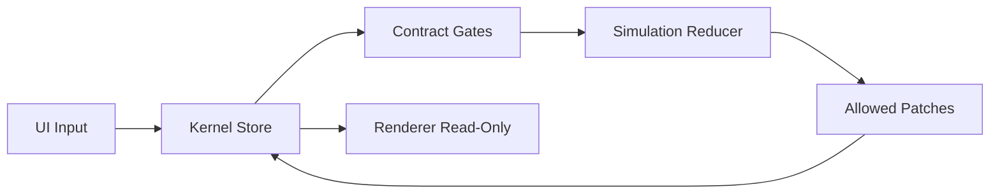

# Architecture SoT

## Prinzipien
- Manifest-first Design.
- Kernel ist alleinige Write-Authority.
- UI/Renderer sind read-only auf State.
- State-Updates nur als Patches durch definierte Gates.

## Top-Level Struktur
- `src/kernel/` - Store, Patching, Validierung
- `src/project/contract/` - Manifest, Schemata, Mutation Matrix, Lifecycle
- `src/game/sim/` - Sim-Logik und Worldgen
- `src/game/render/` - visuelle Ausgabe
- `src/game/ui/` - Input-/Dispatch-Schicht
- `src/app/` - Orchestrierung

## Datenfluss
1. UI dispatcht Action.
2. Kernel validiert Action + Lifecycle + Matrix.
3. Reducer erzeugt erlaubte Patches.
4. Kernel commitet State.
5. Renderer liest State.

## Diagramm

Source of truth: `docs/ARCHITECTURE.md`, `docs/ARCHITECTURE_SOT.md`
