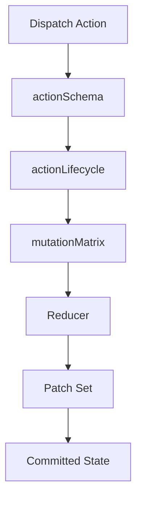

# Determinism and Contracts

## Vertragsschicht
- `src/project/contract/manifest.js` ist die ausfuehrbare Truth-Zentrale.
- `actionSchema` definiert Payload-Regeln.
- `mutationMatrix` erzwingt erlaubte Write-Surfaces.
- `actionLifecycle` dokumentiert `STABLE`, `RENAME`, `DEPRECATED`, `SCAFFOLD` plus Removal-Gates.

## Hardening
- Non-serializable Payloads werden rejectet.
- Zyklische Inputs werden fail-closed blockiert.
- Ungueltige Dimensionsinputs (`SET_SIZE`) erreichen keinen committed State.

## Slice-Status
- Slice B: MapSpec-Pipeline aktiv (`SET_MAPSPEC` -> compile -> `GEN_WORLD`).
- Slice C: Minimal UI + Worker migration aktiv.

## Diagramm

Source of truth: `docs/STATUS.md`, `src/project/contract/*`
