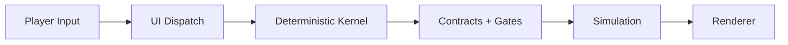

# LifeGameLab Wiki

Willkommen im technischen Wiki von LifeGameLab.

## Einstieg
- Vollstaendige Navigation: [Sidebar](./_Sidebar.md)
- Produktbasis: [Product SoT](./Product-SoT.md)
- Architekturbasis: [Architecture SoT](./Architecture-SoT.md)

## Projektkern
LifeGameLab ist ein deterministisches Browser-RTS mit einem Worker-First-Start.

- Ein Match beginnt mit genau einem Worker.
- Entscheidungen entstehen aus Konsequenz statt Menuefuehrung.
- Gleiche Seeds + gleiche Inputs liefern denselben Simulationsverlauf.

## Systemueberblick

## Aktueller Head (2026-03-20)
- Slice-B-MapSpec-Baseline aktiv.
- Slice-C-Minimal-UI aktiv.
- Worker-Migration weit fortgeschritten.
- Kernel-Hardening gegen nicht-serialisierbare/zyklische Inputs aktiv.

## Source of Truth
Fuer verbindliche Aussagen gelten:
- `docs/PRODUCT.md`
- `docs/ARCHITECTURE.md`
- `docs/STATUS.md`
- `src/project/contract/manifest.js`
