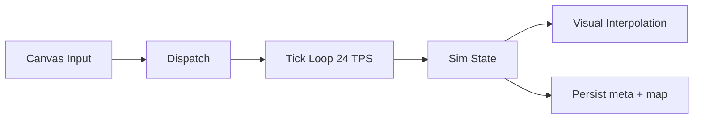

# Runtime and UI

## Runtime
- Tickbasierte Loop mit deterministischem Kern.
- Sichtbare Canvas-Interaktion.
- Builder-Panel fuer Map-Eingriffe statt blindem Toggle-only Flow.

## UI Regeln
- UI darf nicht direkt mutieren.
- Jede relevante Nutzeraktion geht ueber Dispatch.
- Bewegung und visuelle Interpolation bleiben synchron mit Tick-Modell.

## Persistenz
- Default Web Persistence speichert `map` (inkl. `tilePlan`) und `meta`.
- `world` und `sim` bleiben regenerierbar und werden nicht blind persistiert.

## Diagramm

Source of truth: `docs/STATUS.md`, `src/game/ui/*`, `src/kernel/store/persistence.js`
