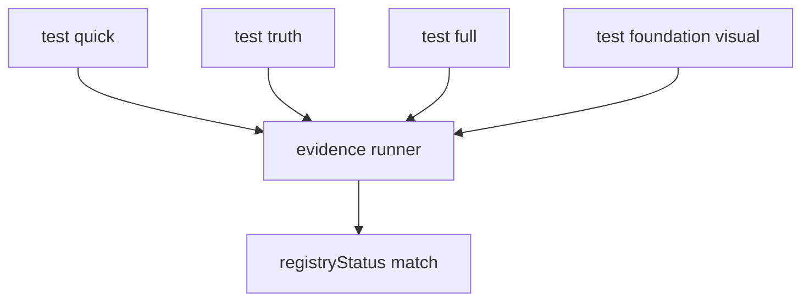

# Testing and Evidence

## Testsuiten
- `npm run test:quick`
- `npm run test:truth`
- `npm run test:full`
- `npm run test:foundation:visual`

## Evidence-Ansatz
- Claims und Regressionen werden gegen Registry/Truth geprueft.
- Evidence-Runner kennzeichnet Verifikation mit `registryStatus=`.
- Longrun-Budget hat explizite Headroom-Grenze (`300_000 ms`).

## Visual Regression
- Playwright-Flow dokumentiert initiale Runtime-/Header-/Canvas-Stabilitaet.

## Diagramm

Source of truth: `tools/`, `tests/`, `docs/STATUS.md`
